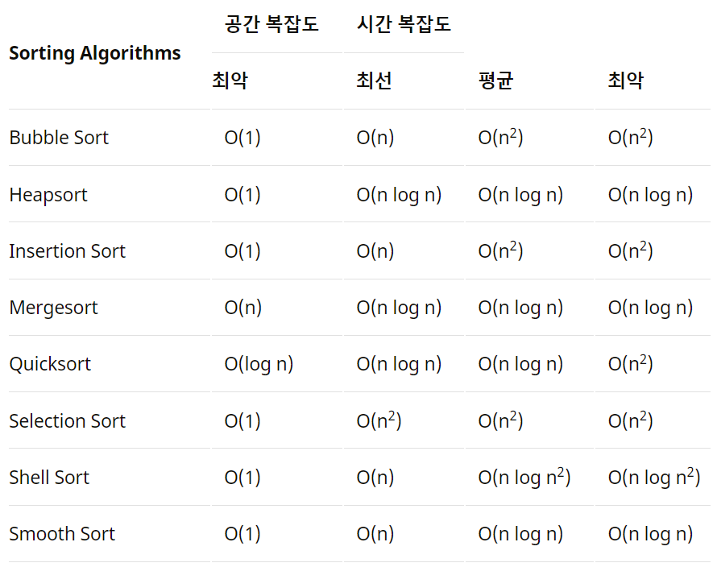

# 3. 알고리즘

[[_TOC_]]

## 1. 알고리즘[기초]

### 버블소트

- 서로 인접한 두 원소를 비교하여 정렬하는 알고리즘입니다. 0번 인덱스부터 n-1번 인덱스까지 n-1번 모든 인덱스를 비교하며 정렬합니다. 시간복잡도는 O(n\*\*2)입니다.

  

### 삽입정렬

- 두 번째 값부터 시작하여 그 앞에 존재하는 원소들과 비교하여 삽입할 위치를 찾아 삽입하는 정렬 알고리즘입니다. 삽입 정렬의 평균 시간복잡도는 O(n\*\*2)이며, 가장 빠른 경우 O(n)까지 높아질 수 있습니다.

  

### 힙소트

- 주어진 데이터를 힙 자료구조로 만들어 최대값 또는 최소값부터 하나씩 꺼내서 정렬하는 알고리즘입니다. 힙소트가 가장 유용한 경우는 전체를 정렬하는 것이 아니라 가장 큰 값 몇개만을 필요로 하는 경우입니다. 시간복잡도는 O(nlog2(n)) 입니다.

  

### 머지소트

- 머지소트는 주어진 배열을 크기가 1인 배열로 분할하고 합병하면서 정렬을 진행하는 분할/정복 알고리즘입니다. 시간복잡도는 O(nlog2(n))입니다

  

### 퀵소트

- 매우 빠른 정렬 속도를 자랑하는 분할 정복 알고리즘 중 하나로 머지소트와 달리 리스트를 비균등하게 분할합니다. 피벗을 설정하고 피벗보다 큰값과 작은값으로 분할하여 정렬을 합니다. 시간복잡도는 O(nlog2(n)) 이며 리스트가 계속해서 불균등하게 나눠지는 경우 시간복잡도가 O(n\*\*2) 까지 나빠질 수 있습니다.

  

### 정렬 알고리즘의 시간복잡도 비교

### 동적 프로그래밍(Dynamic Programming)이란

- 주어진 문제를 풀기 위해서, 문제를 여러 개의 하위 문제(subproblem)로 나누어 푼 다음, 그것을 결합하여 해결하는 알고리즘입니다. 동적 프로그래밍에서는 어떤 부분 문제가 다른 문제들을 해결하는데 사용될 수 있어, 답을 여러 번 계산하는 대신 한 번만 계산하고 그 결과를 재활용하는 메모이제이션(Memoization) 기법으로 속도를 향상 시킬 수 있습니다.
  - 메모이제이션: 동일한 계산을 반복해야 할 때, 이전에 계산한 값을 메모리에 저장함으로써 동일한 반복 수행을 제거하여 속도를 높이는 기법

### 동적 프로그래밍(Dynamic Programming)의 두 가지 조건

- Overlapping Subproblem(중복되는 부분문제): 주어진 문제는 같은 부분 문제가 여러번 재사용된다.
- Optimal Substructure(최적 부분구조): 새로운 부분 문제의 정답을 다른 부분 문제의 정답으로부터 구할 수 있다.

## 2. 알고리즘[고급]

### n개의 배열에서 k번째로 큰 수를 찾는 알고리즘

- 일반적으로 퀵정렬을 사용합니다. 하지만 퀵정렬을 사용하면 정렬이 불필요한 부분들을 정렬하면서 효율적이지 못하게 됩니다. 퀵선택 알고리즘은 퀵정렬을 한 후에 피봇과 K를 비교하여 아래와 같이 수행합니다.
  - pivot의 인덱스가 k와 같은 경우: 그대로 그 인덱스의 값을 리턴하면 된다.
  - pivot의 인덱스가 k보다 작은 경우: pivot의 인덱스+1부터 마지막 인덱스까지 다시 Partition함수에 넘겨준다.
  - pivot의 인덱스가 k보다 큰 경우: 첫번째 인덱스부터 pivot의 인덱스-1까지 다시 Partition함수에 넘겨준다.
    - 퀵정렬 알고리즘과의 다른 점은 예를 들어 Pivot의 인덱스가 7이고 K가 5인 경우에, 피봇의 오른쪽 부분은 재귀 함수를 돌지 않아 한 쪽만으로 재귀를 진행하는 것입니다.
    - 이러한 이유로 퀵선택 알고리즘의 시간복잡도는 n+n/2+4/n+....1=O(n) 입니다.

### 허프만 코딩

- 문자의 빈도를 이용해 압축하는 방법으로 빈도가 높은 문자에 짧은 코드를 부여합니다. 허프만 코드는 접두부 코드와 최적 코드를 사용합니다.

  - 접두부 코드: 문자에 부여된 코드가 다른 이진 코드의 접두부가 되지 않는 코드
  - 최적코드: 인코딩된 메세지의 길이가 가장 짧은 코드

  
