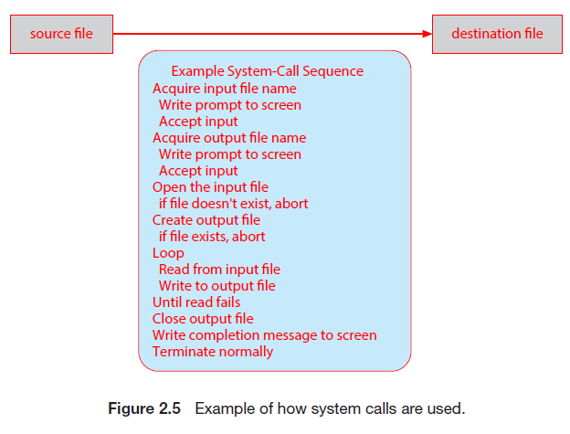
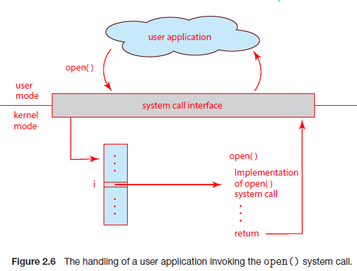
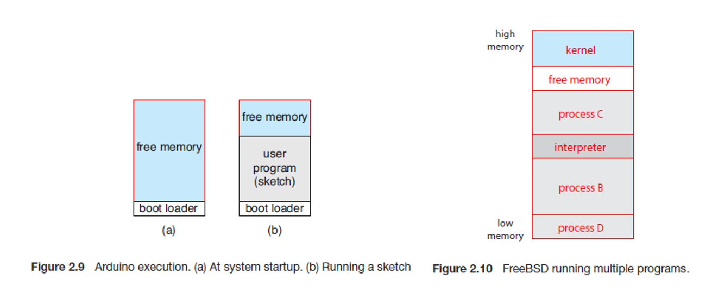
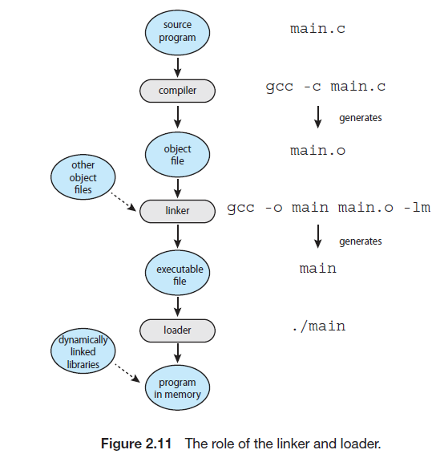
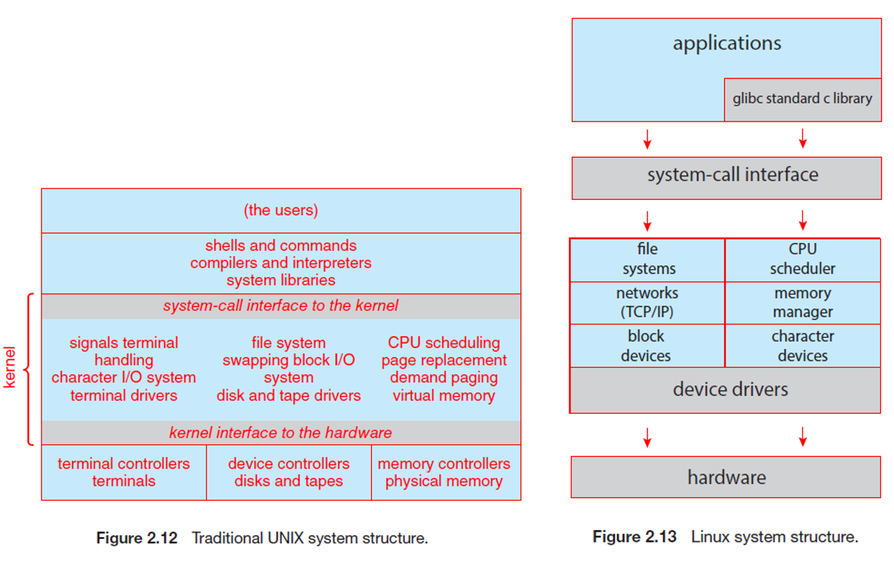
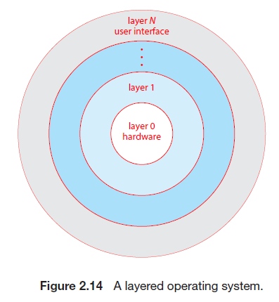
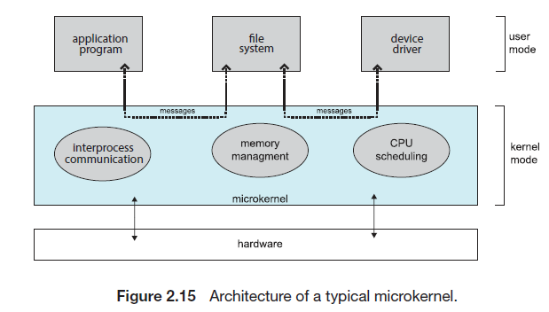
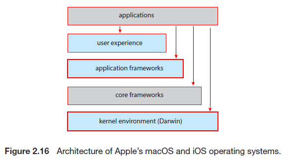
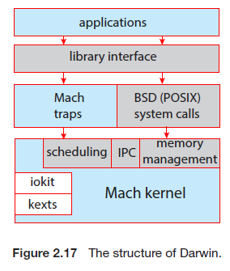
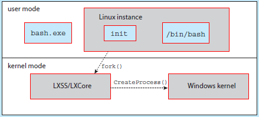

# Chapter2 운영체제 구조

- 운영체제를 살펴보기 위한 관점
  1. 운영체제가 제공하는 서비스의 초점
     - 어떤 서비스를 제공하는지
  2. 운영체제가 사용자와 프로그래머에게 제공하는 인터페이스에 초점
     - 어떤 방식으로 서비스를 제공하는지
  3. 시스템 구성요소와 그들의 상호 연결에 초점
     - 이 서비스들은 어떻게 디버깅 되며, 이러한 시스템을 설계하기 위해서는 어떤 다양한 방법들이 사용되는지

## 2.1 운영체제 서비스

- 운영체제는 프로그램 실행 환경을 제공하며 프로그램과 사용자에게 특정 서비스를 제공
  - 이러한 서비스는 프로그래머가 프로그래밍 작업을 더 쉽게 수행할 수 있도록 함

- 운영체제의 서비스
  - **사용자 인터페이스(UI)**
    - 인터페이스의 종류
      - **그래픽 사용자 인터페이스**
      - **터치스크린 인터페이스**
      - **명령어 라인 인터페이스(CLI)**
  - **프로그램 수행**
    - 시스템은 프로그램을 메모리에 적재 후 수행한 뒤, 끝낼 수 있어야 함(정상적이든 아니든)
  - **입출력 연산**
    - 사용자들은 통상 입출력 장치를 통제할 수 없으므로 운영체제가 입출력 수행의 수단을 제어해야 함
  - **파일 시스템 조작**
    - 프로그램은 파일을 읽기, 쓰기, 생성, 삭제, 탐색 등을 수행할 수 있어야 함
    - 몇몇 프로그램은 파일의 소유권에 기반한 권한 관리를 이용하여 디렉터리의 접근을 허가하거나 거부할 수 있게 함
  - **통신**
    - 한 프로세스가 다른 프로세스와 정보를 교환할 수 있어야 함
    - 통신 수행의 유형
      1. 동일한 컴퓨터에서 수행되고 있는 프로세스 사이에서 발생
      2. 네트워크에 의해 함께 묶여 있는 다른 컴퓨터 시스템에서 수행되는 프로세스 사이에서 발생
    - 통신의 구현 방법
      1. **공유 메모리**를 통하여 구현
      2. **메시지 전달** 기법으로 구현
         - 정보의 패킷들이 운영체제에 의해 프로세스들 사이를 이동
  - **오류 탐지**
    - 운영체는 모든 가능한 오류를 항상 의식하고, 적절한 대응으로 올바르고 일관성 있는 계산을 보장해야 함
    - 오류는 CPU, 메모리 하드웨어, 입출력 장치, 사용자 프로그램 등에서 발생 가능
  - **자원 할당**
    - 다수의 프로세스나 작업이 동시에 실행될 때, 그들 각각에 자원을 할당해줘야 함
      - ex) CPU 스케줄링 루틴, CPU의 처리 코어 개수, USB 저장장치 드라이브 및 프린터에 할당 등
  - **기록 작성**
    - 어떤 프로그램이 어떤 종류의 컴퓨터 자원을 얼마나 사용했는지 **사용 통계**를 기록해야 함
  - **보호(Protection) 및 보안(Security)**
    - **보호**는 시스템 자원에 대한 모든 접근이 통제되도록 보장하는 것
    - **보안**은 네트워크 어댑터 등과 같은 외부 입출력 장치들로부터 부적합한 접근 시도를 막는 것
    - 시스템이 보호되고 보안이 유지되기 위해서는 시스템 전체에 걸쳐 **예방책**이 제정되어야 함

## 2.2 사용자와 운영체제 인터페이스

- 사용자와 운영체제가 접촉하는 방법
  - 명령어 라인 인터페이스(**명령 인터프리터**)
  - 그래픽 사용자 인터페이스
  - 터치스크린 인터페이스

### 2.2.1 명령 인터프리터

- **셸**
  - 선택할 수 있는 여러 명령 인터프리터를 제공하는 시스템에서의 해석기
    - ex) Linux, UNIX에서의 Bourne shell, C shell, Korn shell 등

- **명령 인터프리터**

  - 사용자가 지정한 명령을 가져와서 수행하는 것

    - ex) 생성, 삭제, 리스트, 프린트, 복사 등

  - 명령어의 구현 방법

    1. 명령 인터프리터 자체가 명령을 실행할 코드를 가지는 경우

       - ex) 파일을 삭제하는 명령

         1. 자신의 코드의 한 부분으로 분기
         2. 그 코드 부분이 매개변수를 설정하고 적절한 시스템을 콜

         - 이 경우 제공될 수 있는 명령의 수가 명령 인터프리터의 크기를 결정
           - 각 명령이 자신의 구현 코드를 요구하기 때문

    2. 시스템 프로그램에 의해 대부분의 명령을 구현하는 것

       - 이 경우 명령 인터프리터는 전혀 그 명령을 알지 못함

       - ex) 파일을 삭제하는 명령(`rm file.txt`)

         1. rm이라 불리는 파일을 찾아서 메모리에 적재
         2. 그것을 매개변수 file.txt로 수행
         3. rm 명령과 관련된 로직은 rm이라는 파일 내의 코드로 완전하게 정의

         - 이 방법으로 프로그래머는 적합한 프로그램 로직을 가진 새로운 파일을 생성함으로써 시스템에 새로운 명령을 쉽게 추가 가능

### 2.2.2 그래픽 기반 사용자 인터페이스

- **데스크톱**이라고 특징지어지는 마우스를 기반으로 하는 윈도 메뉴 시스템을 사용
  - 마우스 포인터의 위치에 따라, 버튼을 누름으로써 프로그램을 호출하거나 파일 혹은 디렉터리(**폴더**)를 조작 가능

### 2.2.3 터치스크린 인터페이스

- 사용자는 터치스크린에서 손가락을 누르거나 스와이프 하는 등의 **제스처**를 취하여 상호 작용
  - iPad와 iPhone 모두 **Springboard** 터치스크린 인터페이스를 사용

### 2.2.4 인터페이스의 선택

- 인터페이스의 선택은 개인의 선호
  - **시스템 관리자**와 시스템에 대해 깊게 알고 있는 **파워 유저**들은 명령어 라인 인터페이스를 사용
  - **셸 스크립트**
    - 명령어-라인의 여러 절차를 파일로 저장하고, 해당 파일을 프로그램처럼 실행하는 것(UNIX, Linux)

## 2.3 시스템 콜

- **시스템 콜**
  - 운영체제에 의해 사용 가능하게 된 서비스에 대한 인터페이스를 제공

## 2.3.1 예제

- **시스템 콜**의 사용 예제

  - 한 파일로부터 데이터를 읽어서 다른 파일로 복사하는 간단한 프로그램을 작성한다고 가정

    1. 프로그램이 필요로 하는 첫 번째 입력은 두 개의 파일(입력 파일과 출력 파일의 이름)
       1. `cp in.txt out.txt`로 전달
       2. 프로그램이 사용자에게 먼저 이름을 요청
          - 화면에 프롬프트 메시지를 작성한 다음 키보드에서 두 파일의 이름을 지정하는 문자를 읽기

    2. 프로그램은 반드시 입력 파일을 오픈하고 출력 파일을 생성한 후 오픈
       - 각각의 연산은 또 다른 시스템 콜을 필요로 하며, 각 시스템 콜에서 오류가 발생하면 처리되어야 함
         - ex) 프로그램이 입력 파일을 오픈하려할 때, 파일이 존재하지 않거나 접근이 금지된 경우
           - 프로그램은 에러 메시지를 출력하고(다른 시스템 콜), 비정상적으로 종료(다른 시스템 콜)
         - ex) 입력 파일이 존재하면 새로운 출력 파일을 생성해야 하는데, 동일한 이름을 가진 파일이 존재하는 경우
           - 프로그램을 중단(abort)(다른 시스템 콜)하거나, 기존의 파일을 삭제(다른 시스템 콜)한 후 새로운 파일을 생성(다른 시스템 콜)할 수 있음
       - 대화형 시스템에서 또 다른 방법은 기존의 파일을 대체하는지, 프로그램을 중단할지 물어보는 것
    3. 두 파일이 준비되면, 입력 파일로부터 읽어서, 출력 파일에 기록하는 루프에 들어감
       - 각 읽기와 쓰기는 가능한 여러 가지 오류 상황의 정보를 반환해야 함
         - 파일의 끝에 도달하거나 읽기 중에 하드웨어 오류(ex)패리티 오류)가 발생할 수 있음
         - 쓰기 연산 시 출력 장치에 따라 여러 오류(ex)디스크 공간 부족)가 발생할 수 있음
    4. 마지막으로 전체 파일이 복사된 후, 프로그램은 두 파일을 닫고(2개의 시스템 콜), 콘솔 또는 윈도우에 메시지를 기록(추가적 시스템 콜들), 정상적으로 종료(마지막 시스템 콜)

  

### 2.3.2 응용 프로그래밍 인터페이스

- **응용 프로그래밍 인터페이스(API)**
  - 각 함수에 전달되어야 할 매개변수들과 프로그래머가 기대할 수 있는 반환 값을 포함하여 응용 프로그래머가 사용 가능한 함수의 집합을 명시
    - 응용 프로그래머가 사용 가능한 가장 흔한 3가지 API
      - Windows API
      - POSIX API
        - POSIX 기반 시스템을 위한 API
      - Java API
        - JAVA 가상 기계에서 실행될 수 있는 프로그램을 위한 API
  - 시스템 콜에 비한 API의 이점
    1. 프로그램 호환성
       - API에 다라 프로그램을 설계하면 자신의 프로그램이 같은 API를 지원하는 어느 시스템에서건 컴파일될 수 있음
    2. 복잡성
       - 시스템 콜은 종종 좀 더 자세한 명세가 필요하고 프로그램상에서 작업하기가 API보다 어려움

- **실행시간 환경(RTE)**

  - 특정 프로그래밍 언어로 작성된 응용 프로그램을 실행하는 데 필요한 전체 소프트웨어 제품군과 라이브러리 또는 로더 같은 다른 소프트웨어를 가리킴
  - **시스템 콜 인터페이스**
    - RTE 운영체제가 제공하는 시스템 콜에 대한 연결고리 역할로 API 함수의 호출을 가로채어 필요한 운영체제 시스템 콜을 부름
      - 통상 시스템 콜에는 번호가 할당되고 시스템 콜 인터페이스는 이 번호에 따라 색인되는 테이블을 유지
      - 시스템 콜 인터페이스는 의도하는 시스템 콜을 부르고 시스템 콜의 상태와 반환 값을 돌려줌
    - 호출자는 시스템 콜이 어떻게 구현되고 실행 중 무슨 작업을 하는지 알 필요가 없음
      - API를 준수하고 시스템 콜의 결과로서 운영체제가 무엇을 할 것인지만 이해하면 됨
    - 따라서 운영체제 인터페이스에 대한 대부분의 자세한 내용은 API에 의해 숨겨지고 RTE에 의해 관리됨

  

- 운영체제에 매개변수를 전달하는 일반적 방법
  - 매개변수를 레지스터 내에 전달(가장 간단한 방법)
    - 어떤 경우에는 레지스터보다 더 많은 매개변수가 있을 수 있음
      - 매개변수는 메모리 내의 블록이나 테이블에 저장되고, 블록의 주소가 레지스터 내에 매개변수로 전달
      - 5개 이하의 매개변수가 있으면 레지스터, 5개 이상이면 블록
  - 매개변수는 **스택(stack)**에 **넣어질(push)** 수 있고, 운영체제에 의해 **꺼내진다(pop off)**

### 2.3.3 시스템 콜의 유형

- 시스템 콜의 다섯가지 범주
  - **프로세스 제어**, **파일 조작**, **장치 조작**, **정보 유지 보수**, **통신**과 **보호**

#### 2.3.3.1 프로세스 제어

- 실행 중인 프로그램은 수행이 정상적(end())으로 또는 비정상적(abort())으로 멈출 수 있어야 함

- **디버거**
  - 특별한 파일이나 디스크에 기록된 덤프를 통해 문제의 원인을 결정하기 위해 하는 검사
    - **덤프**는 실행 중인 프로그램을 비정상적으로 종료하기 위해 오류 트랩을 유발할 경우, 때때로 메모리 덤프가 행해지고 생성된 오류 메시지

- 정상적이거나 비정상적인 상황에서 
  - 운영체제는 명령 인터프리터로 제어를 전달해야 함
  - 명령 인터프리터는 다음 명령을 읽음
    - 대화식 시스템에서 명령 인터프리터는 단순히 다음 명령을 계속 수행하며, 사용자가 오류에 응답하는 적절한 명령을 내릴 것이라 가정
    - GUI 시스템에서는 팝업 윈도우가 사용자에게 오류를 알리고 지시를 기다림

- 프로세스에서 적재된(load()) 프로그램이 종료되었을 때, 제어를 어디로 돌려주는가?
  - 만약 기존 프로그램으로 돌아간다면?
    - 반드시 기존 프로그램의 메모리 이미지를 보관해야 함
      - 즉, 한 프로그램이 다른 프로그램을 호출하는 기법을 만든 것
  - 만약 새로운 잡이나 프로세스, 혹은 잡들이나 프로세스들의 집합을 생성한다면?
    - `creat_process()` 프로세스를 생성할 경우
    - 이들의 실행을 제어할 수 있어야 함
      - `get_procee_attribute()` 
      - `get_process_attributes()` 및 `set_process_attributes()`
        - 이 제어는 잡의 우선순위, 최대 허용 실행 시간 등 잡 혹은 프로세스의 속성들을 결정하고 재설정(reset)할 수 있어야 함
      - `terminate_process()` 생성한 잡이나 프로세스가 잘못되거나 필요 없어진 경우 종료해야 할 수 있음

- 새로운 프로세스를 생성한 이후에는?
  - 이들의 실행이 끝나길 기다려야 할 수 있음
    - `wate_time()` 일정 시간만큼 기다리기 원하는 경우
    - `wait_event()` 특정 이벤트가 일어날 때까지 기다리는 경우
      - `signal_event()` 이벤트가 일어나면 신호를 보냄

- 프로세스들의 데이터 공유
  - 공유되는 데이터의 일관성을 보장하기 위해서 운영체제는 종종 프로세스가 공유 데이터를 **잠글** 수 있는 시스템 콜을 제공
    - 잠금이 해제될 때까지 어느 프로세스도 데이터에 접근할 수 없게 됨
    - `acquire_lock()` `release_lock()`

- 단일 태스킹과 다중 태스킹

  - 단일 태스킹: 한 순간에 하나의 프로그램(스케치)만 메모리에 존재할 수 있는 경우
    - **스케치**: USB 연결을 통해 컴파일된 프로그램
  - 다중 태스킹: 한 순간에 다수의 프로그램(스케치)이 메모리에 존재할 수 있는 경우

  

#### 2.3.3.2 파일관리

- 파일 시스템에서 다루는 공통적인 시스템 콜
  - `creat()` 파일 생성
  - `delete()` 파일 삭제
  - `open()` 파일 열기
  - `read()` 읽기
  - `write()` 쓰기
  - `reposition()` 위치 변경
  - `rewind()` 되감기나 파일 끝으로 건너뛰기
  - `close()` 파일 닫기
  - 파일 속성
    - 파일 이름, 파일 유형, 보호 코드, 회계 정보 등을 포함
    - 파일 속성을 재설정(reset)하기 위해 필요한 시스템 콜
      - `get_file_attribute()` 최소한 파일 속성 획득
      - `set_file_attribute()` 파일 속성 설정

#### 2.3.3.3 장치 관리

- 프로세스가 작업을 수행하기 위해 추가 자원이 필요한 경우
  - ex) 주 기억장치, 디스크 드라이브, 파일에 접근 등
  - 자원이 사용 가능한 경우 주어지고, 제어가 사용자 프로그램으로 복귀될 수 있음
  - 아닌 경우 충분한 자원을 사용 가능할 때까지 기다려야 함

- 운영체제에 의해 제어되는 자원
  - 자원들은 장치로 간주될 수 있음
    - 물리 장치 - 디스크 드라이브
    - 가상적 장치 - 파일
  - `request()` 다수의 사용자가 동시에 사용하는 시스템에서 독점적인 사용을 요청
  - `release()` 해당 장치의 사용이 끝나면 방출

#### 2.3.3.4 정보 유지 관리

- 많은 시스템 콜은 단순히 사용자 프로그램과 운영체제 간의 정보 전달을 위해 존재
  - ex
    - `time()` 시간을 돌려줌
    - `date()` 날짜를 돌려줌
  - 다른 시스템 콜은 버전 번호, 자유 메모리 또는 자유 디스크 공간 등과 같은 시스템 정보를 알려줌

- 시간 프로파일(time profile)
  - 프로그램이 특정 위치, 혹은 위치의 집합에서 수행한 시간의 양을 나타냄
  - 이를 위해서는 추적 설비(tracing facility)나 정규 타이머 인터럽트가 필요함
  - 타이머 인터럽트가 발생할 때마다, 프로그램 카운터의 값이 기록
  - 따라서 충분히 빈번하게 일어난다면, 프로그램의 여러 부분에서 소비한 시간의 통계적 그림을 얻을 수 있음

- 운영체제는 현재 운영되는 프로세스에 관한 모든 정보를 가지고 있음
  - `get_file_attribute()` `set_file_attribute()` 등

#### 2.3.3.5 통신

- 통신 모델

  1. 메시지 전달 모델
     - 통신하는 두 프로세스가 정보를 교환하기 위하여 서로 메시지를 주고 받음(직접 or 간접)
       - 통신이 이루어지기 전에 반드시 연결이 열려야 함
       - 상대 통신자의 이름을 반드시 알고 있어야 함
         - 네트워크의 각 컴퓨터는 **호스트 이름**을 가지고, 일반적으로 알려져 있음
         - 마찬가지로, 각 프로세스는 **프로세스 이름**을 갖고 있고, 이름은 운영체제제 의해 동등한 식별자로 반환되고, 식별자는 운영체제가 프로세스를 가리키는 데 사용할 수 있음
           - `get_hostid()` `get_processid()` 식별자 변환을 수행
         - 식별자는 시스템의 통신 모델에 따라 파일 시스템에 의해 제공되는 범용의 `open` `close` 호출에 전달되거나, 특정 `open_connection()`과 `close_connection` 시스템 콜에 전달됨
       - 수신 프로세스는 통신이 일어날 수 있도록 `accept_connection()` 호출에 자신의 허가를 제공
         - 연결을 받아들일 프로세스들의 대부분은 특수 목적인 **디먼(daemon)**임(원래 이런 목적으로 설계됨)
       - 연결을 위해 대기 호출을 수행하고 연결이 이루어질 때 깨어남
       - **클라이언트**로 알려진 통신의 출발지와 **서버**로 알려진 수신 디먼은 `read_message()`와 `write_message()` 시스템 콜에 의해 메시지들을 교환
       - `close_connection()`은 호출 통신을 종료
  2. 공유 메모리 모델
     - 프로세스는 다른 프로세스가 소유한 메모리 영역에 대한 접근을 위해 `shared_memory_creat()`와 `shared_memory_attach()` 시스템 콜을 사용
     - 운영체제는 한 프로세스가 다른 프로세스의 메모리에 접근을 막으므로 두 개 이상의 프로세스가 이러한 제한을 제거하는 데 동의할 것이 필요
     - 이후 공유 영역에서 데이터를 읽고 씀으로써 정보를 교환

  - 위의 두가지 모델이 보편적이며, 보통 둘 다 구현되어 있음
    - 메시지 전달이 유리한 점
      - 메시지 전달은 소량의 데이터를 교환할 때 유리(피해야 할 충돌이 없기 때문)
      - 컴퓨터간 통신을 구현하기가 더 쉬움
    - 공유 메모리가 유리한 점
      - 한 컴퓨터 안에서는 메모리 전송 속도로 수행할 수 있으므로 최대 속도와 편리한 통신을 허용
        - 다만, 보호와 동기화 부분에서 문제를 가짐

#### 2.3.3.6 보호

- 보호
  - 시스템이 제공하는 자원에 대한 접근을 제어하기 위한 기법을 지원
    - `set_permission()` `get_permission()` 파일과 디스크와 같은 자원의 허가 권한을 설정하는 데 이용
    - `alloy_user()` `deny_user()` 특정 사용자가 지정된 자원에 대해 접근이 허가 또는 불허되었는지를 명시

## 2.4 시스템 서비스

- **시스템 서비스(시스템 유틸리티)**
  - 프로그램 개발과 실행을 위해 더 편리한 환경을 제공
    - 몇몇은 단순히 시스템 콜에 대한 사용자 인터페이스이나 나머지는 훨씬 복잡
  - 시스템 서비스의 범주
    - **파일 관리**
      - 파일과 디렉터리를 생성, 삭제, 복사, 개명, 인쇄, 열거 등 조작
    - **상태 정보**
      - 시스템에게 날짜, 시간, 사용 가능한 메모리, 디스크 공간의 양 등의 상태 정보를 물음
        - 몇몇 프로그램은 더 상세한 성능, 디버깅 정보를 제공
        - 몇몇 시스템은 환경 설정 정보를 저장하고 검색할 수 있는 **등록** 기능을 지원
    - **파일 변경**
      - 다른 저장장치에 저장된 파일의 내용을 생성하고 변경하기 위해 다수의 편집기 문장을 사용을 제공
    - **프로그래밍 언어 지원**
      - 언어들(C, Java 등)에 대한 컴파일러, 어셈블러, 디버거 및 해석기가 제공되거나 별도의 다운로드를 받을 수 있음
    - **프로그램 적재와 수행**
      - 시스템은 절대 로더, 재배치 가능 로더, 링키지 에디터, 중첩 로더 등을 제공
    - **통신**
      -  프로세스, 사용자, 다른 컴퓨터 시스템들 사이에 가상 접속을 위한 기법을 제공
    - **백그라운드 서비스**
      - 모든 범용 시스템은 부트할 때 특정 시스템 프로그램을 시작시킬 수 있는 방법을 가짐
        - 항상 실행되는 시스템 프로그램 프로세스는 **서비스**, **서브시스템**, 디먼으로 알려져 있음
        - 운영체제는 수십 개의 디먼을 가지며, 커널 문맥이 아닌 사용자 문맥에서 중요한 활동을 할 경우 디먼으로 이 작업을 수행 가능

## 2.5 링커와 로더

- 프로그램을 컴파일하고 메모리에 배치하여 사용 가능한 CPU 코어에서 실행할 수 있게 되는 절차

  1. 소스파일은 임의의 물리 메모리 위치에 적재되도록 설계된 오브젝트 파일로 컴파일(해당 형식 => **재배치 가능 오브젝트 파일**)

  2. **링커**는 재배치 가능 오브젝트 파일을 하나의 이진 **실행** 파일로 결합
  3. **로더**는 이진 실행 파일을 메모리에 적대하는 데 사용됨(CPU 코어에서 실행할 수 있는 상태)
     - 링크 및 로드와 관련된 활동은 **재배치**로, 프로그램 부분에 최종 주소를 할당하고 프로그램 코드와 데이터를 해당 주소와 일치하도록 조정하여 프로그램이 실행할 때 코드가 라이브러리 함수를 호출하고 변수에 접근할 수 있게 함
       - UNIX 시스템의 예
         - 명령어 라인에 프로그램 이름을 입력하면 셸은 먼저 fork() 시스템 콜을 사용해 프로그램 실행을 위한 새 프로세스를 생성
         - 셸은 exec() 시스템 콜로 로더를 호출하고, exec()에 실행 파일 이름을 전달
         - 로더는 새로 생성된 프로세스의 주소 공간을 사용해 지정돤 프로그램을 메모리에 적재
       - GUI 시스템의 예
         - 실행 파일과 연관된 아이콘을 두 번 클릭하면 유사한 메커니즘을 사용해 로더가 호출
  4. 라이브러리 동적 링크
     - Windows 시스템의 예
       - Windows에서는 동적 링킹 라이브러리**(DLL)**을 지원
       - 실행 파일에서 사용되지 않을 수 있는 라이브러리를 링크하고 로드하지 않아도 되는 장점을 가짐
       - 라이브러리는 조건부로 링크되며 프로그램 실행 히간에 필요한 경우 적재
         - 여러 프로세스가 동적으로 링크된 라이브러리를 공유할 수 있어 메모리 사용이 크게 절약

  

  - 오브젝트 파일 및 실행 파일은 일반적으로 표준화된 형식을 지님

    - 기호 테이블(컴파일된 기계 코드 및 프로그램에서 참조되는 함수 및 변수에 대한 메타데이터 등을 가짐)을 포함

      - UNIX와 Linux 시스템에서는 이 표준 형식을 **ELF**(Executable and Linkable Format)라고 함
        - 재배치 가능 파일과 실행 파일 각각을 위한 별도의 ELF 형식이 사용
        - ELF 파일의 정보 중 하나는 **시작점**이고, 프로그램을 실행할 첫 번째 명령어 주소가 저장되어 있음
          - ex) main.o가 오브젝트 파일이고, main이 실행 파일인 경우
            - 명령 `file main.o`는 `main.o`가 ELF 재배치 가능 파일로 보고
            - 명령 `file main`은 `main`이 ELF 실행 파일이라고 보고

      - Windows 시스템은 **PE**(Portable Executable) 형식을 사용
      - macOS는 **Mach-O** 형식을 사용

## 2.6 응용 프로그램이 운영체제마다 다른 이유

- 각 운영체제는 고유한 시스템 콜 집합을 제공하며, 시스템 콜은 응용 프로그램이 사용할 수 있는 운영체제가 제공하는 서비스 집합의 일부
  - 응용 프로그램을 다른 운영체제에서 실행하기 어려움(시스템 콜이 어느정도 같더라도)

- 동일한 응용 프로그램을 다른 운영체제에서 사용할 수 있게 만드는 방법
  1. 인터프리터를 이용
     - 응용 프로그램은 운영체제마다 제공되는 인터프리터 언어로 작성될 수 있음
     - 인터프리터가 소스 프로그램의 각 라인을 읽고, 해당 운영체제의 시스템 콜을 호출
       - 다만, 기계어로 작성된 응용 프로그램에 비해 성능이 떨어짐
       - 또한, 인터프리터는 각 운영체제 기능의 일부만 제공하므로 응용 프로그램의 기능이 제한될 수 있음
  2. 가상 머신을 이용
     - 응용 프로그램은 가상 머신을 가진 언어로 작성될 수 있음(가상 머신은 언어의 RTE 중 일부)
       - 대표적인 예시가 Java로 로더, 바이트코드 검증기, Java 응용 프로그램을 Java 가상 머신으로  적재하는 구성요소롤 RTE로 가지고 있음
     - RTE는 메인 프레임에서 스마트폰까지 다양한 운영체제에 **이식** 또는 개발되어 이론적으로 Java 앱은 RTE가 제공되는 어디서나 실행 가능
     - 다만, 1번의 경우와 비슷한 단점을 가짐
  3. API 이용
     - 응용 프로그램은 운영체제 고유의 이진 파일을 생성하는 표준 언어 또는 API를 사용해 작성될 수 있음
     - 응용 프로그램은 실행될 각 운영체제로 이식되어야 하고, 이식은 시간이 많이 소요될 수 있고 많은 디버깅을 거쳐 응용 프로그램의 새 버전마다 수행되야 함
       - 다만, 하나의 API 집합을 호출하도록 설계된 응용 프로그램은 해당 API를 제공하지 않는 운영체제에서는 작동하지 않음

- 시스템의 낮은 수준에서의 어려움
  - 각 운영체제에는 헤더, 명령어 및 변수의 배치를 강제하는 이진 형식이 있고, 이는 명시된 구조 형태로 실행 파일 내의 특정 위치에 있어야 운영체제가 파일을 열고 적재하여 올바르게 실행할 수 있음
  - CPU는 다양한 명령어 집합을 가지며 해당 명령어가 포함된 응용 프로그램만 올바르게 실행할 수 있음
  - 운영체제는 응용 프로그램이 필요로 하는 다양한 시스템 콜을 제공하는 데, 이 시스템 콜은 사용되는 피연산자, 피연산자 순서, 호출하는 방법, 시스템 콜 번호 등 운영체제마다 다름

- **ABI**(application banary interface)
  - 아키텍쳐 수준에서 이진 코드의 여러 구성요소가 주어진 아키텍쳐에서 특정 운영체제와 상호작용할 수 있는 방법을 정의
    - 주소 길이, 시스템 콜에 매개변수를 전달하는 방법, 런타임 스택 구성, 시스템 라이브러리의 이진 형식 및 데이터 유형의 크기 등 하위 수준의 세부 정보를 명시
  - 일반적으로 ABI는 특정 아키텍쳐에 대해 명시되므로, ABI는 아키텍쳐 수준의 API
  - 이진 실행 파일이 특정 ABI에 따라 컴파일되고 링크된 경우 해당 ABI를 지원하는 다른 시스템에서 실행될 수 있어야 함
    - 하지만, 특정 아키텍쳐에서 실행되는 특정 운영체제에 대해 ABI가 정의되어 있기 때문에 ABI는 플랫폼 간 호환성을 거의 제공하지 않음

- 요약
  - 모든 차이점은 CPU 유형(intel x86, ARMv8 등)의 특정 운영체제에서 인터프리터, RTE 또는 이진 실행 파일을 작성하고 컴파일하지 않으면 응용 프로그램이 실행되지 않는 것을 의미

## 2.7 운영체제 설계 및 구현

### 2.7.1 설계 목표

- 시스템 설계의 첫 번째 문제는 시스템 목표와 명세를 정의하는 것
  - 최상위 수준에서는 하드웨어와 시스템 유형(일괄처리, 시분할, 단일 또는 다중 사용자 등)의 선택에 영향을 받음
  - 요구 조건은 **사용자 목적**과 **시스템 목적**의 두 가지로 나눌 수 있음
    - 사용자들은 시스템에 기대하는 특징이 있음
      - 이해가 쉬움, 배우기 쉬움, 안전함, 신속함 등(이는 일반적으로 합의되지 않았으므로 설계에 쓸모있는 건 아님)
    - 설계, 조작, 유지하는 사람들이 기대하는 특징도 있음
      - 설계와 구현과 유지보수가 쉬움, 적응성과 신뢰성을 가짐 등(이것 또한 애매함을 가짐)

### 2.7.2 기법과 정책

- **기법**으로부터 **정책**을 분리하는 원칙을 지켜야 함
  - 기법: "어떻게 할 것인가?"를 결정
  - 정책: "무엇을 할 것인가?"를 결정(정책 결정은 자원 할당 문제에 있어 중요함)
  - ex) 타이머 구조는 CPU 보호를 보장하기 위한 기법이나, 특정 사용자를 위해 얼마나 오래 설정할지는 정책임
  - 정책은 시간과 장소가 바뀜에 따라 변경될 수 있고, 최악의 경우는 기법의 변경이 요구됨
    - 따라서, 여러 정책에서 사용되기에 충분히 융통성 있는 일반적인 기법이 바람직함

### 2.7.3 구현

- 설계가 끝나면 어셈블리 언어, 고급언어 등으로 작성됨
  - ex) 대부분의 Android 시스템 라이브러리는 C 또는 C++로 작성되고, 시스템 개발자 인터페이스를 제공하는 응용 프로그램 프레임워크는 대부분 Java로 작성
  - 고급 언어를 통한 운영체제 구현
    - 장점은 응용 프로그램을 위해 해당 언어가 사용되는 장점과 비슷
      - 간결하고, 이해하기 쉽고, 디버깅도 쉬움
      - 특히 다른 언어로의 이식이 쉬움
        - 소형 임베디드 장치와 같은 여러 가지 다른 하드웨어 시스템에서 실행되어야 하는 운영체제에서 특히 중요함
    - 단점은 속도가 느리고 저장 장치가 많이 소요되는 것(어셈블리 언어에 비해)
      - 어셈블리 언어로 효율적인 작은 루틴을 생산할 수 있지만, 현대의 컴파일러는 대규모 프로그램을 위해 복잡한 분석을 수행하고 정교화 최적화를 적용하여 우수한 코드를 생산할 수 있음
      - 운영체제의 성능 향상은 우수한 어셈블리어 코드보다는 좋은 자료구조와 알고리즘의 결과인 경우가 많음
      - 운영체제는 거대하지만, 소량의 코드만이 고성능이 중요함
        - 인터럽트 핸들러, 입출력 관리자, 메모리 관리자, CPU 스케줄러 등

## 2.8 운영체제 구조

- 거대한 운영체제를 동작하게 하기 위한 일반적인 접근 방법은 한 개의 일관된 시스템보다는 태스크를 작은 구성요소로 분할하는 것
  - 해당 장에서는 구성요소들이 어떤 방법으로 상호 연결되고 하나의 커널로 결합되는지 알아봄

### 2.8.1 모놀리식 구조

- **모놀리식 구조**
  - 커널의 모든 기능을 단일 주소 공간에서 실행되는 단일 정적 이진 파일에 넣는 것(구조가 없는 것과 비슷?)
  - 장점
    - 속도와 효율성이 좋음
      - 시스템 콜 인터페이스에는 오버헤드가 거의 없고 커널 안에서의 통신 속도가 빠름(아직도 UNIX, Linux, Windows에서 사용되는 이유)
  - 단점
    - 단순성을 가짐에도 이 구조를 구현하거나 확장하기 어려움
      - 시스템의 한 부분을 변경하면 다른 부분에 광범위하게 영향을 줄 수 있음(**밀접하게 결합된**시스템)

### 2.8.2 계층적 접근

- **계층적 접근**

  - 기능이 특정 기능 및 한정된 기능을 가진 개별적이며 작은 구성요소로 나눔(모듈화)
  - 운영체제는 여러 층의 형태를 띄게 되는데, 층들은 자신의 하위층들의 서비스와 기능들만을 사용하도록 선택됨
    - 이에 따라 최하위(0층)은 하드웨어만을 사용함
    - 각 층을 순차로 구현하므로 오류가 생기면 해당 층에서 발생한 것을 알 수 있음(하위층은 이미 디버깅했으므로)
  - 장점
    - 시스템의 내부 동작을 더 자유롭게 생성하고 변경할 수 있음
      - 한 구성요소의 변경이 해당 구성요소에만 영향을 미침(**느슨하게 결합된** 시스템)
  - 단점
    - 각 층의 기능을 적절히 정의해야 함
    - 사용자 프로그램은 운영체제 서비스를 얻기 위해 여러 계층을 통과해야 하는 오버헤드가 발생
  - 명확한 단점들로 인해 해당 방법을 사용하는 운영체제는 거의 없으나 어느정도의 계층화는 사용함
    - 더 많은 기능을 가진 더 적은 개수의 층을 가짐
      - 즉, 층 기능의 정의 및 상호작용의 문제를 피하면서 모듈화된 장점을 지님

  

### 2.8.3 마이크로 커널

- **마이크로커널 접근**

  - 모든 중요치 않은 구성요소를 커널로부터 제거하고, 그들을 별도의 주소 공간에 존재하는 사용자 수준 프로그램으로 구현하는 방법
  - 마이크로 커널의 주 기능은 클라이언트 프로그램과 역시 사용자 공간에서 수행되는 다양한 서비스 간에 통신을 제공하는 것
    - ex) 클라이언트 프로그램이 파일에 접근하기 원하는 경우
      - 클라이언트 프로그램과 서비스는 직접 상호작용 하지 않고, 마이크로커널과 메시지를 교환하여 간접적으로 상호 작용
  - 장점
    - 운영체제의 확장이 쉬움
      - 모든 새로운 서비스는 사용자 공간에 추가되고, 커널을 변경할 필요 없음
      - 커널이 변경되야 할 때는 마이크로커널이 작은 커널이므로 변경 대상이 비교적 적음
    - 다른 하드웨어로 이식이 쉽고 높은 보안성과 신뢰성을 제공
      - 마이크로커널은 서비스 대부분이 커널이 아니라 사용자 프로세스로 수행됨
  - 단점
    - 가중된 시스템 기능 오버헤드
      - 두 개의 사용자 수준 서비스가 통신해야 하는 경우 별도의 주소 공간에 서비스가 존재하므로 메시지가 복사되야 함
      - 또한, 운영체제는 메시지를 교환하기 위해 한 프로세스에서 다으 프로세스로 전환해야 할 수도 있음

  

#### 2.8.4 모듈

- **적재가능 커널 모듈(LKM** lodable kernel modules)
  - 대부분의 현대 운영체제가 구현하고 있는 방법
  - 커널은 핵심 서비스를 제공하고 다른 서비스들은 커널이 실행되는 동안 동적으로 구현
    - 커널은 핵심적인 구성요소의 집합을 가지고 있고 부팅 때 또는 실행 중인 부가적인 서비스들을 모듈을 통해 링크할 수 있음
    - 서비스를 동적으로 링크하는 것은 새로운 기능을 추가하는 것보다 바람직함
      - 새로운 기능을 추가하게 되면 수정 사항이 생길때마다 커널을 다시 컴파일해야 함
  - 앞선 방법과의 유사점과 차이
    - 계층 구조
      - 유사점: 커널의 각 부분이 정의되고 보호된 인터페이스를 가짐
      - 차이: 모듈에서 임의의 다른 모듈을 호출할 수 있다는 점에서 계층 구조보다 유연
    - 마이크로커널
      - 유사점: 중심 모듈은 단지 핵심 기능만을 가지고 있고 다른 모듈의 적재 방법과 모듈들과 어떻게 통신하는지 앎
      - 차이: 통신을 하기 위해 메시지 전달을 호출할 필요가 없으므로 더 효율적

### 2.8.5 하이브리드 시스템

- 대부분의 운영체제는 하나의 구조를 선택하지 않고, 다양한 구조를 결합하여 성능, 보안 등의 문제를 해결함
  - Linux
    - 운영체제 전부가 하나의 주소 공간에 존재하여 효율적인 성능을 제공 => 모놀리식 구조
    - 하지만 모듈을 사용하여 새로운 기능을 동적으로 커널에 추가할 수 있음
  - Windows
    - Linux와 비슷하게 성능상의 이유로 모놀리식 구조라 할 수 있음
    - 사용자 모드 프로세스로서 실행되는 분리된 서브시스템을(운영체제의 **인격*으로 알려진) 지원하는 등 전형적인 마이크로 커널의 형태
    - 또한, 동적으로 적재 가능 커널 모듈도 지원

#### 2.8.5.1 macOS와 iOS

- 다양한 층의 주요 특징

  - **사용자 경험 층**
    - 사용자가 컴퓨터 장치와 상호 작용할 수 있는 소프트웨어 인터페이스를 정의
      - macOS는 마우스 또는 트랙패드 용으로 설계된 Aqua 사용자 인터페이스를 사용
      - iOS는 터치 장치용으로 설계된 Springboard 사용자 인터페이스를 사용
  - **응용 프로그램 프레임워크 층**
    - 해당 층에는 Cocoa 및 Cocoa Touch 프레임워크가 포함되며, Objective-C 및 Swift 프로그래밍 언어에 대한 API를 제공
      - Cocoa와 Cocoa Touch의 주요 차이점
        - Cocoa는 macOS 응용 프로그램 개발에 사용됨
        - Cocoa Touch는 iOS가 터치스크린과 같은 모바일 장치에 고유한 하드웨어 기능을 지원하는 데 사용
  - **핵심 프레임워크**
    - Quicktime 및 OpenGL을 포함한 그래픽 및 미디어를 지원하는 프레임워크를 정의
  - **커널 환경(Darwin)**
    - Mach 마이크로커널과 BSD UNIX 커널이 포함

  
  
  - 그림 2.16처럼 응용 프로그램은 사용자 경험을 이용하거나 핵심 프레임워크와 직접 상호작용할 수 있고, 이 모든 것을 건너띄고 커널 환경과 직접 통신할 수 있음

- macOS와 iOS의 중요한 차이점
  1. 어떠한 환경에서 컴파일 될 수 있는가?
     - macOS는 데스크톱 및 랩톱 컴퓨터 시스템이므로 Intel 아키텍쳐에서 실행되도록 컴파일 됨
     - iOS는 모바일 장치용으로 설계되었으므로 ARM 가번 어카텍쳐용으로 컴파일
       - iOS 커널은 전원 관리 및 공격적인 메모리 관리 같은 모바일 시스템의 특정 기능과 요구를 해결하기 위해 수정됨(보안도 더 엄격하게 설정)
  2. 개발자에게 얼마나 폐쇄적인가?
     - iOS 운영체제가 일반적으로 macOS보다 개발자에게 훨씬 제한적이며 폐쇄적

- **Darwin**

  - Mach 마이크로커널과 BSD UNIX 커널로 구성된 계층화된 시스템
  - 운영체제 대부분은 UNIX 및 Linux 시스템에서 표준 C 라이브러리를 통하는 것처럼 커널에 대해 **한 개**의 시스템 콜 인터페이스를 제공하는 반면 Darmwin은 Mach 시스템 콜과 BSD 시스템 콜 **두 개**의 시스템 콜 인터페이스를 제공
    - 표준 C 라이브러리뿐만 아니라 네트워킹, 보안 및 프로그래밍 언어 자원을 제공하는 라이브러리를 포함
  - 시스템 콜 아래에서 Mach는 메모리 관리, CPU 스케줄링 및 메시지 전달 및 원격 프로시서 호출과 같은 프로세스 간 통신 기능을 포함한 기본 운영체제 서비스를 제공
    - Mach에서 제공하는 대부분의 기능은 **커널 추상화**를 통해서 사용 가능
      - 추상화에는 태스크(Mach 프로세스), 스레드, 메모리 객체 및 포트(IPC 사용)가 포함
      - ex) 응용 프로그램은 BSD POSIX fork() 시스템 콜을 사용하여 새 프로세스를 생성할 수 있음
  - 2.8.3절에서 마이크로커널의 성능상 문제를 해결하기 위해 Darwin은 Mach, BSD, I/O 키트 및 모든 커널 확장을 단일 주소 공간으로 결합
    - 따라서 다양한 하위 시스템이 사용자 공간에서 실행된다는 관점에서는 마이크로커널이 아님
    - Mach 내에서 메시지 전달은 여전히 발생하지만 서비스가 동일한 주소 공간에 액세스 할 수 있으므로 복사할 필요 없음

  

#### 2.8.5.2 Android

- **Android**
  - Open Handset Alliance(Google이 주도)가 설계했으며, Android 스마트폰과 태블릿을 위해 개발
    - iOS와 달리 소스 코드가 공개됨
  - Android는 그래픽, 오디오 및 하드웨어 기능을 지원하는 다양한 프레임워크를 제공하는 계층화된 소프트웨어 스택(iOS와 유사)
  - Java 언어로 응용 프로그램을 개발하지만 일반적인 표준 Java API가 아닌 Android Runtime ART에서 실행할 수 있는 형식으로 컴파일
    - **ART**는 메모리와 CPU 처리 능력이 제한적인 모바일 장치에 최적화된 가상 머신
      - 컴파일의 차이
        - Java 프로그램은 우선 java 바이트코드 .class 파일로 컴파일된 후 실행 가능한 .dex 파일로 변환됨
          - Java 가상 머신이 응용 프로그램 효율성을 향상시키기 위해 JIT(just-in-time) 컴파일을 수행
        - 반면 ART는 **AOT**(ahead-of-time) 컴파일을 수행(전력 소비를 줄임)
  
  

- 네이티브 라이브러리 집합
  - 웹 브라우저(webkit)
  - 데이터베이스 지원(SQLite)
  - 네트워크 소켓(ex) SSL)을 개발하기 위한 프레임워크

## 2.9 운영체제 빌딩과 부팅

- Linux를 위한 Windows 서브시스템

  - Windows는 다른 운영체제 환경을 에뮬레이트 하기 위해 서브시스템을 제공하는 하이브리드 구조를 사용
    - 사용자 모드 서브시스템은 실제 서비스를 제공하기 위해 Windows 커널과 통신
    - Windows10에는 Linux용 Windows 서비시스템(**WSL**)이 추가되어 네이티브 Linux 응용 프로그램을 실행할 수 있음
      - 통상 사용자가 Windows 응용 프로그램 bash.exe를 시작
      - Linux를 사용하는 bash 셸을 사용자에게 제시
      - 내부적으로 WSL은 init 프로세스로 구성된 **Linux 인스턴스**를 생성하고 네이티브 Linux 응용 프로그램 /bin/basg를 실행하는 bash 셸 프로세스를 생성
      - 각 프로세스는 Windows **Pico** 프로세스에서 실행
      - 이 프로세스는 네이티브 Linux 바이너리를 프로세스 자체 주소 공간에 적재하여 Linux 응용 프로그램을 실행할 수 있는 환경을 제공

  

### 2.9.1 운영체제 생성

- 운영체제를 처음부터 생성(빌딩)하는 경우의 절차
  1. 운영체제 소스 코드를 작성(또는 이전에 작성된 소스 코드를 확보)
  2. 운영체제가 실행될 시스템의 운영체제를 구성
  3. 운영체제를 컴파일
  4. 운영체제를 설치
  5. 컴퓨터와 새 운영체제를 부팅

- 시스템을 구성하려면 어떤 기능이 포함되는지 명시해야 함

  - 일반적으로 시스템 구성 방법을 설명하는 매개변수를 특정 유형의 구성 파일에 저장되고, 여러 가지 방법으로 사용할 수 있음

    - 시스템 관리자가 해당 파일을 사용하여 운영체제 소스 코드의 사본을 수정할 수 있고, 이후 운영체제가 완전히 컴파일됨(**시스템 빌드**)
      - 컴파일 시 주어진 데이터 선언, 초기화 및 상수는 구성 파일에 설명된 시스템에 맞는 운영체제의 출력 오브젝트 버전을 생성

    1. 상세한 조정을 할 수 없는 수준에서는 시스템 설명을 통하여 기존 라이브러리에서 사전 컴파일된 오브젝트 모듈을 선택할 수 있음
       - 이 모듈들이 서로 링크되어 새 운영체제가 생성되고, 이 과정에서 지원되는 모든 I/O 장치의 장치 드라이버를 포함한 라이브러리에서 필요한 것만 선택되어 운영체제에 링크할 수 있음
         - 시스템이 다시 컴파일되는 것이 아니므로 속도는 빠르나 지나치게 일반적일 수 있고 다른 하드웨어 구성을 지원하지 않을 수 있음
       - 주로 임베디드 시스템에서 많이 사용됨
    2. 완전히 모듈 방식으로 시스템을 구성
       - 선택은 컴파일 또는 링크 시간이 아닌 실행 시간에 일어남
         - 시스템 생성은 단순히 시스템 구성을 설명하는 매개변수만 설정하면 됨
       - 데스크톱 및 랩톱 컴퓨터와 모바일 장치를 지원하는 대부분의 최신 운영체제의 방식
         - 여전히 특정 하드웨어를 위해 구성되지만 적재가능 커널 모듈과 같은 기술을 사용하면 시스템의 동적 변경을 위한 모듈 방식을 지원할 수 있음

    - 두 방법의 차이는 생성된 시스템의 크기 및 일반성과 하드웨어 구성이 변경될 때 변경이 얼마나 쉬운가에 있음

- Linux 시스템 빌드하는 과정
  1. http://www.kernel.org에서 Linux 소스 코드를 다운로드
  2. "make menuconfig" 명령을 사용하여 커널을 구성, 이 단계는 .config 구성 파일을 생성
  3. "make" 명령을 사용하여 메인 커널을 컴파일하고 make 명령은 .config 파일에서 식별된 구성 매개변수를 기반으로 커널을 컴파일하여 커널 이미지인 vmlinuz 파일을 생성
  4. "make modules" 명령을 사용하여 커널 모듈을 컴파일하고 커널 컴파일 마찬가지로 모듈 컴파일은 .config 파일에 지정된 구성 매개변수에 따름
  5. "make modules install" 명령을 사용하여 커널 모듈을 vmlinuz에 설치
  6. "make install" 명령을 입력하여 시스템에 새 커널을 설치

- Linux를 가상 머신으로 설치하기 위한 옵션
  1. 처음부터 가상 머신을 빌드
     - Linux 시스템을 처음부터 빌드하는 것과 유사(운영체제는 컴파일될 필요 X)
  2. 이미 빌드 및 구성된 운영체제인 Linux 가상 머신 어플라이언스를 사용
     - 어플라이언스를 다운로드하고 VirtualBox 또는 VMware 같은 가상화 소프트웨어를 사용하여 설치

### 2.9.2 시스템 부트

- 운영체제가 생성된 후 하드웨어에서 새 운영체제를 사용할 수 있어야 함
  - 하드웨어는 커널의 위치 또는 커널을 적재하는 방법은 어떻게 알 수 있을까?
    - 커널을 적재하여 컴퓨터를 시작하는 과정을 시스템 **부팅**이라고 함
    - 부팅 과정
      1. **부트스트랩 프로그램** 또는 **부트 로더**라고 불리는 작은 코드가 커널의 위치를 찾음
      2. 커널이 메모리에 적재되고 시작
      3. 커널은 하드웨어를 초기화
      4. 루트 파일 시스템은 마운트
    - 일부 컴퓨터 시스템은 다단계 부팅 과정을 사용
      - 컴퓨터 전원을 처음 켜면 **BIOS**라고 하는 비휘발성 펌웨어에 있는 소형 부트 로더가 실행
      - 초기 부트 로더는 일반적으로 **부트 로더**라고 하는 디스크의 정해진 위치에 있는 두 번째 부트 로더를 적재하는 작업
        - 부트 블록에 적재된 프로그램은 전체 운영체제를 메모리에 적재하고 실행을 시작하기에 충분히 정교할 수 있음
          - 더 일반적으로, 이 부트 로더는 간단한 코드로서 디스크의 주소와 부트스트랩 프로그램 나머지의 길이만 알고 있음
    - 최신 컴퓨터 시스템은 BIOS 기반 부팅 과정을 **UEFI**(Unified Extensible Firmware Interface)로 대체
      - UEFI의 장점
        - 64비트 시스템과 용량이 큰 디스크를 더 잘 지원
        - UEFI가 하나의 완전한 부팅 관리자이므로 다단계 BIOS 부팅 과정보다 빠름
    - 부트스트랩 프로그램의 다양한 작업
      - 커널 프로그램이 포함된 파일을 메모리에 적재
      - 진단을 실시하여 메모리와 CPU를 점검하고 장치 검색과 같은 시스템 상태를 확인
        - 진단을 통과하면 프로그램은 부팅 과정을 계속 진행할 수 있음
      - 부트스트랩은 CPU 레지스터에서 장치 컨트롤러 및 메인 메모리의 내용에 이르기까지 시스템의 모든 측면을 초기화 할 수 있음
      - 이후 운영체제를 시작하고 루트 파일 시스템을 마운트(이 시점에 시스템이 **실행 중**이라 할 수 있음)
    - **GRUB**은 Linux 및 UNIX 시스템을 위한 공개 소스 부트스트랩 프로그램
      - GRUB 구성 파일에 설정되며 GRUB의 실행 시작 시점에 적재
      - GRUB는 융통성이 있어 부팅 시 커널 매개변수를 수정하거나 부팅 가능한 다른 커널 중 하나를 선택하는 것도 가능

## 2.10 운영체제 디버깅

- **디버깅**
  - 하드웨어와 소프트웨어에서는 시스템의 오류를 발견하고 수정하는 행위
  - 시스템 처리 중에 발생하는 **병목 현상**을 제거하여 성능을 향상시키려는 **성능 조정**도 디버깅에 포함

### 2.10.1 장애 분석

- **로그 파일**
  - 운영체제의 대부분은 시스템 관리자 또는 문제를 발생시킨 사용자에게 문제를 발생했다는 것을 경고하기 위해 오류 정보를 기록(프로세스 실패시)
    - 운영체제는 또한 프로세스가 사용하던 메모리를 캡처한 **코어 덤프**를 취하고 차후 분석을 위해 파일로 저장
    - 실행 중인 프로그램과 코어 덤프는 디버거에 의해 검사될 수 있고, 장애 발생 시 프로그래머가 프로세스의 코드와 메모리를 분석할 수 있도록 함
  - 커널 디버깅은 코드 디버깅보다 어려운 수준
    - 커널 장애는 **크래시**라고 부름
    - 프로세스 장애와 마찬가지로 오류 정보가 로그 파일에 저장되고 메모리의 상태가 **크래시 덤프**에 저장

- 운영체제 디버깅과 프로세스 디버깅
  - 파일 시스템 코드 때문에 발생한 커널 장애
    - 재부팅 전에 커널의 상태를 파일 시스템에 저장하려는 시도를 위험하게 함
      - 일반적인 기법은 커널의 메모리 상태를 이 용도를 위해 예약된 파일 시스템을 가지지 않은 디스크의 특정 부분에 저장하는 것
      - 터널이 복구 불가능한 오류를 탐지하면 메모리의 전체 내용 또는 적어도 시스템 메모리의 커널이 소유한 부분만이라도 이 디스크 영역에 저장
    - 시스템이 재부팅되면 프로세스는 이 영역으로부터 데이터를 수집하고 분석을 위해 파일 시스템의 크래시 덤프 파일에 기록

### 2.10.2 성능 관찰 및 조정

- 앞서 성능 조정은 처리 병목 지점을 제거함으로써 이룸
  - 병목 지점을 발견하기 위하여 시스템 성능을 감시할 수 있음 => 시스템 동작을 측정하고 표시할 수 있는 방법이 필요
    - 도구는 **프로세스별** 또는 **시스템 전체**의 관찰을 제공하느냐로 특징이 묘사될 수 있음
      - 이런 관찰을 위해 도구는 **카운터** 또는 **추적**의 두 가지 접근 방식 중 하나를 사용할 수 있음

#### 2.10.2.1 카운터

- 운영체제는 일련의 카운터를 통해 호출된 시스템 콜 횟수 또는 네트워크 장치 또는 디스크에 수행된 작업 수와 같은 활동을 추적
  - Linux 도구의 카운터 예
    - **프로세스별**
      - ps - 하나의 프로세스 또는 선택된 프로세스에 대한 정보를 보고
      - top - 현재 프로세스에 대한 실시간 통계를 보고
    - **시스템 전체**
      - vmstat - 메모리 사용량 통계를 보고
      - netstat - 네트워크 인터페이스에 대한 통계를 보고
      - iostat - 디스크의 I/O 사용량을 보고

- **/proc**(Linux 시스템의 카운터 기반 도구 대부분)
  - 파일 시스템에서 통계를 읽음
  - 커널 메모리에만 존재하는 "의사" 파일 시스템이며, 주로 다양한 프로세스별 통계와 커널 통계를 질의하는 데 사용
  - /proc 파일 시스템은 디렉터리 계층 구조로 구성(프로세스가 /proc 아래의 하위 디렉터리로 표시)
    - 여기서 프로세스는 각 프로세스에 지정된 고유의 정수 값

- **Windows 작업 관리자**(Windows 시스템)
  - 현재 실행중인 응용 프로그램과 함께 프로세스, CPU, 메모리 사용 및 네트워크 통계를 보여줌

- **Kerninghan's 법칙**
  - 애초에 디버깅은 코드를 작성하는 것보다 두 배 어렵다. 그러므로 여러분이 가능한 한 영리하게 코드를 작성한다면, 정의에 따라 디버깅 할 만큼 똑똑할 수 없다.

### 2.10.3 추적

- 추적
  - 시스템 콜과 관련된 단계와 같은 특정 이벤트에 대한 데이터를 수집
  - Linux 도구의 예
    - **프로세스별**
      - strace - 프로세스에 의해 호출된 시스템 콜을 추적
      - gdb - 소스 레벨 디버거
    - **시스템 전체**
      - perf - 리눅스 성능 도구 모음
      - tcpdump - 네트워크 패킷을 수집함

- 새로운 세대의 커널 가능 성능 분석 도구는 이 목표를 달성하는 방법을 크게 개선함(밑의 BCC)

### 2.10.4 BCC

- **BCC**
  - Linux 시스템을 위한 추적 기능을 제공하는 풍부한 툴킷
  - 확장된 BPF => (eBPF)는 BPF에 다양한 기능을 추가함
    - eBPF는 C의 부분집합을 사용하여 작성되며 eBPF 명령어로 컴파일되며, 이 명령어는 실행 중인 Linux 시스템에 동적으로 삽입될 수 있음
    - eBPF 명령어는 특정 이벤트를 캡처하거나 시스템 성능을 관찰하는 데 사용될 수 있음
      - eBPF 명령어가 올바르게 작동하는 것을 보장하기 위해 실행 중인 Linux 커널에 삽입하기 전에 **검증기**를 통과해야 함
        - 검증기는 명령어가 시스템 성능이나 보안에 영향을 미치지 않는지 확인함

## 2.11 요약

- 운영체제는 사용자 및 프로그램에 서비스를 제공하여 프로그램 실행 환경을 제공
- 운영체제와 상호 작용하기 위한 세 가지 주요 접근 방식은 (1) 명령 인터프리터, (2) 그래픽 사용자 인터페이스, (3) 터치스크린 인터페이스
- 시스템 콜은 운영체제에서 제공하는 서비스에 대한 인터페이스를 제공하며 프로그래머는 시스템 콜 서비스에 액세스 하기 위해 시스템 콜의 API를 사용
- 시스템 콜은 (1) 프로세스 제어, (2) 파일 관리, (3) 장치 관리, (4) 정보 유지 관리, (5) 통신, (6) 보호의 6가지 주요 범주로 나눌 수 있음
- 표준 C 라이브러리는 UNIX 및 Linux 시스템을 위한 시스템 콜 인터페이스를 제공
- 운영체제에는 사용자에게 유틸리티를 제공하는 시스템 프로그램 모음도 포함
- 링커는 재배치 가능한 여러 오브젝트 모듈을 하나의 이진 실행 파일로 결합하고, 로더는 실행 파일을 메모리에 적재하여 사용 가능한 CPU에서 실행할 수 있게 됨
- 응용 프로그램이 운영체제에 따라 달라지는 몇 가지 이유가 있는데 여기에는 프로그램 실행 파일에 대한 서로 다른 이진 형식, CPU에 따라 다른 명령 집합 및 운영체제마다 다른 시스템 콜이 포함
- 운영체제는 특정 목표를 염두에 두고 설계되었다. 이러한 목표는 궁극적으로 운영체제 정책을 결정함(운영체제는 특정 기법을 통해 이러한 정책을 구현)
- 모놀리식 운영체제는 구조가 없다. 모든 기능은 하나의 주소 공간에서 실행되는 단일 정적 바이너리 파일로 제공된다. 이러한 시스템을 수정하기는 어렵지만 주요 이점은 효율성
- 계층화된 운영체제는 여러 개의 개별 층으로 나뉜다. 여기서 하위층은 하드웨어 인터페이스이고 최상위층은 사용자 인터페이스이다. 계층화된 소프트웨어 시스템이 어느 정도 성공을 거두었지만, 이 방법은 일반적으로 성능 문제로 인해 운영체제를 설계하는 데 적합하지 않음
- 운영체제 설계를 위한 마이크로커널 접근 방식은 최소한의 커널을 사용한다. 대부분의 서비스는 사용자 수준 응용 프로그램으로 실행된다. 메시지 전달을 통해 통신이 이뤄짐
- 운영체제 설계를 위한 모듈식 접근 방식은 실생 시간 중에 적재 및 제거할 수 있는 모듈을 통해 운영체제 서비스를 제공한다. 현대의 많은 운영체제는 모놀리식 커널과 모듈의 조합을 사용하여 하이브리드 시스템으로 구성
- 부트 로더는 운영체제를 메모리에 적재하고 초기화를 수행하며 시스템 실행을 시작
- 카운터 또는 추적을 사용하여 운영체제의 성능을 관찰할 수 있다. 카운트는 시스템 전제 또는 프로세스별 통계의 모음인 반면 추적은 운영체제를 통한 프로그램 실행을 추적

