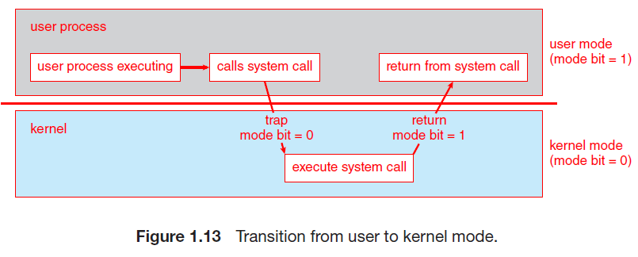
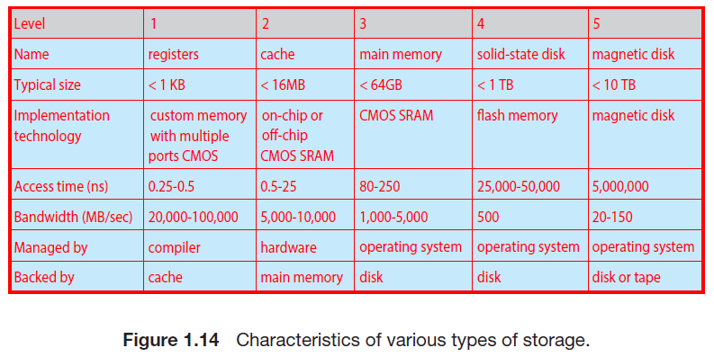
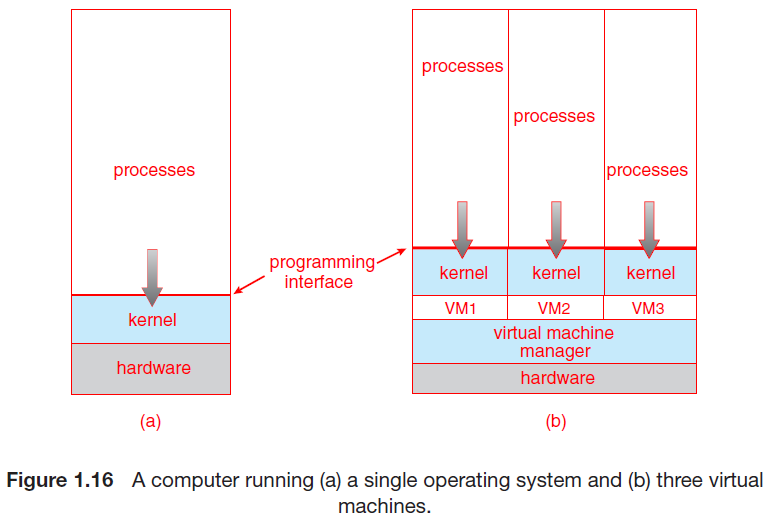

# Chapter1 서론

[[_TOC_]]

## 0 Introduction

- 운영체제란
  - 컴퓨터 하드웨어를 관리하는 소프트웨어
  - 응용 프로그램을 수행하기 위한 기반을 제공하며 컴퓨터 하드웨어와 사용자 사이의 중재자 역할
  - 

## 1.1 운영체제가 할 일

- 컴퓨터 시스템의 구성요소
  1. 하드웨어
     - 중앙 처리 장치(CPU), 메모리 및 입출력(I/O) 장치로 구성되어, 기본 계산용 자원을 제공
  2. 운영체제
     - 여러 응용 프로그램으로 인한 사용자의 계산 문제를 해결하기 위해 자원이 어떻게 사용될지를 정의
     - 다양한 사용자를 위해 다양한 응용 프로그램 간의 하드웨어 사용을 제어하고 조정
  3. 응용 프로그램
     - 워드 프로세서, 스프레드시트, 컴파일러, 웹 브라우저 등
  4. 사용자

### 1.1.1 사용자 관점

- 사용자 관점에서 설계된 운영체제는 **사용자 용이성**이 중점
  - 성능에 약간 신경을 쓰고 다양한 하드웨어와 소프트웨어 자원이 어떻게 공유되느냐의 따른 **자원의 이용**에는 전혀 신경을 쓰지 않음

### 1.1.2 시스템 관점

- 컴퓨터의 관점에서 운영체제는 하드웨어와 가장 밀접학 연관된 프로그램
  - 따라서 운영체제를 **자원 할당자**로 볼 수 있음
  - 컴퓨터 시스템은 문제 해결을 위한 자원들(메모리 공간, 저장장치 공간, CPU 시간 등)을 가짐
  - 운영체제는 이 자원들을 효율적으로 운영할 수 있도록 어느 요청에 어떤 자원을 할당할지를 결정

- 다른 관점에서 운영체제는 **제어 프로그램**
  - 컴퓨터의 부적절한 사용을 방지하기 위해 사용자 프로그램 수행을 제어(특히 입출력 장치에 대해)

### 1.1.3 운영체제의 정의

- 컴퓨터의 기능과 용도가 다양해짐에 따라 운영체제도 다양해졌고, 따라서 보편적 정의는 어려움
  - 운영체제에는 항상 실행 중인 **커널**, 응용 프로그램 개발을 쉽게 하고 기능을 제공하는 **미들웨어 프레임 워크** 및 시스템 실행 중에 시스템을 관리하는 데 도움이 되는 시스템 프로그램이 포함됨

## 1.2 컴퓨터 시스템의 구성

- 범용 컴퓨터 시스템 구성

  1. 하나 이상의 CPU

  2. 구성요소와 공유 메모리 사이의 액세를 제공하는 공통 **버스**로 연결된 여러 **장치 컨트롤러**
     - 장치 컨트롤러는 일부 로컬 버퍼 저장소와 특수 목적 레지스터 집합을 유지 관리
     - 장치 컨트롤러는 제어하는 주변 장치와 로컬 버퍼 저장소 간에 데이터를 이동

- CPU와 장치 컨트롤러는 병렬로 실행되어 메모리 사이클을 놓고 경쟁하고, 공유 메모리를 질서있게 액세스하기 위해 메모리 컨트롤러는 메모리에 대한 액세스를 동기화함

### 1.2.1 인터럽트

- 일반적인 컴퓨터의 작업(입출력 프로그램)
  1. 입출력 작업의 시작을 위해 장치 드라이버는 장치 컨트롤러의 적절한 레지스터에 값을 적재
  2. 장치 컨트롤러가 이러한 레지스터의 내용을 검사하여 수행할 작업을 결정
  3. 컨트롤러는 장치에서 로컬 버퍼로 데이터 전송을 시작
  4. 데이터 전송이 완료되면, 장치 컨트롤러는 장치 드라이버에게 작업이 완료됨을 알림
     - 작업이 완료됨을 알리는 것은 **인터럽트**를 통해서 이루어짐
  5. 장치 드라이버는 읽기 요청이면 데이터 또는 데이터에 대한 포인터를 반환하고 운영체제의 다른 부분에 제어를 넘김
  6. 다른 작업의 경우 "쓰기 완료" 또는 "장치 사용 중"과 같은 상태 정보를 반환

#### 1.2.1.1 개요

1. 하드웨어는 어느 순간이는 시스템 버스를 통해 CPU에 신호를 보내 **인터럽트**를 발생시킬 수 있음
   - 인터럽트는 다른 목적으로도 많이 사용됨(운영체제와 하드웨어 상호 작용의 핵심)
2. CPU가 인터럽트 되면, CPU는 하던 일을 중단하고 즉시 고정된 위치로 실행을 옮김
   - 고정된 위치는 일반적으로 인터럽트를 위한 서비스 루틴이 위치한 시작 주소를 가지고 있음
3. 인터럽트 서비스 루틴이 실행
4. 서비스 루틴이 완료되면, CPU는 인터럽트 되었던 연산을 재개

- 인터럽트

  - 인터럽트는 적절한 서비스 루틴으로 제어를 전달
    - 각 컴퓨터 설계는 자신의 인터럽트 메커니즘을 갖고 있고, 몇 가지는 공통적

  - 인터럽트는 매우 빈번하게 발생하므로 빠르게 처리되어야 함
    - 필요한 속도를 제공하기 위해 인터럽트 루틴에 대한 포인터들의 테이블을 대신 이용 가능
    - 이 경우 중간 루틴을 둘 필요 없이, 테이블을 통해 간접적으로 인터럽트 루틴을 호출 가능
      - 일반적으로 포인터들의 테이블은 하위 메모리에 저장(첫 100개 정도 위치)
    - 인터럽트가 요청되면, 인터럽트를 유발한 장치를 위한 인터럽트 서비스 루틴의 주소를 제공하기 위해 이 주소의 배열, 즉 인터럽트 벡터가 인터럽트 요청과 함께 주어진 고유의 유일한 장치 번호로 색인됨(Windows, UNIX가 이런 방식을 이용)
    - 또한, 인터럽트된 모든 정보를 저장해야 인터럽트를 처리한 후 복원할 수 있음
      - 인터럽트 루틴은 반드시 명시적으로 현재의 상태를 저장해야 하며, 복귀하기 전에 상태를 복원해야 함(만약, 인터럽트 루틴이 처리기의 상태를 변경할 필요가 있다면)

#### 1.2.1.2 구현

- 기본 인터럽트의 메커니즘
  1. CPU 하드웨어에는 **인터럽트 요청 라인**이라는 선이 있는데, 이는 하나의 명령어의 실행을 완료할 때마다 CPU가 이 선을 감지
  2. CPU가 컨트롤러가 인터럽트 요청 라인에 신호를 보낸 것을 감지하면, 인터럽트 번호를 읽고 이 번호를 인터럽트 벡터의 인덱스로 사용하여 **인터럽트 핸들러 루틴**으로 점프
  3. 해당 인덱스와 관련된 주소에서 실행을 시작
  4. 인터럽트 처리기는 작업 중에 변경될 상태를 저장하고, 인터럽트 원인을 확인하고, 필요한 처리를 수행하고, 상태 복원을 수행하고 return_from_interrupt 명령어를 실행하여 CPU를 인터럽트 전 실행 상태로 되돌림

- 인터럽트 구동 입출력 사이클 요약
  1. CPU가 장치 드라이버 입출력 개시
  2. 장치 컨트롤러가 입출력 개시
  3. 장치 컨트롤러가 입력 준비 완료, 출력 완료 혹은 에러가 발생할 때 인터럽트 신호를 발생시킴
  4. CPU는 인터럽트를 전달 받으면, 제어를 인터럽트 핸들어에 넘김
  5. 인터럽트 핸들러가 데이터를 처리하고 인터럽트에서 복귀
  6. CPU는 인터럽트로 중단된 작업의 처리를 재개
  7. 1로 반복?

- 최신 운영체제에서는 더욱 정교한 인터럽트 처리 기능이 필요

  1. 중요한 처리 중에 인터럽트를 연기할 수 있어야 함
  2. 장치의 적절한 인터럽트 핸들러로 효율적인 디스패치할 방법이 필요
  3. 운영체제가 우선순위가 높은 인터럽트와 낮은 인터럽트를 구분하고 적절한 긴급도로 대응할 수 있는 다단계 인터럽트가 필요

  - 해당 3가지 기능은 CPU 및 **인터럽트 컨트롤러 하드웨어**에 의해 제공
  - 대부분의 CPU는 2개의 인터럽트 요청 라인이 존재
    1. **마스크 불가능 인터럽트**: 복구할 수 없는 메모리 오류와 같은 이벤트
    2. **마스킹 가능 인터럽트**

- **인터럽트 체인**: 인터럽트 벡터의 주소 개수보다 많은 장치를 처리하기 위해 존재

- **우선순위 레벨**: 모든 인터럽트를 마스킹하지 않아도 되게 만듬
  - 우선순위가 낮은 인터럽트를 연기
  - 우선순위가 높은 인터럽트가 우선순위가 낮은 인터럽트의 실행을 선점

### 1.2.2 저장장치 구조

- CPU는 메모리에서만 명령을 적재할 수 있으므로 실행하려면 프로그램을 먼저 메모리에 적재해야 함
  - 메인 메모리(**RAM**)인 재기록 가능한 메모리에서 가져옴(**RAM**은 **DRAM**으로 구현됨)

- 다른 형태의 메모리
  - **부트스트랩 프로그램**은 컴퓨터가 실행될 때, 가장 먼저 실행되는데 **RAM**은 휘발성이므로 부트스트랩 프로그램을 유지하는 용도로 사용할 수 없음
  - 따라서 컴퓨터는 전기적으로 소거 가능한 저장장치도 사용함
    - **하드 디스크 드라이브(HDD)**, **비휘발성 메모리(NVM)** 등
      - 보통 메모리에 적재될 때까지 보조저장장치에 저장됨

- **적재** 명령: 메인 메모리로부터 CPU 내부의 레지스터로 한 바이트 또는 한 워드를 옮기는 것
- **저장** 명령: 레지스터의 내용을 메인 메모리로 옮김
- 명시적인 적재, 저장 명령 이외에 CPU는 프로그램 카운터에 저장된 위치부터 실행하기 위해 메인 메모리에서 명령을 자동으로 적재함

- **폰 노이만 구조 시스템**에서 전형적인 명령-실행 사이클
  1. 메모리로부터 명령을 인출
  2. 해당 명령을 **명령 레지스터**에 저장
  3. 명령을 해독
     - 이는 메모리로부터 피연산자를 인출하여 내부 레지스터에 저장하도록 유발할 수 있음
     - 피연산자에 대해 명령을 실행한 후에 결과가 메모리에 다시 저장될 수 있음

- 저장장치 정의와 표기
  - **비트**: 컴퓨터 저장장치의 기본 단위(0과 1 두 값 중 하나를 가짐)
  - **바이트**: 8개의 비트로 이루어짐(통상 비트가 아닌 바이트 단위로 이동하는 명령만 존재함)
  - **워드**: 하나 이상의 바이트로 구성(컴퓨터 구조의 본연의 데이터 단위)

- 최상위 4단계 메모리는 반도체 기반 전자회로로 구성된 **반도체 메모리**를 사용하여 구성
- **NVS**: 비휘발성 저장장치
  - **기계적** 유형: HDD, 광 디스크, 자기 테이프 등
  - **전기적** 유형: 플래시 메모리, **FRAM**, **NRAM**, SSD 등(이는 **NVM**)
  - 기계적 저장장치가 일반적으로 용량이 더 크고 싸지만, 느림

### 1.2.3 입출력 구조

- 1.2.1절에 설명된 인터럽트 구동 I/O의 형태는 소량의 데이터에 이동하기엔 좋지만, NVS I/O와 같은 대량 데이터 이동에는 높은 오버헤드 문제가 생길 수 있음
  - 이를 해결하기 위해 **직접 메모리 액세스(DMA)**가 사용됨
    - 장치에 대한 버퍼 및 포인터, 입출력 카운트를 세팅한 후 장치 제어기는 CPU의 개입 없이 메모리로부터 자신의 버처 장치로(또는 버퍼로부터 메모리로) 데이터 블록 전체를 전송
      - 앞선 경우처럼 바이트마다 인터럽트가 발생하는 것이 아닌 블록 전송이 완료될 때마다 발생
      - 장치 컨트롤러가 전송 작업을 수행하고 있는 동안 CPU는 다른 작업을 수행할 수 있음

## 1.3 컴퓨터 시스템 구조

- 컴퓨터 시스템은 사용된 범용 처리기의 수에 따라 분류 가능한 다양한 방식으로 구성 가능

### 1.3.1 단일 처리기 시스템

- **코어**는명령을 실행하고 로컬로 데이터를 저장하기 위한 레지스터를 포함하는 구성요소
  - 코어를 가진 하나의 메인 CPU는 프로세스의 명령어를 포함하여 범용 명령어 세트를 실행 가능
    - 모든 전용 처리기들은 제한된 명령어 집합을 실행하지만, 사용자 프로세스를 실행하지는 않음
    - 이 처리기들은 운영체제에 의해 관리되기도 하는데, 운영체제는 이 처리기들을 수행할 다음 태스크에 대한 정보를 보내고 상태를 감시함
  - 현대에는 단일 프로세스 시스템은 거의 없음

### 1.3.2 다중 처리기 시스템

- 일반적으로 단일 코어 CPU가 있는 두 개 이상의 프로세서
  - 프로세서는 컴퓨터 버스 및 때때로 클록, 메모리 및 주변 장치를 공유함
  - 일반적으로 단일보다 성능이 좋지만, 프로세서의 개수와 성능이 정비례하지는 않음
    - 여러 프로세스가 하나의 작업을 협력할 때 모든 프로세스가 올바르게 작동하게 유지하는 데 일정한 양의 오버헤드가 발생함(또한 공유 자원에 대한 경합도 성능을 낮춤)

- **SMP**(symmetric multiprocessing)
  - 가장 일반적인 다중 처리기 시스템
  - 각 CPU 처리기에는 개별 또는 로컬 캐시뿐만 아니라 자체 레지스터 세트가 있음
    - 다만, 모든 프로세서는 시스템 버스를 통해 물리적 메모리를 공유함
  - N개의 CPU가 있으면 성능을 크게 저하하지 않으면서 N개의 프로세스를 실행할 수 있다는 장점이 있음

- **다중 코어** 시스템도 다중 처리기 시스템에 포함됨
  - 칩 내 통신이 칩 간 통신보다 빠르므로 효율적일 수 있음
  - 또한, 전력을 훨씬 적게 사용함(모바일, 노트북에 매우 필수적)
  - 다중 코어 시스템은 각각의 코어가 L1 캐시를 갖고 코어들이 공유하는 L2 캐시가 존재

- 컴퓨터 시스템 구성요소 정의
  - CPU - 명령을 실행하는 하드웨어
  - 프로세서 - 하나 이상의 CPU를 포함하는 물리적인 칩
  - 코어 - CPU의 기본 계산 단위
  - 다중 코어 - 동일한 CPU에 여러 컴퓨팅 코어를 포함
  - 다중 처리기 - 여러 프로세서를 포함

- **NUMA**(non-uniform memory access)
  - 각 CPU에 작고 빠른 로컬 버스를 통해 액세스 되는 자체 로컬 메모리를 제공하는 것
  - 모든 CPU가 **공유 시스템 연결**로 연결되어 모든 CPU가 하나의 물리 주소 공간을 공유(경합 X)
  - 다만, CPU가 시스템 상호 연결을 통해 원격 메모리에 액세스해야 할 때 지연 시간이 증가하여 성능 저하가 발생할 수 있음
    - 운영체제의 신중한 CPU 스케줄링 및 메모리 관리를 통해 이런 단점을 최소화 할 수 있음

- **블레이드 서버**
  - 다수의 처리기 보드 및 입출력 보드, 네트워킹 보드들이 하나의 섀시 안에 장착되는 형태
  - 기존 다중 처리기와의 차이점은 블레이드-처리기 보드는 독립적으로 부팅될 수 있고 자기 자신의 운영체제를 수행함

### 1.3.3 클러스터형 시스템

- 여러 CPU를 가진 또 다른 유형
  - 둘 이상의 독자적 시스템 또는 노드들을 연결하여 구성한다는 점이 차이점
  - 클러스터링은 통상 **높은 가용성**을 제공하기 위해 사용됨
    - 높은 가용성은 시스템에 중복 기능을 추가함으로써 얻어짐
      - 클러스터 소프트웨어 중 한 층이 클러스터 노드에서 실행
      - 각 노드는 하나 이상의 다른 노드들을 감시
      - 감시받던 노드가 고장 나면 감시하던 노드가 고장난 노드의 저장장치에 대한 소유권을 넘겨받고, 그 노드에서 실행중이던 응용 프로그램을 다시 시작

- 클러스터링의 구성
  - **비대칭형 클러스터링**
    - 다른 컴퓨터들이 응용 프로그램을 실행하는 동안 한 컴퓨터는 **긴급 대기 모드** 상태를 유지
      - 이 긴급 대기 모드의 호스트는 활성 서버들을 감시하는 작업만 수행
      - 서버가 고장나면 해당 호스트가 활성 서버가 됨
  - **대칭형 클러스터링**
    - 둘 이상의 호스트들이 응용 프로그램을 실행하고 서로를 감시
      - 가용한 하드웨어를 모두 사용하므로 더 효율적
      - 대칭형 구성의 효율을 위해서는 하나 이상의 응용 프로그램들이 실행 가능해야 함

- **병렬화**
  - 프로그램을 컴퓨터의 개별 코어에서 혹은 클러스터의 각 컴퓨터에서 수행되는 분리된 요소로 나누는 작업을 포함
    - 각 계산 노드가 문제 일부를 해결한 후 모든 노드의 결과를 결합하여 최종 해답을 얻음(**응용**)

- **분산 잠금 관리자(DLM)**
  - 데이터에 대한 공유 접근을 제공하기 위하여, 접근간의 충돌이 발생하지 않는 것을 보장하기 위하여 접근 제어와 잠금 기법을 제공하는 기술

- **스토리지 전용 네트워크(SAN)**
  - 여러 호스트를 여러 저장장치에 부착할 수 있게 만들어 줌

## 1.4 운영체제의 작동

- 컴퓨터를 실행하기 위한 절차
  -  초기 프로그램을 실행해야 함(부트스트랩 프로그램)
    - 일반적으로 컴퓨터 하드웨어 내의 펌웨어로 저장
  - CPU 레지스터에서 장치 컨트롤러, 메모리 내용에 이르기까지 시스템의 모든 측면을 초기화
  - 부트스트랩 프로그램은 운영체제를 적재하는 방법과 해당 시스템 실행을 시작하는 방법을 알아야 함
    - 해당 목표를 위해 운영체제 커널을 찾아 메모리에 적재해야 함
  - 커널이 적재되어 실행되면 시스템과 사용자에게 서비스를 제공할 수 있음

- 실행할 프로세스, 서비스할 I/O 장치 및 응답할 사용자가 없는 경우 운영체제는 가만히 기다림

  - 이벤트는 거의 항상 인터럽트를 발생시킴

  - 또 다른 인터럽트는 **트랩**(또는 **예외**)으로, 오류 또는 사용자 프로그램의 특정 요청 때문에 발생하는 소프트웨어 생성 인터럽트
    - 특정 요청은 **시스템 콜**이라는 특수 연산을 실행하여 요청되고 운영체제가 제공하는 서비스가 수행될 것을 요구함

- HADOOP
  - 클러스터형 시스템으로 빅데이터의 분산 처리에 사용도는 공개 소스 소프트웨어 프레임워크
  - 구성요소 3가지
    1. 분산 컴퓨팅 노드에서 데이터 파일을 관리하는 **분산 파일 시스템**
    2. **YARN 프레임워크**는 클러스터 내의 자원을 관리하고 클러스터의 노드에 작업을 스케줄
    3. **MapReduce** 시스템은 클러스터의 노드에서 데이터를 병렬 처리를 가능하게 함

### 1.4.1 다중 프로그래밍과 다중 태스킹

- **다중 프로그래밍**
  - CPU가 항상 한 개는 실행할 수 있도록 프로그램을 구성하여 CPU 이용률을 높이고 사용자 만족도를 높임
  - 다중 프로그램 시스템에서 실행 중인 프로그램을 **프로세스**라고 함
  - 운영체제는 여러 프로세스를 동시에 메모리를 유지하는데 하나의 프로세스를 선택하여 실행을 할 때, 다중 프로그래밍 되지 않은 상태에서는 일부 작업이 완료할 때까지 기다려야 할 수 있음
    - 다중 프로그램 시스템에서 운영체제는 단순히 다른 프로세스로 전환하여 실행

- **다중 태스킹**
  - 다중 프로그래밍의 논리적 확장
  - 다중 태스킹 시스템에서 CPU는 여러 프로세스를 전환하며 프로세스를 실행하지만, 전환이 자주 발생하여 사용자에게 빠른 **응답 시간**을 제공
    - 즉, 출력이 사용자의 디스플레이로 입력은 키보드, 마우스 등인데 이때 사람의 입력 속도는 컴퓨터에 비해 느리므로 순간순간 빠른 전환으로 CPU의 가동률을 높이고, 성능을 높이는 것
  - 다중 태스킹에서는 적절한 응답 시간을 보장해야 함
    - 응답 시간을 보장하는 일반적인 방법은 **가상 메모리**로, 이것은 일부만 메모리에 적재된 프로세스의 실행을 허용하는 기법
      - 가상 메모리의 이점은 **물리 메모리**의 크기보다 더 커도 된다는 것
        - 메인 메모리를 크고 균등한 저장장치의 배열로 추상화하여 사용자에게 보이는 **논리 메모리**를 물리 메모리로부터 분리시킴
  - 시스템, 다중 태스킹, 다중 프로그래밍이 제공해야 하는 것들
    1. 다중 프로그래밍 및 다중 태스킹 시스템도 파일 시스템을 제공해야 함
       - 파일 시스템은 보조저장장치에 존재(따라서 저장장치 관리가 제공되어야 함)
    2. 시스템은 부적절한 사용으로부터 자원을 보호해야 함
    3. 질서 있게 실행하려면 시스템은 프로세스 동기화 및 통신을 위한 기법을 제공해야 함
    4. 프로세스가 서로를 영원히 기다리는 교착 상태에 빠지지 않도록 보장해야 함

### 1.4.2 이중-모드와 다중모드 운용

- 운영체제와 사용자는 컴퓨터 시스템의 하드웨어 및 소프트웨어 자원을 공유하므로 운영체제는 잘못된 프로그램으로 인해 다른 프로그램 또는 운영체제가 잘못 실행되지 않도록 보장해야 함
  - 시스템이 올바르게 실행하려면 운영체제 코드 실행과 사용자-정의 코드 실행을 구분할 줄 알아야 함

- 대부분의 시스템이 취하는 방법은 다양한 실행 모드를 차별화할 수 있는 하드웨어 지원을 제공하는 것
  - 이를 위해 적어도 두 개의 독립된 연산 모드, 즉 **사용자 모드**와 **커널 모드**[**수퍼바이저 모드**, **시스템 모드**(**특권 모드**)]가 필요
  - **모드 비트**라고 하는 하나의 비트가 현재의 모드를 나타내기 위해 컴퓨터 하드웨어에 추가됨
    - 이 비트는 커널 모드(0), 사용자 모드(1)을 나타탬(이를 통해 운영체제를 위한 작업과 사용자를 위한 작업을 구분)
  - 다만, 사용자 응용이 운영체제로부터 서비스를 요청하면(시스템 콜을 통함) 이 요청을 수행하기 위해서는 사용자 모드에서 커널 모드로 전환해야 함

- 시스템 부트 시
  - 하드웨어는 커널 모드에서 시작
  - 운영체제를 적재
  - 사용자 모드에서 사용자 프로세스가 실행
  - 트랩이나 인터럽트가 발생할 때마다, 하드웨어는 사용자 모드에서 커널 모드로 전환(즉, 모든 비트를 0으로)
    - 운영체제가 컴퓨터의 제어를 얻을 때마다 항상 커널 모드에 있는 것
  - 시스템은 사용자 프로그램을으로 제어를 넘기기 전에 항상 사용자 모드(모든 비트를 1로)로 전환

- 잘못된 명령을 보호하는 방법
  - 악영향을 끼칠 수 있는 일부 명령을 **특권 명령**으로 지정함으로써 이러한 보호를 달성
  - 하드웨어는 특권 명령이 커널 모드에서만 수행되도록 함
  - 즉, 사용자 모드에서 특권 명령을 수행하려고 시도하면, 하드웨어는 이를 실행하지 않고, 불법 명령으로 간주해 운영체제로 트랩을 검
  - ex) 커널 모드로 전환하는 명령

- 다중 모드
  - intel 프로세스: 4개의 분리된 **보호 링**이 존재(0은 커널 모드 3은 사용자 모드)
  - ARMv8 시스템: 7가지 모드
  - **VMM**: 시스템을 제어하는 시점을 표시하기 위한 별도의 모드를 가짐

### 1.4.3 타이머

- 운영체제가 CPU에 대한 제어를 유지할 수 있도록 보장해야 함
  - 사용자 프로그램이 무한 루프에 빠지거나 시스템 서비스 호출을 실패하여, 제어가 운영체제로 복귀하지 않은 경우가 없도록 방지
  - 이러한 목적을 달성하기 위해, **타이머**를 사용할 수 있음
    - 타이머는 지정된 시간 후 컴퓨터를 인터럽트 하도록 설정할 수 있음(시간은 고정 또는 가변적)
  - **가변 타이머**는 일반적으로 고정률의 클록과 계수기로 구현(계수기 값은 운영체제가 설정)
    - 클록이 똑딱(tick)할 때마다 계수기가 감소(계수기가 0이 될 때 인터럽트가 발생)
- 사용자에게 제어를 양도하기 전, 운영체제는 타이머가 인터럽트를 할 수 있도록 설정되었는지 확인
  - 만약 타이머가 인터럽트를 발생하면 제어는 자동으로 운영체제에 넘어감
    - 운영체제는 인터럽트를 치명적인 오류로 취급하거나, 또는 프로그램에게 더 많은 시간을 줄 수 있음
    - 타이머 값은 특권 명령

## 1.5 자원 관리

- 운영체제는 **자원 관리**

### 1.5.1 프로세스 관리

- 프로그램은  CPU에 의해 명령이 실행되지 않으면 아무것도 할 수 없음(실행 중인 프로그램 => 프로세스)
  - 프로세스는 자기 일을 수행하기 위해 CPU 시간, 메모리, 파일, 입출력 장치를 포함한 여러 자원이 필요
    - 이런 자원은 보통 실행하는 동안 할당되고 종료되면 운영체제가 회수함

- 프로그램과 프로세스
  - 프로그램 자체는 프로세스가 아님
    - 하나의 프로그램은 디스크에 저장된 파일의 내용과 같이 수동적 개체
    - 프로세스는 다음 수행할 명령을 지정하는 **프로그램 카운터**를 가진 능동적인 개체(수행은 반드시 순차적)
    - CPU는 해당 프로세스가 끝날 때까지 그 프로세스의 명령을 차례로 수행
      - 즉, 두 개의 프로세스가 동일한 프로그램과 연관되어 있어도, 그들은 두 개의 별도 수행 순서로 간주됨
    - 프로세스 중 일부는 운영체제 프로세스들(시스템 코드를 수행)이고, 나머지는 사용자 프로세스(사용자 코드 수행)

- 운영체제가 프로세스 관리와 연관하여 책임을 지는 활동
  1. 사용자 프로세스와 시스템 프로세스의 생성과 제거
  2. CPU에 프로세스와 스레드 스케줄하기
  3. 프로세스의 일시 중지와 재수행
  4. 프로세스 동기화를 위한 기법 제공
  5. 프로세스 통신을 위한 기법 제공

### 1.5.2 메모리 관리

- 메인 메모리
  - CPU와 입출력 장치에 의하여 공유되는, 빠른 접근이 가능한 데이터의 저장소
  - 일반적으로 CPU가 직접 주소를 지정할 수 있고 직접 접근할 수 있는 유일한 대량 메모리
    - 예시
      - CPU가 디스크에서 가져온 데이터를 처리
      - 데이터는 CPU가 생성한 입출력 호출에 의해 먼저 메인 메모리로 전송
      - CPU가 명령을 수행하기 위해서는 명령이 메인 메모리 내에 있어야 함

- 매핑
  - 프로그램이 수행되기 위해서는 반드시 절대 주소로 **매핑**되고 메모리에 적재되어야 함
  - 프로그램을 수행하며, 이 절대 주소를 생성해 메모리의 프로그램 명령어와 데이터에 접근
  - 프로그램이 종료되고, 프로그램이 차지하던 메모리 공간은 가용공간으로 선언되고, 다음 프로그램이 적재되어 수행할 수 있음

- 메모리 관리
  - 여러 프로그램을 유지해야 하므로 메모리 관리가 필요
  - 특정 시스템에 대한 메모리 관리 기법의 선택은 여러 요인에 의해 결정되는데, 특히 시스템의 하드웨어 설계에 좌우됨
  - 운영체제가 메모리 관리와 관령해 담당해야 하는 일
    1. 메모리의 어느 부분이 현재 사용되고 있으며 어느 프로세스에 의해 사용되는지 추적
    2. 필요에 따라 메모리 공간을 할당하고 회수
    3. 어떤 프로세스들을 메모리에 적재하고 제거할 것인가 결정

### 1.5.3 파일 시스템 관리

- 운영체제는 정보 저장장치에 대한 균일한 논리적 관점을 제공
  - 저장장치의 물리적 특성을 추상화하여 논리적인 저장 단위인 파일을 정의함
    - 파일을 물리적 매체로 매핑하며, 저장장치를 통해 이들 파일에 접근
  - 파일은 파일 생성자에 의해 정의된 관련 정보의 집합체로 일반적으로 프로그램과 데이터를 나타냄
    - 파일은 통상 사용하기 쉽도록 디렉터리들로 구성됨
  - 운영체제는 파일 관리를 위하여 다음의 일을 담당
    1. 파일의 생성 및 제거
    2. 디렉터리 생성 및 제거
    3. 파일과 디렉터리를 조작하기 위한 프리미티브의 제공
    4. 파일을 보조저장장치로 매핑
    5. 안정적인(비휘발성) 저장 매체에 파일을 백업

### 1.5.4 대용량 저장장치 관리

- 운영체제는 보조저장장치 관리와 관련하여 다음의 일을 담당
  1. 마운팅과 언마운팅
  2. 사용 가능 공간의 관리
  3. 저장장소 할당
  4. 디스크 스케줄링
  5. 저장장치 분할
  6. 보호

- 3차 저장장치
  - 보조저장장치보다 더 느리고 비용은 적게 들고 용량이 큰 장치를 필요한 경우 사용함
  - ex) 테이프 드라이브, CD, DVD, Blue-ray
  - 운용체제의 성능에는 큰 영향은 없으나(보조저장장치는 큰 영향) 관리는 해야 함

### 1.5.5 캐시 관리

- **캐싱**
  - 캐시는 정보를 더 빠르게 처리함(메인 메모리 보다)
  - 정보를 읽을 때, 캐시를 먼저 읽고, 없다면 메인 메모리를 읽게 됨
  - 따라서 캐시에는 다음에 사용될 확률이 높은 정보들을 넣게 됨

- **캐시 관리**
  - 캐시 크기는 제한적이므로 캐시의 관리는 중요한 설계 문제
  - 캐시 크기와 교체 정책을 신중하게 선택하면 성능이 크게 향상될 수 있음

- 일반적으로 캐시로부터 CPU 및 레지스터로 데이터 전송은 운영체제 간섭이 없이 하드웨어에서 일어나지만, 디스크와 메모리 간의 데이터 전송은 제어됨

- **캐시 일관성 문제**
  - 동일한 데이터가 서로 다른 수준의 저장장치 시스템에 나타나 생기는 문제
    - ex) B 파일에 있는 A 변수를 변경해야 할 경우
      - B(자기 디스크로 가정)에서 A가 있는 디스크 블록을 메인 메모리로 복사하는 입출력 연산을 호출
      - A를 캐시에 복사하고, 이어 다시 내부 레지스터로 복사
      - 이 과정속에서 여러 A가 생길 수 있음
  - 단일 CPU가 아닌 다중 태스킹에서는 문제가 발생하게 됨

### 1.5.6 입출력 시스템 관리

- 운영체제의 목적 중 하나는 특정 하드웨어 장치의 특성을 사용자에게 숨기는 것
  - ex) UNIC에서 입룰력 장치의 특성은 **입출력 서브시스템**에 의해 숨겨져 있음

## 1.6 보안과 보호

- 다수의 사용자 및 프로세스 환경에서는 데이터에 대한 접근의 규제가 필요

- **보호**
  - 컴퓨터 시스템이 정의한 자원에 대해 프로그램, 프로세스, 사용자 접근을 제어하는 기법
  - 이 기법은 시행될 제어에 대한 명세와 이들을 강제 시행하는 방법을 규정하는 수단을 반드시 제공해야 함
  - 구성요소 서브시스템 간의 인터페이스에서 잠재적인 오류를 검출함으로써 시스템의 신뢰성을 증가시킬 수 있음

- **보안**
  - 외부 또는 내부의 공격을 방어하는 기능

- **사용자 식별자**(Window => **보안 식별자(SID)**)
  - 보호와 보안을 제공하기 위해서는 시스템의 모든 사용자를 구분할 수 있어야 하는데,  이때 사용자 이름과 연관된 리스트를 의미
    - 식별자는 사용자마다 할당되고 시스템에서 유일한 값을 가짐
    - 사용자가 로그인 할 때 인증 단계에서 사용자에게 맞는 적절한 식별자를 결정(이 식별자는 사용자의 모든 프로세스나 스레드에 연관)
    - 식별자를 사용자가 읽어야 할 필요가 있을 대 사용자 이름 리스트를 통하여 원래의 사용자 이름으로 변환

- **그룹 식별자**
  - 각 사용자가 아닌 사용자의 집합을 정의한 리스트(똑같이 관련된 모든 프로세스나 스레드에 연관)

- **유효 사용자 식별자**
  - 사용자가 원하는 작업을 수행하기 위해 **권한을 상승**해야 할 때, 프로세스가 종료되거나 특권을 해제하기 전까지 수행됨
    - ex) 제한된 장치에 접근

## 1.7 가상화

- **가상화**
  - 단일 컴퓨터(CPU, 메모리, 디스크 드라이브)의 하드웨어를 여러 가지 실행 환경으로 추상화하여 개별 환경이 자신만의 컴퓨터에서 실행되고 있다는 환상을 만들 수 있는 기술

- **가상 머신**
  - 단일 운영체제에서 동시에 실행되는 다양한 프로세스 간에 전환할 수 있는 것과 동일한 방식으로 다양한 운영체제 간에 전환될 수 있음

- **가상 머신 관리자(VMM)**
  - 게스트 운영체제를 수행하고 그들의 자원 이용을 관리하며 각 게스트를 서로로부터 보호
    - 다수의 운영체제를 설치할 수 있게 만들어줌

## 1.8 분산 시스템

- 분산 시스템
  - 물리적으로 떨어져 있는 이기종 컴퓨터들의 집합(네트워크로 연결)

- **네트워크**
  - 두 개 이상 시스템 간의 통신 경로(사용되는 프로토콜, 노드 간의 거리, 전송 매체에 따라 다름)
  - **TCP/IP**는 가장 일반적인 네트워크 프로토콜로 인터넷 기본 구조를 제공
  - 거리에 따른 네트워크
    - **근거리 통신망(LAN)**은 한 방, 한 층, 한 건물에 존재
    - **광역 통신망(WAN)**은 통상 건물, 도시 또는 국가 사이를 연결
    - **도시권 통신망(MAN)**은 한 도시 내의 건물들을 연결할 수 있음
    - **블루투스(BlueTooth)**와 **802.11** 장치는 무선 통신 기술을 사용하여 수 미터 짧은 거리에서 통신
      - **단거리 통신망(PAN)**을 만듬

## 1.9 커널 자료구조

### 1.9.1 리스트, 스택, 큐

- **배열**
  - 가장 기본적인 자료구조(다만, 크기가 변하는 데이터는 다른 자료구조를 사용해야 함)
  - 각 항에 직접 접근이 가능

- **리스트**
  - 마찬가지로 가장 기본적인 자료구조
  - 항들을 순서로 접근

- **연결 리스트**
  - 연결 리스트의 종류
    - **단일 연결 리스트**는 뒷 항을 가리킴
    - **이중 연결 리스트**는 앞 항과 뒷 항을 가리킴
    - **원형 연결 리스트**는 마지막 항이 null이 아니라 첫 항을 가리킴
  - 연결 리스트는 가변 수의 항들을 수용하며 항의 삭제와 삽입이 쉬움
    - 기본 리스트는 특정 항을 인출할 때 O(n)

- **스택**
  - 순차적 순서를 가진 자료구조로 항을 넣거나 꺼내는 데 **후입선출(LIFO)**을 사용
  - 마지막에 삽입된 항이 먼저 인출
  - 삽입을 PUSH, 인출을 POP이라 함
  - 운영체제는 함수를 호출할 경우 종종 스택을 사용함

- **큐**
  - 순차 순서의 자료구조로 **선입선출(FIFO)**을 사용

### 1.9.2 트리

- 트리
  - 데이터의 서열(부모 자식)을 표시하는 데 사용 가능한 자료구조
  - 트리의 종류
    - **일반 트리**는 부모는 임의의 수의 자식을 가질 수 있는 트리
    - **이진 트리**는 부모는 최대 두 개의 자식을 가질 수 있음(좌측 자식, 우측 자식)
      - **이진 탐색 트리**는 추가로 부모의 두 자신 사이에 좌측 자식 <= 우측 자신의 순서를 요구함
        - 일반 트리는 특정 항을 찾을 때 O(n)이지만 이진 탐색 트리는 O(log n)

### 1.9.3 해시 함수와 맵

- **해시 함수**
  - 데이터를 입력 받아 이 데이터에 산술 연산을 수행하여 하나의 수를 반환
  - 이 수는 그 데이터를 인출하기 위해 테이블의 인덱스로 사용할 수 있음
    - 즉, 크기 n인 리스트에서 데이터를 찾을 때 O(n)인 반면, 해시 함수를 이용하면 O(1)만큼 좋을 수 있음
  - 다만, **해시 충돌**이 발생할 수 있음
    - 두 개의 다른 입력이 동일한 출력 값을 가질 수 있다는 의미
  - 해시 함수의 한 용도는 **해시 맵**을 구현하는 것
    - 해시 맵은 해시 함수를 사용하여 [키:값]을 연관시킴
    - 일단 매핑이 성립되면 키에 해시 함수를 적용하여 해시 맵으로부터 그 값을 얻을 수 있음

- **비트맵**

  - n개의 항의 상태를 나타내는 데 사용 가능한 n개의 이진 비트의 스트링

    - ex) 다수의 자원이 있을 때, 각 자원의 가용 여부를 0(가능), 1(불가)로 표시해보면
      - `001011101`로 표시될 수 있음
      - 8개의 값을 하나의 바이트로 표현한 것으로 자료구조의 크기를 축소시킨 것(비트맵이 아니면 8배의 크기가 되는 것)

    - ex) 중간 크기의 디스크 드라이브는 **디스크 블록**이라 불리는 수천 개의 독립된 단위로 나눠짐
      - 각 디스크 블록의 가용 여부를 나타내기 위해 비트맵을 사용할 수 있음