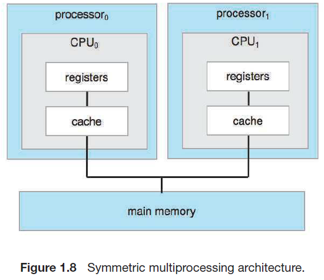
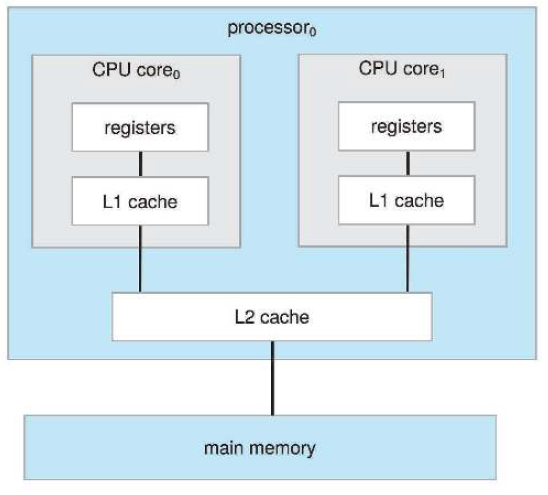
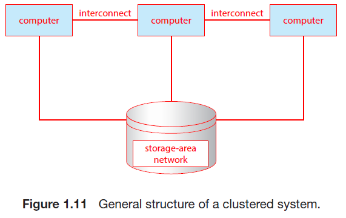

# Chapter1 서론

[[_TOC_]]

## 0 Introduction

- 운영체제란
  - 컴퓨터 하드웨어를 관리하는 소프트웨어
  - 응용 프로그램을 수행하기 위한 기반을 제공하며 컴퓨터 하드웨어와 사용자 사이의 중재자 역할
  - 

## 1.1 운영체제가 할 일

- 컴퓨터 시스템의 구성요소
  1. 하드웨어
     - 중앙 처리 장치(CPU), 메모리 및 입출력(I/O) 장치로 구성되어, 기본 계산용 자원을 제공
  2. 운영체제
     - 여러 응용 프로그램으로 인한 사용자의 계산 문제를 해결하기 위해 자원이 어떻게 사용될지를 정의
     - 다양한 사용자를 위해 다양한 응용 프로그램 간의 하드웨어 사용을 제어하고 조정
  3. 응용 프로그램
     - 워드 프로세서, 스프레드시트, 컴파일러, 웹 브라우저 등
  4. 사용자

### 1.1.1 사용자 관점

- 사용자 관점에서 설계된 운영체제는 **사용자 용이성**이 중점
  - 성능에 약간 신경을 쓰고 다양한 하드웨어와 소프트웨어 자원이 어떻게 공유되느냐의 따른 **자원의 이용**에는 전혀 신경을 쓰지 않음

### 1.1.2 시스템 관점

- 컴퓨터의 관점에서 운영체제는 하드웨어와 가장 밀접학 연관된 프로그램
  - 따라서 운영체제를 **자원 할당자**로 볼 수 있음
  - 컴퓨터 시스템은 문제 해결을 위한 자원들(메모리 공간, 저장장치 공간, CPU 시간 등)을 가짐
  - 운영체제는 이 자원들을 효율적으로 운영할 수 있도록 어느 요청에 어떤 자원을 할당할지를 결정

- 다른 관점에서 운영체제는 **제어 프로그램**
  - 컴퓨터의 부적절한 사용을 방지하기 위해 사용자 프로그램 수행을 제어(특히 입출력 장치에 대해)

### 1.1.3 운영체제의 정의

- 컴퓨터의 기능과 용도가 다양해짐에 따라 운영체제도 다양해졌고, 따라서 보편적 정의는 어려움
  - 운영체제에는 항상 실행 중인 **커널**, 응용 프로그램 개발을 쉽게 하고 기능을 제공하는 **미들웨어 프레임 워크** 및 시스템 실행 중에 시스템을 관리하는 데 도움이 되는 시스템 프로그램이 포함됨

## 1.2 컴퓨터 시스템의 구성

- 범용 컴퓨터 시스템 구성

  1. 하나 이상의 CPU

  2. 구성요소와 공유 메모리 사이의 액세를 제공하는 공통 **버스**로 연결된 여러 **장치 컨트롤러**
     - 장치 컨트롤러는 일부 로컬 버퍼 저장소와 특수 목적 레지스터 집합을 유지 관리
     - 장치 컨트롤러는 제어하는 주변 장치와 로컬 버퍼 저장소 간에 데이터를 이동

- CPU와 장치 컨트롤러는 병렬로 실행되어 메모리 사이클을 놓고 경쟁하고, 공유 메모리를 질서있게 액세스하기 위해 메모리 컨트롤러는 메모리에 대한 액세스를 동기화함

### 1.2.1 인터럽트

- 일반적인 컴퓨터의 작업(입출력 프로그램)
  1. 입출력 작업의 시작을 위해 장치 드라이버는 장치 컨트롤러의 적절한 레지스터에 값을 적재
  2. 장치 컨트롤러가 이러한 레지스터의 내용을 검사하여 수행할 작업을 결정
  3. 컨트롤러는 장치에서 로컬 버퍼로 데이터 전송을 시작
  4. 데이터 전송이 완료되면, 장치 컨트롤러는 장치 드라이버에게 작업이 완료됨을 알림
     - 작업이 완료됨을 알리는 것은 **인터럽트**를 통해서 이루어짐
  5. 장치 드라이버는 읽기 요청이면 데이터 또는 데이터에 대한 포인터를 반환하고 운영체제의 다른 부분에 제어를 넘김
  6. 다른 작업의 경우 "쓰기 완료" 또는 "장치 사용 중"과 같은 상태 정보를 반환

#### 1.2.1.1 개요

1. 하드웨어는 어느 순간이는 시스템 버스를 통해 CPU에 신호를 보내 **인터럽트**를 발생시킬 수 있음
   - 인터럽트는 다른 목적으로도 많이 사용됨(운영체제와 하드웨어 상호 작용의 핵심)
2. CPU가 인터럽트 되면, CPU는 하던 일을 중단하고 즉시 고정된 위치로 실행을 옮김
   - 고정된 위치는 일반적으로 인터럽트를 위한 서비스 루틴이 위치한 시작 주소를 가지고 있음
3. 인터럽트 서비스 루틴이 실행
4. 서비스 루틴이 완료되면, CPU는 인터럽트 되었던 연산을 재개

- 인터럽트

  - 인터럽트는 적절한 서비스 루틴으로 제어를 전달
    - 각 컴퓨터 설계는 자신의 인터럽트 메커니즘을 갖고 있고, 몇 가지는 공통적

  - 인터럽트는 매우 빈번하게 발생하므로 빠르게 처리되어야 함
    - 필요한 속도를 제공하기 위해 인터럽트 루틴에 대한 포인터들의 테이블을 대신 이용 가능
    - 이 경우 중간 루틴을 둘 필요 없이, 테이블을 통해 간접적으로 인터럽트 루틴을 호출 가능
      - 일반적으로 포인터들의 테이블은 하위 메모리에 저장(첫 100개 정도 위치)
    - 인터럽트가 요청되면, 인터럽트를 유발한 장치를 위한 인터럽트 서비스 루틴의 주소를 제공하기 위해 이 주소의 배열, 즉 인터럽트 벡터가 인터럽트 요청과 함께 주어진 고유의 유일한 장치 번호로 색인됨(Windows, UNIX가 이런 방식을 이용)
    - 또한, 인터럽트된 모든 정보를 저장해야 인터럽트를 처리한 후 복원할 수 있음
      - 인터럽트 루틴은 반드시 명시적으로 현재의 상태를 저장해야 하며, 복귀하기 전에 상태를 복원해야 함(만약, 인터럽트 루틴이 처리기의 상태를 변경할 필요가 있다면)

#### 1.2.1.2 구현

- 기본 인터럽트의 메커니즘
  1. CPU 하드웨어에는 **인터럽트 요청 라인**이라는 선이 있는데, 이는 하나의 명령어의 실행을 완료할 때마다 CPU가 이 선을 감지
  2. CPU가 컨트롤러가 인터럽트 요청 라인에 신호를 보낸 것을 감지하면, 인터럽트 번호를 읽고 이 번호를 인터럽트 벡터의 인덱스로 사용하여 **인터럽트 핸들러 루틴**으로 점프
  3. 해당 인덱스와 관련된 주소에서 실행을 시작
  4. 인터럽트 처리기는 작업 중에 변경될 상태를 저장하고, 인터럽트 원인을 확인하고, 필요한 처리를 수행하고, 상태 복원을 수행하고 return_from_interrupt 명령어를 실행하여 CPU를 인터럽트 전 실행 상태로 되돌림

- 인터럽트 구동 입출력 사이클 요약
  1. CPU가 장치 드라이버 입출력 개시
  2. 장치 컨트롤러가 입출력 개시
  3. 장치 컨트롤러가 입력 준비 완료, 출력 완료 혹은 에러가 발생할 때 인터럽트 신호를 발생시킴
  4. CPU는 인터럽트를 전달 받으면, 제어를 인터럽트 핸들어에 넘김
  5. 인터럽트 핸들러가 데이터를 처리하고 인터럽트에서 복귀
  6. CPU는 인터럽트로 중단된 작업의 처리를 재개
  7. 1로 반복?

- 최신 운영체제에서는 더욱 정교한 인터럽트 처리 기능이 필요

  1. 중요한 처리 중에 인터럽트를 연기할 수 있어야 함
  2. 장치의 적절한 인터럽트 핸들러로 효율적인 디스패치할 방법이 필요
  3. 운영체제가 우선순위가 높은 인터럽트와 낮은 인터럽트를 구분하고 적절한 긴급도로 대응할 수 있는 다단계 인터럽트가 필요

  - 해당 3가지 기능은 CPU 및 **인터럽트 컨트롤러 하드웨어**에 의해 제공
  - 대부분의 CPU는 2개의 인터럽트 요청 라인이 존재
    1. **마스크 불가능 인터럽트**: 복구할 수 없는 메모리 오류와 같은 이벤트
    2. **마스킹 가능 인터럽트**

- **인터럽트 체인**: 인터럽트 벡터의 주소 개수보다 많은 장치를 처리하기 위해 존재

- **우선순위 레벨**: 모든 인터럽트를 마스킹하지 않아도 되게 만듬
  - 우선순위가 낮은 인터럽트를 연기
  - 우선순위가 높은 인터럽트가 우선순위가 낮은 인터럽트의 실행을 선점

### 1.2.2 저장장치 구조

- CPU는 메모리에서만 명령을 적재할 수 있으므로 실행하려면 프로그램을 먼저 메모리에 적재해야 함
  - 메인 메모리(**RAM**)인 재기록 가능한 메모리에서 가져옴(**RAM**은 **DRAM**으로 구현됨)

- 다른 형태의 메모리
  - **부트스트랩 프로그램**은 컴퓨터가 실행될 때, 가장 먼저 실행되는데 **RAM**은 휘발성이므로 부트스트랩 프로그램을 유지하는 용도로 사용할 수 없음
  - 따라서 컴퓨터는 전기적으로 소거 가능한 저장장치도 사용함
    - **하드 디스크 드라이브(HDD)**, **비휘발성 메모리(NVM)** 등
      - 보통 메모리에 적재될 때까지 보조저장장치에 저장됨

- **적재** 명령: 메인 메모리로부터 CPU 내부의 레지스터로 한 바이트 또는 한 워드를 옮기는 것
- **저장** 명령: 레지스터의 내용을 메인 메모리로 옮김
- 명시적인 적재, 저장 명령 이외에 CPU는 프로그램 카운터에 저장된 위치부터 실행하기 위해 메인 메모리에서 명령을 자동으로 적재함

- **폰 노이만 구조 시스템**에서 전형적인 명령-실행 사이클
  1. 메모리로부터 명령을 인출
  2. 해당 명령을 **명령 레지스터**에 저장
  3. 명령을 해독
     - 이는 메모리로부터 피연산자를 인출하여 내부 레지스터에 저장하도록 유발할 수 있음
     - 피연산자에 대해 명령을 실행한 후에 결과가 메모리에 다시 저장될 수 있음

- 저장장치 정의와 표기
  - **비트**: 컴퓨터 저장장치의 기본 단위(0과 1 두 값 중 하나를 가짐)
  - **바이트**: 8개의 비트로 이루어짐(통상 비트가 아닌 바이트 단위로 이동하는 명령만 존재함)
  - **워드**: 하나 이상의 바이트로 구성(컴퓨터 구조의 본연의 데이터 단위)

- 최상위 4단계 메모리는 반도체 기반 전자회로로 구성된 **반도체 메모리**를 사용하여 구성
- **NVS**: 비휘발성 저장장치
  - **기계적** 유형: HDD, 광 디스크, 자기 테이프 등
  - **전기적** 유형: 플래시 메모리, **FRAM**, **NRAM**, SSD 등(이는 **NVM**)
  - 기계적 저장장치가 일반적으로 용량이 더 크고 싸지만, 느림

### 1.2.3 입출력 구조

- 1.2.1절에 설명된 인터럽트 구동 I/O의 형태는 소량의 데이터에 이동하기엔 좋지만, NVS I/O와 같은 대량 데이터 이동에는 높은 오버헤드 문제가 생길 수 있음
  - 이를 해결하기 위해 **직접 메모리 액세스(DMA)**가 사용됨
    - 장치에 대한 버퍼 및 포인터, 입출력 카운트를 세팅한 후 장치 제어기는 CPU의 개입 없이 메모리로부터 자신의 버처 장치로(또는 버퍼로부터 메모리로) 데이터 블록 전체를 전송
      - 앞선 경우처럼 바이트마다 인터럽트가 발생하는 것이 아닌 블록 전송이 완료될 때마다 발생
      - 장치 컨트롤러가 전송 작업을 수행하고 있는 동안 CPU는 다른 작업을 수행할 수 있음

## 1.3 컴퓨터 시스템 구조

- 컴퓨터 시스템은 사용된 범용 처리기의 수에 따라 분류 가능한 다양한 방식으로 구성 가능

### 1.3.1 단일 처리기 시스템

- **코어**는명령을 실행하고 로컬로 데이터를 저장하기 위한 레지스터를 포함하는 구성요소
  - 코어를 가진 하나의 메인 CPU는 프로세스의 명령어를 포함하여 범용 명령어 세트를 실행 가능
    - 모든 전용 처리기들은 제한된 명령어 집합을 실행하지만, 사용자 프로세스를 실행하지는 않음
    - 이 처리기들은 운영체제에 의해 관리되기도 하는데, 운영체제는 이 처리기들을 수행할 다음 태스크에 대한 정보를 보내고 상태를 감시함
  - 현대에는 단일 프로세스 시스템은 거의 없음

### 1.3.2 다중 처리기 시스템

- 일반적으로 단일 코어 CPU가 있는 두 개 이상의 프로세서
  - 프로세서는 컴퓨터 버스 및 때때로 클록, 메모리 및 주변 장치를 공유함
  - 일반적으로 단일보다 성능이 좋지만, 프로세서의 개수와 성능이 정비례하지는 않음
    - 여러 프로세스가 하나의 작업을 협력할 때 모든 프로세스가 올바르게 작동하게 유지하는 데 일정한 양의 오버헤드가 발생함(또한 공유 자원에 대한 경합도 성능을 낮춤)

- **SMP**(symmetric multiprocessing)
  - 가장 일반적인 다중 처리기 시스템
  - 각 CPU 처리기에는 개별 또는 로컬 캐시뿐만 아니라 자체 레지스터 세트가 있음
    - 다만, 모든 프로세서는 시스템 버스를 통해 물리적 메모리를 공유함
  - N개의 CPU가 있으면 성능을 크게 저하하지 않으면서 N개의 프로세스를 실행할 수 있다는 장점이 있음

- **다중 코어** 시스템도 다중 처리기 시스템에 포함됨
  - 칩 내 통신이 칩 간 통신보다 빠르므로 효율적일 수 있음
  - 또한, 전력을 훨씬 적게 사용함(모바일, 노트북에 매우 필수적)
  - 다중 코어 시스템은 각각의 코어가 L1 캐시를 갖고 코어들이 공유하는 L2 캐시가 존재

- 컴퓨터 시스템 구성요소 정의
  - CPU - 명령을 실행하는 하드웨어
  - 프로세서 - 하나 이상의 CPU를 포함하는 물리적인 칩
  - 코어 - CPU의 기본 계산 단위
  - 다중 코어 - 동일한 CPU에 여러 컴퓨팅 코어를 포함
  - 다중 처리기 - 여러 프로세서를 포함

- **NUMA**(non-uniform memory access)
  - 각 CPU에 작고 빠른 로컬 버스를 통해 액세스 되는 자체 로컬 메모리를 제공하는 것
  - 모든 CPU가 **공유 시스템 연결**로 연결되어 모든 CPU가 하나의 물리 주소 공간을 공유(경합 X)
  - 다만, CPU가 시스템 상호 연결을 통해 원격 메모리에 액세스해야 할 때 지연 시간이 증가하여 성능 저하가 발생할 수 있음
    - 운영체제의 신중한 CPU 스케줄링 및 메모리 관리를 통해 이런 단점을 최소화 할 수 있음

- **블레이드 서버**
  - 다수의 처리기 보드 및 입출력 보드, 네트워킹 보드들이 하나의 섀시 안에 장착되는 형태
  - 기존 다중 처리기와의 차이점은 블레이드-처리기 보드는 독립적으로 부팅될 수 있고 자기 자신의 운영체제를 수행함

### 1.3.3 클러스터형 시스템

- 여러 CPU를 가진 또 다른 유형
  - 둘 이상의 독자적 시스템 또는 노드들을 연결하여 구성한다는 점이 차이점
  - 클러스터링은 통상 **높은 가용성**을 제공하기 위해 사용됨
    - 높은 가용성은 시스템에 중복 기능을 추가함으로써 얻어짐
      - 클러스터 소프트웨어 중 한 층이 클러스터 노드에서 실행
      - 각 노드는 하나 이상의 다른 노드들을 감시
      - 감시받던 노드가 고장 나면 감시하던 노드가 고장난 노드의 저장장치에 대한 소유권을 넘겨받고, 그 노드에서 실행중이던 응용 프로그램을 다시 시작

- 클러스터링의 구성
  - **비대칭형 클러스터링**
    - 다른 컴퓨터들이 응용 프로그램을 실행하는 동안 한 컴퓨터는 **긴급 대기 모드** 상태를 유지
      - 이 긴급 대기 모드의 호스트는 활성 서버들을 감시하는 작업만 수행
      - 서버가 고장나면 해당 호스트가 활성 서버가 됨
  - **대칭형 클러스터링**
    - 둘 이상의 호스트들이 응용 프로그램을 실행하고 서로를 감시
      - 가용한 하드웨어를 모두 사용하므로 더 효율적
      - 대칭형 구성의 효율을 위해서는 하나 이상의 응용 프로그램들이 실행 가능해야 함

- **병렬화**
  - 프로그램을 컴퓨터의 개별 코어에서 혹은 클러스터의 각 컴퓨터에서 수행되는 분리된 요소로 나누는 작업을 포함
    - 각 계산 노드가 문제 일부를 해결한 후 모든 노드의 결과를 결합하여 최종 해답을 얻음(**응용**)

- **분산 잠금 관리자(DLM)**
  - 데이터에 대한 공유 접근을 제공하기 위하여, 접근간의 충돌이 발생하지 않는 것을 보장하기 위하여 접근 제어와 잠금 기법을 제공하는 기술

- **스토리지 전용 네트워크(SAN)**
  - 여러 호스트를 여러 저장장치에 부착할 수 있게 만들어 줌