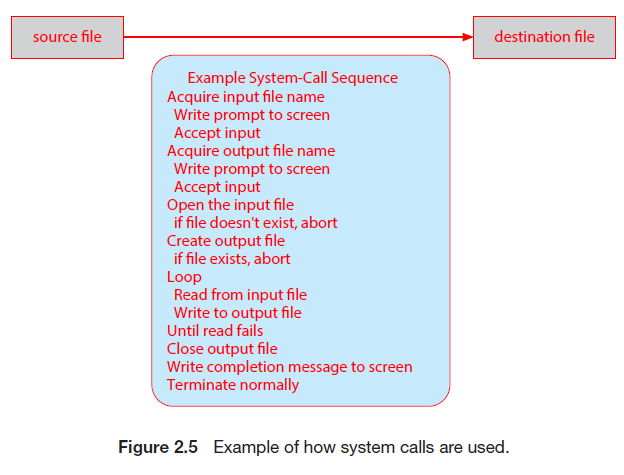
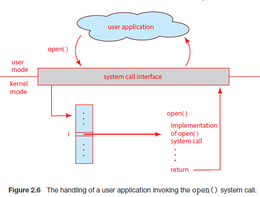
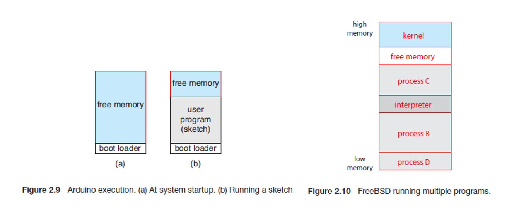

# Chapter2 운영체제 구조

- 운영체제를 살펴보기 위한 관점
  1. 운영체제가 제공하는 서비스의 초점
     - 어떤 서비스를 제공하는지
  2. 운영체제가 사용자와 프로그래머에게 제공하는 인터페이스에 초점
     - 어떤 방식으로 서비스를 제공하는지
  3. 시스템 구성요소와 그들의 상호 연결에 초점
     - 이 서비스들은 어떻게 디버깅 되며, 이러한 시스템을 설계하기 위해서는 어떤 다양한 방법들이 사용되는지

## 2.1 운영체제 서비스

- 운영체제는 프로그램 실행 환경을 제공하며 프로그램과 사용자에게 특정 서비스를 제공
  - 이러한 서비스는 프로그래머가 프로그래밍 작업을 더 쉽게 수행할 수 있도록 함

- 운영체제의 서비스
  - **사용자 인터페이스(UI)**
    - 인터페이스의 종류
      - **그래픽 사용자 인터페이스**
      - **터치스크린 인터페이스**
      - **명령어 라인 인터페이스(CLI)**
  - **프로그램 수행**
    - 시스템은 프로그램을 메모리에 적재 후 수행한 뒤, 끝낼 수 있어야 함(정상적이든 아니든)
  - **입출력 연산**
    - 사용자들은 통상 입출력 장치를 통제할 수 없으므로 운영체제가 입출력 수행의 수단을 제어해야 함
  - **파일 시스템 조작**
    - 프로그램은 파일을 읽기, 쓰기, 생성, 삭제, 탐색 등을 수행할 수 있어야 함
    - 몇몇 프로그램은 파일의 소유권에 기반한 권한 관리를 이용하여 디렉터리의 접근을 허가하거나 거부할 수 있게 함
  - **통신**
    - 한 프로세스가 다른 프로세스와 정보를 교환할 수 있어야 함
    - 통신 수행의 유형
      1. 동일한 컴퓨터에서 수행되고 있는 프로세스 사이에서 발생
      2. 네트워크에 의해 함께 묶여 있는 다른 컴퓨터 시스템에서 수행되는 프로세스 사이에서 발생
    - 통신의 구현 방법
      1. **공유 메모리**를 통하여 구현
      2. **메시지 전달** 기법으로 구현
         - 정보의 패킷들이 운영체제에 의해 프로세스들 사이를 이동
  - **오류 탐지**
    - 운영체는 모든 가능한 오류를 항상 의식하고, 적절한 대응으로 올바르고 일관성 있는 계산을 보장해야 함
    - 오류는 CPU, 메모리 하드웨어, 입출력 장치, 사용자 프로그램 등에서 발생 가능
  - **자원 할당**
    - 다수의 프로세스나 작업이 동시에 실행될 때, 그들 각각에 자원을 할당해줘야 함
      - ex) CPU 스케줄링 루틴, CPU의 처리 코어 개수, USB 저장장치 드라이브 및 프린터에 할당 등
  - **기록 작성**
    - 어떤 프로그램이 어떤 종류의 컴퓨터 자원을 얼마나 사용했는지 **사용 통계**를 기록해야 함
  - **보호(Protection) 및 보안(Security)**
    - **보호**는 시스템 자원에 대한 모든 접근이 통제되도록 보장하는 것
    - **보안**은 네트워크 어댑터 등과 같은 외부 입출력 장치들로부터 부적합한 접근 시도를 막는 것
    - 시스템이 보호되고 보안이 유지되기 위해서는 시스템 전체에 걸쳐 **예방책**이 제정되어야 함

## 2.2 사용자와 운영체제 인터페이스

- 사용자와 운영체제가 접촉하는 방법
  - 명령어 라인 인터페이스(**명령 인터프리터**)
  - 그래픽 사용자 인터페이스
  - 터치스크린 인터페이스

### 2.2.1 명령 인터프리터

- **셸**
  - 선택할 수 있는 여러 명령 인터프리터를 제공하는 시스템에서의 해석기
    - ex) Linux, UNIX에서의 Bourne shell, C shell, Korn shell 등

- **명령 인터프리터**

  - 사용자가 지정한 명령을 가져와서 수행하는 것

    - ex) 생성, 삭제, 리스트, 프린트, 복사 등

  - 명령어의 구현 방법

    1. 명령 인터프리터 자체가 명령을 실행할 코드를 가지는 경우

       - ex) 파일을 삭제하는 명령

         1. 자신의 코드의 한 부분으로 분기
         2. 그 코드 부분이 매개변수를 설정하고 적절한 시스템을 콜

         - 이 경우 제공될 수 있는 명령의 수가 명령 인터프리터의 크기를 결정
           - 각 명령이 자신의 구현 코드를 요구하기 때문

    2. 시스템 프로그램에 의해 대부분의 명령을 구현하는 것

       - 이 경우 명령 인터프리터는 전혀 그 명령을 알지 못함

       - ex) 파일을 삭제하는 명령(`rm file.txt`)

         1. rm이라 불리는 파일을 찾아서 메모리에 적재
         2. 그것을 매개변수 file.txt로 수행
         3. rm 명령과 관련된 로직은 rm이라는 파일 내의 코드로 완전하게 정의

         - 이 방법으로 프로그래머는 적합한 프로그램 로직을 가진 새로운 파일을 생성함으로써 시스템에 새로운 명령을 쉽게 추가 가능

### 2.2.2 그래픽 기반 사용자 인터페이스

- **데스크톱**이라고 특징지어지는 마우스를 기반으로 하는 윈도 메뉴 시스템을 사용
  - 마우스 포인터의 위치에 따라, 버튼을 누름으로써 프로그램을 호출하거나 파일 혹은 디렉터리(**폴더**)를 조작 가능

### 2.2.3 터치스크린 인터페이스

- 사용자는 터치스크린에서 손가락을 누르거나 스와이프 하는 등의 **제스처**를 취하여 상호 작용
  - iPad와 iPhone 모두 **Springboard** 터치스크린 인터페이스를 사용

### 2.2.4 인터페이스의 선택

- 인터페이스의 선택은 개인의 선호
  - **시스템 관리자**와 시스템에 대해 깊게 알고 있는 **파워 유저**들은 명령어 라인 인터페이스를 사용
  - **셸 스크립트**
    - 명령어-라인의 여러 절차를 파일로 저장하고, 해당 파일을 프로그램처럼 실행하는 것(UNIX, Linux)

## 2.3 시스템 콜

- **시스템 콜**
  - 운영체제에 의해 사용 가능하게 된 서비스에 대한 인터페이스를 제공

## 2.3.1 예제

- **시스템 콜**의 사용 예제

  - 한 파일로부터 데이터를 읽어서 다른 파일로 복사하는 간단한 프로그램을 작성한다고 가정

    1. 프로그램이 필요로 하는 첫 번째 입력은 두 개의 파일(입력 파일과 출력 파일의 이름)
       1. `cp in.txt out.txt`로 전달
       2. 프로그램이 사용자에게 먼저 이름을 요청
          - 화면에 프롬프트 메시지를 작성한 다음 키보드에서 두 파일의 이름을 지정하는 문자를 읽기

    2. 프로그램은 반드시 입력 파일을 오픈하고 출력 파일을 생성한 후 오픈
       - 각각의 연산은 또 다른 시스템 콜을 필요로 하며, 각 시스템 콜에서 오류가 발생하면 처리되어야 함
         - ex) 프로그램이 입력 파일을 오픈하려할 때, 파일이 존재하지 않거나 접근이 금지된 경우
           - 프로그램은 에러 메시지를 출력하고(다른 시스템 콜), 비정상적으로 종료(다른 시스템 콜)
         - ex) 입력 파일이 존재하면 새로운 출력 파일을 생성해야 하는데, 동일한 이름을 가진 파일이 존재하는 경우
           - 프로그램을 중단(abort)(다른 시스템 콜)하거나, 기존의 파일을 삭제(다른 시스템 콜)한 후 새로운 파일을 생성(다른 시스템 콜)할 수 있음
       - 대화형 시스템에서 또 다른 방법은 기존의 파일을 대체하는지, 프로그램을 중단할지 물어보는 것
    3. 두 파일이 준비되면, 입력 파일로부터 읽어서, 출력 파일에 기록하는 루프에 들어감
       - 각 읽기와 쓰기는 가능한 여러 가지 오류 상황의 정보를 반환해야 함
         - 파일의 끝에 도달하거나 읽기 중에 하드웨어 오류(ex)패리티 오류)가 발생할 수 있음
         - 쓰기 연산 시 출력 장치에 따라 여러 오류(ex)디스크 공간 부족)가 발생할 수 있음
    4. 마지막으로 전체 파일이 복사된 후, 프로그램은 두 파일을 닫고(2개의 시스템 콜), 콘솔 또는 윈도우에 메시지를 기록(추가적 시스템 콜들), 정상적으로 종료(마지막 시스템 콜)

  

### 2.3.2 응용 프로그래밍 인터페이스

- **응용 프로그래밍 인터페이스(API)**
  - 각 함수에 전달되어야 할 매개변수들과 프로그래머가 기대할 수 있는 반환 값을 포함하여 응용 프로그래머가 사용 가능한 함수의 집합을 명시
    - 응용 프로그래머가 사용 가능한 가장 흔한 3가지 API
      - Windows API
      - POSIX API
        - POSIX 기반 시스템을 위한 API
      - Java API
        - JAVA 가상 기계에서 실행될 수 있는 프로그램을 위한 API
  - 시스템 콜에 비한 API의 이점
    1. 프로그램 호환성
       - API에 다라 프로그램을 설계하면 자신의 프로그램이 같은 API를 지원하는 어느 시스템에서건 컴파일될 수 있음
    2. 복잡성
       - 시스템 콜은 종종 좀 더 자세한 명세가 필요하고 프로그램상에서 작업하기가 API보다 어려움

- **실행시간 환경(RTE)**

  - 특정 프로그래밍 언어로 작성된 응용 프로그램을 실행하는 데 필요한 전체 소프트웨어 제품군과 라이브러리 또는 로더 같은 다른 소프트웨어를 가리킴
  - **시스템 콜 인터페이스**
    - RTE 운영체제가 제공하는 시스템 콜에 대한 연결고리 역할로 API 함수의 호출을 가로채어 필요한 운영체제 시스템 콜을 부름
      - 통상 시스템 콜에는 번호가 할당되고 시스템 콜 인터페이스는 이 번호에 따라 색인되는 테이블을 유지
      - 시스템 콜 인터페이스는 의도하는 시스템 콜을 부르고 시스템 콜의 상태와 반환 값을 돌려줌
    - 호출자는 시스템 콜이 어떻게 구현되고 실행 중 무슨 작업을 하는지 알 필요가 없음
      - API를 준수하고 시스템 콜의 결과로서 운영체제가 무엇을 할 것인지만 이해하면 됨
    - 따라서 운영체제 인터페이스에 대한 대부분의 자세한 내용은 API에 의해 숨겨지고 RTE에 의해 관리됨

  

- 운영체제에 매개변수를 전달하는 일반적 방법
  - 매개변수를 레지스터 내에 전달(가장 간단한 방법)
    - 어떤 경우에는 레지스터보다 더 많은 매개변수가 있을 수 있음
      - 매개변수는 메모리 내의 블록이나 테이블에 저장되고, 블록의 주소가 레지스터 내에 매개변수로 전달
      - 5개 이하의 매개변수가 있으면 레지스터, 5개 이상이면 블록
  - 매개변수는 **스택(stack)**에 **넣어질(push)** 수 있고, 운영체제에 의해 **꺼내진다(pop off)**

### 2.3.3 시스템 콜의 유형

- 시스템 콜의 다섯가지 범주
  - **프로세스 제어**, **파일 조작**, **장치 조작**, **정보 유지 보수**, **통신**과 **보호**

#### 2.3.3.1 프로세스 제어

- 실행 중인 프로그램은 수행이 정상적(end())으로 또는 비정상적(abort())으로 멈출 수 있어야 함

- **디버거**
  - 특별한 파일이나 디스크에 기록된 덤프를 통해 문제의 원인을 결정하기 위해 하는 검사
    - **덤프**는 실행 중인 프로그램을 비정상적으로 종료하기 위해 오류 트랩을 유발할 경우, 때때로 메모리 덤프가 행해지고 생성된 오류 메시지

- 정상적이거나 비정상적인 상황에서 
  - 운영체제는 명령 인터프리터로 제어를 전달해야 함
  - 명령 인터프리터는 다음 명령을 읽음
    - 대화식 시스템에서 명령 인터프리터는 단순히 다음 명령을 계속 수행하며, 사용자가 오류에 응답하는 적절한 명령을 내릴 것이라 가정
    - GUI 시스템에서는 팝업 윈도우가 사용자에게 오류를 알리고 지시를 기다림

- 프로세스에서 적재된(load()) 프로그램이 종료되었을 때, 제어를 어디로 돌려주는가?
  - 만약 기존 프로그램으로 돌아간다면?
    - 반드시 기존 프로그램의 메모리 이미지를 보관해야 함
      - 즉, 한 프로그램이 다른 프로그램을 호출하는 기법을 만든 것
  - 만약 새로운 잡이나 프로세스, 혹은 잡들이나 프로세스들의 집합을 생성한다면?
    - `creat_process()` 프로세스를 생성할 경우
    - 이들의 실행을 제어할 수 있어야 함
      - `get_procee_attribute()` 
      - `get_process_attributes()` 및 `set_process_attributes()`
        - 이 제어는 잡의 우선순위, 최대 허용 실행 시간 등 잡 혹은 프로세스의 속성들을 결정하고 재설정(reset)할 수 있어야 함
      - `terminate_process()` 생성한 잡이나 프로세스가 잘못되거나 필요 없어진 경우 종료해야 할 수 있음

- 새로운 프로세스를 생성한 이후에는?
  - 이들의 실행이 끝나길 기다려야 할 수 있음
    - `wate_time()` 일정 시간만큼 기다리기 원하는 경우
    - `wait_event()` 특정 이벤트가 일어날 때까지 기다리는 경우
      - `signal_event()` 이벤트가 일어나면 신호를 보냄

- 프로세스들의 데이터 공유
  - 공유되는 데이터의 일관성을 보장하기 위해서 운영체제는 종종 프로세스가 공유 데이터를 **잠글** 수 있는 시스템 콜을 제공
    - 잠금이 해제될 때까지 어느 프로세스도 데이터에 접근할 수 없게 됨
    - `acquire_lock()` `release_lock()`

- 단일 태스킹과 다중 태스킹

  - 단일 태스킹: 한 순간에 하나의 프로그램(스케치)만 메모리에 존재할 수 있는 경우
    - **스케치**: USB 연결을 통해 컴파일된 프로그램
  - 다중 태스킹: 한 순간에 다수의 프로그램(스케치)이 메모리에 존재할 수 있는 경우

  

#### 2.3.3.2 파일관리

- 파일 시스템에서 다루는 공통적인 시스템 콜
  - `creat()` 파일 생성
  - `delete()` 파일 삭제
  - `open()` 파일 열기
  - `read()` 읽기
  - `write()` 쓰기
  - `reposition()` 위치 변경
  - `rewind()` 되감기나 파일 끝으로 건너뛰기
  - `close()` 파일 닫기
  - 파일 속성
    - 파일 이름, 파일 유형, 보호 코드, 회계 정보 등을 포함
    - 파일 속성을 재설정(reset)하기 위해 필요한 시스템 콜
      - `get_file_attribute()` 최소한 파일 속성 획득
      - `set_file_attribute()` 파일 속성 설정

#### 2.3.3.3 장치 관리

- 프로세스가 작업을 수행하기 위해 추가 자원이 필요한 경우
  - ex) 주 기억장치, 디스크 드라이브, 파일에 접근 등
  - 자원이 사용 가능한 경우 주어지고, 제어가 사용자 프로그램으로 복귀될 수 있음
  - 아닌 경우 충분한 자원을 사용 가능할 때까지 기다려야 함

- 운영체제에 의해 제어되는 자원
  - 자원들은 장치로 간주될 수 있음
    - 물리 장치 - 디스크 드라이브
    - 가상적 장치 - 파일
  - `request()` 다수의 사용자가 동시에 사용하는 시스템에서 독점적인 사용을 요청
  - `release()` 해당 장치의 사용이 끝나면 방출

#### 2.3.3.4 정보 유지 관리

- 많은 시스템 콜은 단순히 사용자 프로그램과 운영체제 간의 정보 전달을 위해 존재
  - ex
    - `time()` 시간을 돌려줌
    - `date()` 날짜를 돌려줌
  - 다른 시스템 콜은 버전 번호, 자유 메모리 또는 자유 디스크 공간 등과 같은 시스템 정보를 알려줌

- 시간 프로파일(time profile)
  - 프로그램이 특정 위치, 혹은 위치의 집합에서 수행한 시간의 양을 나타냄
  - 이를 위해서는 추적 설비(tracing facility)나 정규 타이머 인터럽트가 필요함
  - 타이머 인터럽트가 발생할 때마다, 프로그램 카운터의 값이 기록
  - 따라서 충분히 빈번하게 일어난다면, 프로그램의 여러 부분에서 소비한 시간의 통계적 그림을 얻을 수 있음

- 운영체제는 현재 운영되는 프로세스에 관한 모든 정보를 가지고 있음
  - `get_file_attribute()` `set_file_attribute()` 등

#### 2.3.3.5 통신

- 통신 모델

  1. 메시지 전달 모델
     - 통신하는 두 프로세스가 정보를 교환하기 위하여 서로 메시지를 주고 받음(직접 or 간접)
       - 통신이 이루어지기 전에 반드시 연결이 열려야 함
       - 상대 통신자의 이름을 반드시 알고 있어야 함
         - 네트워크의 각 컴퓨터는 **호스트 이름**을 가지고, 일반적으로 알려져 있음
         - 마찬가지로, 각 프로세스는 **프로세스 이름**을 갖고 있고, 이름은 운영체제제 의해 동등한 식별자로 반환되고, 식별자는 운영체제가 프로세스를 가리키는 데 사용할 수 있음
           - `get_hostid()` `get_processid()` 식별자 변환을 수행
         - 식별자는 시스템의 통신 모델에 따라 파일 시스템에 의해 제공되는 범용의 `open` `close` 호출에 전달되거나, 특정 `open_connection()`과 `close_connection` 시스템 콜에 전달됨
       - 수신 프로세스는 통신이 일어날 수 있도록 `accept_connection()` 호출에 자신의 허가를 제공
         - 연결을 받아들일 프로세스들의 대부분은 특수 목적인 **디먼(daemon)**임(원래 이런 목적으로 설계됨)
       - 연결을 위해 대기 호출을 수행하고 연결이 이루어질 때 깨어남
       - **클라이언트**로 알려진 통신의 출발지와 **서버**로 알려진 수신 디먼은 `read_message()`와 `write_message()` 시스템 콜에 의해 메시지들을 교환
       - `close_connection()`은 호출 통신을 종료
  2. 공유 메모리 모델
     - 프로세스는 다른 프로세스가 소유한 메모리 영역에 대한 접근을 위해 `shared_memory_creat()`와 `shared_memory_attach()` 시스템 콜을 사용
     - 운영체제는 한 프로세스가 다른 프로세스의 메모리에 접근을 막으므로 두 개 이상의 프로세스가 이러한 제한을 제거하는 데 동의할 것이 필요
     - 이후 공유 영역에서 데이터를 읽고 씀으로써 정보를 교환

  - 위의 두가지 모델이 보편적이며, 보통 둘 다 구현되어 있음
    - 메시지 전달이 유리한 점
      - 메시지 전달은 소량의 데이터를 교환할 때 유리(피해야 할 충돌이 없기 때문)
      - 컴퓨터간 통신을 구현하기가 더 쉬움
    - 공유 메모리가 유리한 점
      - 한 컴퓨터 안에서는 메모리 전송 속도로 수행할 수 있으므로 최대 속도와 편리한 통신을 허용
        - 다만, 보호와 동기화 부분에서 문제를 가짐

#### 2.3.3.6 보호

- 보호
  - 시스템이 제공하는 자원에 대한 접근을 제어하기 위한 기법을 지원
    - `set_permission()` `get_permission()` 파일과 디스크와 같은 자원의 허가 권한을 설정하는 데 이용
    - `alloy_user()` `deny_user()` 특정 사용자가 지정된 자원에 대해 접근이 허가 또는 불허되었는지를 명시

