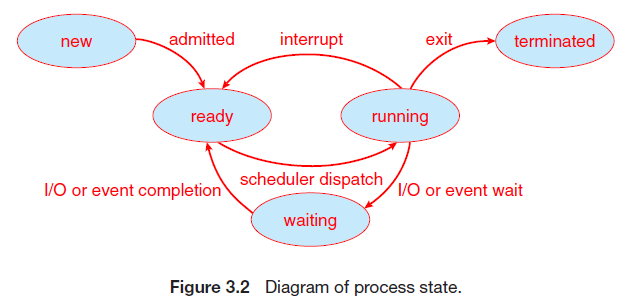
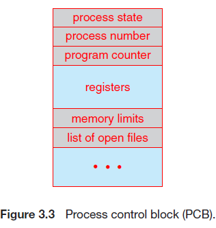
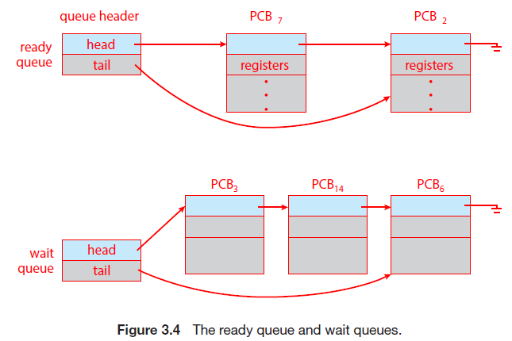
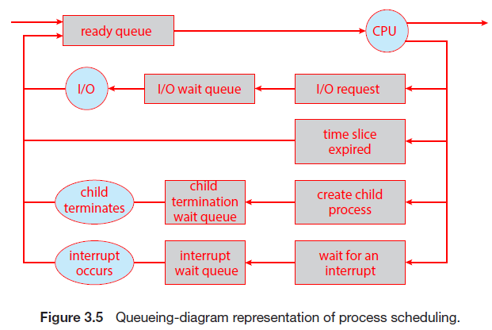
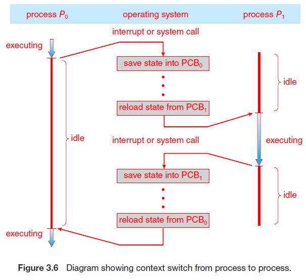
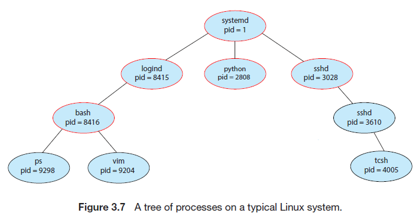
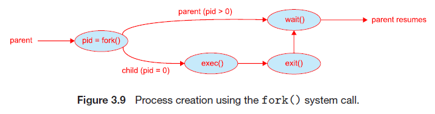
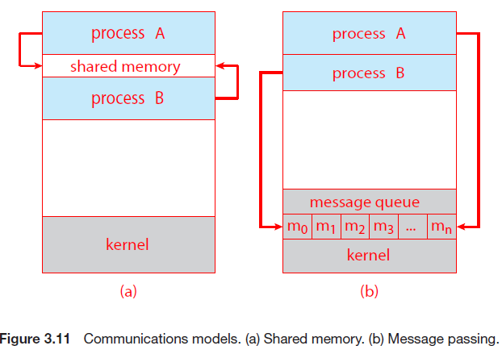
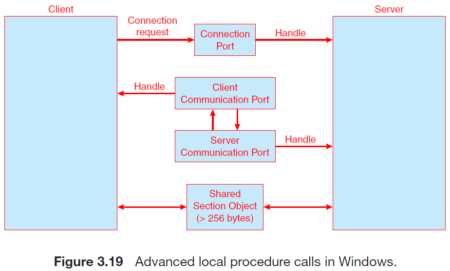

# Chapter3 프로세스

[[_TOC_]]

- 오늘날의 컴퓨터 시스템들은 메모리에 다수의 프로그램이 적재되어 병행 실행 되는데, 이러한 발전은 다양한 프로그램을 보다 견고하게 제어하고 보다 구획화할 것이 필요
  - 이런 필요가 프로세스의 개념을 낳았고, **프로세스**란 실행 중인 프로그램을 말함(현대 컴퓨팅 시스템에서 작업의 단위)


## 3.1 프로세스 개념

- 모든 CPU 활동들을 어떻게 부를 것인가?
  - 과거
    - 초기 컴퓨터는 **작업**을 실행하는 일괄 처리 시스템
    - 이후 **사용자 프로그램** 또는 **태스크**를 실행하는 시분할 시스템


### 3.1.1 프로세스

- **프로세스**

  - 비공식적으로 프로세스란 실행 중인 프로그램
  - 프로세스의 현재 활동의 상태는 **프로그램 카운터** 값과 프로세서 레지스터의 내용으로 나뉨
  - 프로세스의 메모리 배치는 일반적으로 여러 섹션으로 구분
    - **텍스트 섹션** - 실행 코드
    - **데이터 섹션** - 전역 변수
    - **힙 섹션** - 프로그램 실행 중에 동적으로 할당되는 메모리
    - **스택 섹션** - 함수를 호출할 때 임시 데이터 저장장소(예: 함수 매개변수, 복귀 주소, 지역 변수)
      - 텍스트 및 데이터 섹션의 크기는 고정되기 때문에 실행 시간동안 크기가 변하지 않음
      - 스택 및 힙 섹션은 프로그램 실행 중에 동적으로 줄어들거나 커질 수 있음
        - 스택 섹션
          - 함수가 호출될 때마다 함수 매개변수, 지역 변수, 복귀 주소를 포함하는 **활성화 레코드**가 스택의 푸쉬
          - 함수에서 제어가 되돌아오면 스택에서 **활성화 레코드**가 팝됨
        - 힙 섹션
          - 메모리가 동적으로 할당됨에 따라 힙이 커지고 메모리가 시스템에 반환되면 축소
        - 스택과 힙 섹션이 서로의 **방향으로** 커지더라도 운영체제는 서로 **겹치지** 않도록 해야 함

  

  - 프로그램과 프로세스
    - 프로그램 그 자체는 프로세스가 아님
      - 프로그램은 명령어 리스트를 내용으로 가진 디스크에 저장된 파일(**실행 파일**)과 같은 **수동적인** 존재
      - 프로세스는 다음에 실행할 명령어를 지정하는 프로그램 카운터와 관련 자원의 집합을 가진 **능동적인** 존재
    - 실행 파일이 메모리에 적재될 때 프로그램은 프로세스가 됨
      - 적재의 방법
        1. 실행 파일을 나타내는 아이콘을 더블 클릭
        2. 명령어 라인상에서 `prog.exe` 또는 `a.out`과 같이 파일이름을 입력하는 방식

  

  - 두 프로세스들이 동일한 프로그램에 연관될 수 있지만, 이들 두 개의 별도의 실행 순서로 간주
    - 즉, 텍스트 섹션이 동등하다 할지라도 데이터, 힙, 스택 섹션은 다를 수 있음
    - 프로세스가 실행되는 과정에서 많은 프로세스를 생성하는 것이 보통

  

  - 프로세스 자체가 다른 개체를 위한 실행 환경으로 동작할 수 있음
    - Java의 예
      - 대부분의 상황에서 실행 가능한 Java 프로그램은 Java 가상기계(JVM) 안에서 실행
      - JVM은 적재된 Java 코드를 해석하고 그 코드를 대신하여 원 기계어를 이용하여 행동을 취하는 프로세스로서 프로그램을 실행
        - 예를 들어, 컴파일된 Java 프로그램 Program.class를 실행하기 위해 `java program` 명령어 입력
          - java 명령어는 JVM을 보통의 프로세스처럼 실행시킴
          - JVM은 Java 프로그램 Program을 가상기계 안에서 실행

  

  ### 3.1.2 프로세스 상태

  - **상태**
    - 프로세스는 실행되면서 변화되며, 프로세스의 현재의 활동에 따라서 정의됨
      - **생성(new)**: 프로세스가 생성 중
      - **실행(running)**: 명령들이 실행 중
      - **대기(waiting)**: 프로세스가 어떤 이벤트가 일어나기를 기다림
      - **준비(ready)**: 프로세스가 처리기에 할당되기를 기다림
      - **종료(terminated)**: 프로세스의 실행이 종료
    - 이 이름들은 임의적이며 운영체제마다 변하지만, 이들이 나타내는 상태는 모든 시스템에서 공통적
      - 한 순간에 한 처리기 코어에서는 오직 하나의 프로세스만 실행됨이 중요

    

  

  ### 3.1.3 프로세스 제어 블록

  - **프로세스 제어 블록**(PCB)(혹은 **태스크 제어 블록**)

    - 약간의 회계 데이터와 프로세스를 시작시키거나 다시 시작시키기 위한 모든 데이터를 저장
    - 특정 프로세스와 연관된 여러 정보를 수록함
      - **프로세스 상태**: 상태는 생성, 준비, 실행, 대기, 정지(halted) 등
      - **프로그램 카운터**: 프로그램 카운터는 이 프로세스가 다음에 실행할 명령어의 주소를 가리킴
      - **CPU 레지스터들**: CPU 레지스터는 컴퓨터의 구조에 따라 다양한 수와 유형을 가짐
        - 레지스터에는 누산기(accumulator), 인덱스 레지스터, 스택 레지스터, 범용(general-purpose) 레지스터, 상태 코드 정보가 포함
        - 프로그램 카운터와 함께 이 정보는 프로세스가 다시 스케줄될 때 올바르게 실행하도록 하기 위해 인터럽트 발생 시 저장되야 함
      - **CPU 스케줄링 정보**: 프로세스 우선순위, 스케줄 큐에 대한 포인터와 다른 스케줄 매개변수를 포함
      - **메모리 관리 정보**: 이 정보는 운영체제에 의해 사용되는 메모리 시스템에 따라 기준(base) 레지스터, 한계(limit) 레지스터 값, 운영체제가 사용하는 메모리 시스템에 따라 페이지 테이블 또는 세그먼트 테이블 등과 같은 정보를 포함
      - **회계 정보**: CPU 사용 시간, 경과된 시간, 시간 제한, 계정 번호, 잡 또는 프로세스 번호 등을 포함
      - **입출력 상태 정보**: 프로세스에 할당된 입출력 장치들과 열린 파일의 목록 등을 포함

    

  

  ### 3.1.4 스레드

  - 현대 운영체제는 한 프로세스가 다수의 스레드를 가질 수 있도록 허용함
    - 즉, 프로세스가 한 번에 하나 이상의 일을 수행할 수 있게 함
    - 이를 통해 다중 처리기 시스템에서 여러 스레드가 병렬로 실행될 수 있음

  

  ## 3.2 프로그램 스케줄링

  - 다중 프로그램
    - 목적: CPU의 이용을 최대로 하기 위해 항상 어떤 프로세스가 실행되도록 만드는 것
    - 시분할의 목적은 각 프로그램이 실행되는 동안 사용자가 상호 작용할 수 있도록 프로세스들 사이에서 CPU 코어를 빈번하게 교체하는 것
      - 해당 목적을 위해 **프로세스 스케줄러**는 코어에서 실행 가능한 여러 프로세스 중에서 하나의 프로세스를 선택
      - 한 개의 CPU 코어는 한 번에 한 개만 실행 가능하므로 코어보다 많은 프로세스가 있는 경우 초과 프로세스는 대기해야 함
        - **다중 프로그래밍 정도**: 현재 메모리에 있는 프로세스 수

  

  - 다중 프로그래밍과 시간 공유의 목표를 균형 있게 유지하려면 프로세스의 일반적인 동작을 고려해야 함
    - 일반적으로 대부분의 프로세스는 I/O 바운드, CPU 바운드
      - **I/O바운드 프로세스**: 계산보다 I/O에 더 많은 시간을 소비하는 프로세스
      - **CPU 바운드 프로세스**: 계산에 더 많은 시간을 사용하여 I/O 요청을 자주 생성하지 않는 프로세스

  

  ### 3.2.1 스케줄링 큐

  - 프로세스가 시스템에 들어가면
    - **준비 큐**에 들어가 준비 상태가 되어 CPU 코어에서 실행을 기다림
      - 해당 큐는 일반적으로 연결 리스트로 저장
    - 준비 큐는 첫 번째 PCB에 대한 포인터가 저장되고 각 PCB에는 준비 큐의 다음 PCB를 가리키는 포인터 필드가 포함

  

  - 프로세스가 CPU 코어에 할당되면

    - 프로세스는 잠시 실행되어 종료 또는 인터럽트되거나 I/O 요청의 완료와 같은 특정 이벤트가 발생할 때까지 기다림
      - I/O 완료와 같이 특정 이벤트가 발생하기를 기다리는 프로세스는 **대기 큐**에 삽입됨

    

    

    - 프로세스 스케줄링의 일반적인 표현은 그림 3.5와 같은 **큐잉 다이어그램**

      - 빨간 원 => 서비스를 제공하는 자원, 화살표 => 시스템 프로세스의 흐름

    - 절차

      - 새 프로세스는 처음에 준비 큐(ready queue)에 놓임

        - 프로세스는 실행을 위해 선택되거나 **디스패치**될 때까지 기다림

      - CPU에 놓여 실행 상태가 되면, 여러 이벤트 중 하나가 발생할 수 있음

        1. 프로세스가 I/O 요청을 공표한 다음 I/O 대기 큐에 놓일 수 있음

        2. 프로세스는 새 자식 프로세스를 만든 다음 자식의 종료를 기다리는 동안 대기 큐에 놓일 수 있음

        3. 인터럽트 또는 타임 슬라이스가 만료되어 프로세스가 코어에서 강제로 제거되어 준비 큐로 돌아갈 수 있음

        - 처음 2개는 결국 대기 상태에서 준비 상태로 전환된 다음 준비 큐에 다시 들어감
          - 프로세스는 종료까지 이 주기를 계속하고, 종료되면 모든 큐에서 제거되고 PCB와 자원이 반환됨

  ​	

  ### 3.2.3 CPU 스케줄링

  - **CPU 스케줄러**
    - 준비 큐에 있는 프로세스 중에서 선택된 하나의 프로세스에 CPU 코어를 할당
    - CPU를 할당하기 위해 새 프로세스를 자주 선택해야 함
      - I/O 바운드 프로세스는 I/O 요청을 대기하기 전 몇 밀리초 동안만 실행할 수 있음
      - CPU 바운드 프로세스는 오랜 시간 동안 CPU 코어가 필요하지만 스케줄러는 프로세스에게 코어를 장기간 부여할 가능성이 없음
        - 대신 프로세스에서 CPU를 강제로 제거하고 실행될 다른 프로세스를 스케줄 하도록 설계될 가능성이 높음
      - 따라서 CPU 스케줄러는 적어도 100밀리초마다 한 번씩 실행(일반적으로는 더 많이 실행)
    - **스와핑**
      - 때때로 메모리에서 프로세스를 제거하여 다중 프로그래밍 정도를 감소시키는 것
        - 프로세스를 메모리에서 디스크로 "스왑아웃"하고 현재 상태를 저장하고, 이후 디스크에서 메모리로 "스왑인"하여 상태를 복구함
      - 일반적으로 메모리가 초과 사용되어 가용 공간을 확보해야 할 때 필요

  

  ### 3.2.3 문맥 교환

  - 인터럽트 발생 시
    - 시스템은 인터럽트 처리가 끝난 후 **문맥**을 복구할 수 있도록 현재 실행 중인 프로세스를 현재 문맥에 저장할 필요가 있음(결국 프로세스를 중단 후 다시 실행하는 작업)
      - 문맥은 프로세스의 PCB에 표현됨
        - CPU 레지스터의 값, 프로세스 상태, 메모리 관리 정보 등이 포함

  

  - **문맥 교환**

    - 사용자 모드이건  커널 모드이건 CPU의 현재 상태를 저장하는 **작업을 수행** 후 연산 재개를 위해 상태 **복구 작업을 수행**하는 작업
    - 문맥 교환이 일어나면 커널은 과거 프로세스의 문맥을 PCB에 저장하고, 실행이 스케줄된 새로운 프로세스의 저장된 문맥을 복구함
      - 문맥 교환 시간은 다른 작업을 못하므로 순수 오버헤드임
        - 문맥 교환 시간은 하드웨어 지원의 큰 영향
          - 예를 들어, 일부 처리기들은 여러 개의 레지스터 집합을 제공함
          - 문맥 교환은 레지스터 집합에 대한 포인터 변경을 해야하고, 레지스터 집합보다 프로세스가 더 많다면, 레지스터 자료를 메모리로 또는 메모리에서 복사해야 함
          - 또한, 운영체제가 복잡할수록, 문맥 교환 시 해야 할 작업의 양이 더 많아짐
        - 복잡한 고급 메모리 관리 기법을 사용하면 문맥 교환 시 더 많은 자료를 교환해야 함
          - 예를 들어, 문맥 교환 시 현재 프로세스의 주소 공간은 다음 태스크의 공간이 사용 준비되는 동안 반드시 보존되야 함
          - 주소 공간이 어떤 식으로 보존되고, 보존하기 위해 수행해야 할 작업의 양은 운영체제 메모리 관리 기법에 따라 달라짐

    

  

  - 모바일 시스템에서의 다중 태스킹
    - **전경**에 있는 응용은 화면에 보이면서 실행중인 응용
    - **백그라운드 응용**은 메모리에 남아 있지만, 화면에는 보이지 않는 응용
    - **화면 분할**은 더 큰 모바일 화면을 통해 동시에 2개의 전경 응용을 실행시키는 것

  

  ## 3.3 프로세스에 대한 연산

  - 대부분 시스템은 프로세스들을 병행 실행할 수 있으며, 반드시 동적으로 생성되고 제거되어야 함
    - 즉, 운영체제는 프로세스 생성 및 종료를 위한 기법을 제공해야 함

  

  ### 3.3.1 프로세스 생성

  - 프로세스는 실행하는 동안 여러 프로세스를 생성 가능
    - 생성하는 프로세스를 부모 프로세스, 생성된 프로세스를 자식 프로세스라고 함
    - 결과적으로 **트리**를 형성

  

  - UNIX, Linux, Windows에서의 **프로세스 식별자(pid)**

    - 식별자는 보통 정수이며, 각 프로세스의 고유한 값으로 할당
    - 식별자를 통해 커널이 유지하고 있는 프로세스의 다양한 속성에 접근하기 위한 index로 사용

    
    - 언제나 pid가 1인 `systemd` 프로세스가 모든 사용자 프로세스의 푸트 부모 프로세스의 역할
      - 시스템이 부트될 때 생성되는 첫 번째 사용자 프로세스로 부팅 후 다양한 사용자 프로세스를 생성
        - 웹 또는 프린트 서버, ssh 서버 등
    - `logind` 프로세스는 시스템에 직접 로그인하는 클라이언트를 관리하는 책임
      - 그림에서는 bash 셸을 사용하여 logind 이후 bash를 실행
        - 이후 사용자가 명령어 라인 인터페이스를 통해 ps 프로세스와 vim 편집기 프로세스를 생성함
    - `sshd` 프로세스는 ssh(secure shell의 축약)을 사용하여 시스템에 접속하는 클라이언트의 관리를 책임

  

  - `ps -el`
    - UNIX와 Linux 시스템에서는 ps 명령어를 사용하여 프로세스 목록을 얻을 수 있음
    - 단, 현재 활성화되어 있는 모든 프로세스의 정보를 나열함
      - 프로세스들의 부모 프로세스가 `systemd`가 나올때까지 재귀적으로 추적

  

- 자식 프로세스가 생성될 때

  - 자원은?

    - 이 자원을 운영체제로부터 직접 얻거나, 부모 프로세스가 가진 자원의 부분 집합만으로 제한될 수 있음
      - 후자는 자식을 많이 생성하여 시스템을 과부화시키는 것을 방지할 수 있음

  - 데이터는?

    - 자식이 생성될 때, 초기 데이터(입력)을 전달할 수 있음
      - 예를 들어 입출력 장치에 대한 정보 등

  - 실행 방법은?

    1. 부모는 자식과 병행하게 실행을 계속
    2. 부모는 일부 또는 자식이 종료될 때까지 대기

  - 주소 공간 측면은?

    1. 자식 프로세스는 부모 프로세스의 복사본(자식은 부모와 똑같은 프로그램과 데이터를 가짐)
    2. 자식 프로세스가 자신에게 적재될 새로운 프로그램을 가짐

    - UNIX에서

      1. fork() 시스템 콜로 프로세스 생성 후 명령어에서부터 실행을 계속
         - 자식은 원래 부모의 주소 공간의 복사본으로 저장됨
         - 이는 부모와 통신을 쉽게 할 수 있게 함

      2. 두 프로세스 중 한 프로세스가 exec() 시스템 콜을 사용하여 자신의 메모리 공간의 새로운 프로그램으로 교체
         - 이진 파일을 메모리로 적재(load)하고 그 프로그램의 실행을 시작함
         - 이 방법으로 두 프로세스는 통신을 할 수 있고, 각자의 길을 감
         - exec()는 프로세스의 주소 공간을 새 프로그램에 덮어쓰므로 오류 발생이 아닌 이상 제어를 반환하지 않음

      3. 이후 부모는 더 많은 자식을 생성하거나, 자식이 끝날 때까지 기다리는 경우 wait() 시스템 콜을 함

      4. 자식은 열린 파일의 자원 외에도 특권과 스케줄링 속성을 상속받고, execlp() 시스템 콜을 사용하여 자신의 주소 공간을 UNIX 명령 /bin/ls로 덮어씀

      5. 자식이 끝나면 부모는 wait() 호출로부터 재개하여, exit() 시스템 콜을 사용해 끝냄

    

    ```c
    #include <sys/types.h>
    #include <stdio.h>
    #include <unistd.h>
    
    int main() {
        pid t pid;
    
        /* 새 프로세스를 생성(fork) */
        pid = fork();
        
        if (pid < 0) { /* 오류 발생 */
        fprintf(stderr, "Fork Failed");
        return 1;
        }
        else if (pid == 0) { /* 자식 프로세스 */
        execlp("/bin/ls","ls",NULL);
        }
        else { /* 부모 프로세스 */
        /* 부모가 자식이 완료되기를 기다릴 것임 */
        wait(NULL);
        printf("Child Complete");
        }
        
    	return 0;
    }
    ```

    - Windows에서

      - Windiws API의 CreateProcess() 함수로 새로운 프로세스 생성
        - fork()와는 달리 같은 주소 공간이 아닌 주소 공간에 명시된 프로그램을 적재하며, 10개 이상의 매개변수를 요구(fork는 요구 X)

      ```c
      #include <stdio.h>
      #include <windows.h>
      
      int main(VOID) {
          STARTUPINFO si;
          PROCESS INFORMATION pi;
          
          
          /* 메모리 할당 */
          ZeroMemory(&si, sizeof(si));
          si.cb = sizeof(si);
          ZeroMemory(&pi, sizeof(pi));
          
          /* 자식 프로세스 생성 */
          if (!CreateProcess(NULL, /* 명령어 라인 사용 */
          "C:∖∖WINDOWS∖∖system32∖∖mspaint.exe", /* 명령어 라인 */
          NULL, /* 프로세스는 상속하지 말 것 */
          NULL, /* 스레드 핸들러 상속하지 말 것 */
          FALSE, /* 핸들 상속 디제이블 */
          0, /* 생성 플래그 없음 */
          NULL, /* 부모 환경 블록 사용 */
          NULL, /* 부모 프로세스가 존재하는 디렉터리 사용 */
          &si,
          &pi))
          {
          fprintf(stderr, "Create Process Failed");
          return -1;
          }
          
          /* 부모 프로세스가 자식 프로세스가 끝나기를 기다림 */
          WaitForSingleObject(pi.hProcess, INFINITE);
          printf("Child Complete");
          
          /* 핸들 닫기 */
          CloseHandle(pi.hProcess);
          CloseHandle(pi.hThread);
      }
      ```

      

      - CreateProcess() 함수에 전달된 두 개의 매개변수는 STARTUPINFO와 PROCESS_INFORMATION 구조체의 인스턴스
        - STARTUPINFO는 윈도 크기와 모양 표준 입력과 출력 파일에 대한 핸들과 같은 새로운 프로세스의 특성을 지정
        - PROCESS_INFORMATION 구조체는 새로 생덩된 프로세스와 스레드에 대한 핸들과 식별자들을 포함
      - ZeroMemory() 함수는 프로세스 생성 함수 전에 각각의 구조체가 쓸 메모리를 할당하기 위함


### 3.3.2 프로세스 종료

- 일반적인 프로세스 종료
  - 마지막 문장의 실행을 끝내고 exit 시스템 콜을 이용하여 운영체제에 자신의 삭제를 요청하면 종료함
    - 이 시점에 자신을 기다리고 있는 부모에(wait를 통해) 상태 값을 반환할 수 있음
    - 물리 메모리, 가상 메모리, 열린 파일, 입출력 버퍼 등 모든 자원이 할당 해제되고 운영체제로 반납


- 종료가 발생하는 다른 경우
  - 한 프로세는 적당한 시스템 콜(Windows의 TerminateProcess() 등)을 통해 다른 프로세스의 종료를 유발할 수 있음
    - 통상적으로, 종료될 프로세스의 부모만이 호출(자식을 생성할 때 자식의 pid는 부모에 전달됨)
      1. 자식이 자신에게 할당된 자원을 초과하여 사용할 경우
      2. 자식에게 할당된 태스크가 더 이상 필요 없는 경우
      3. 부모가 exit를 하는데, 운영체제는 부모가 exit 한 후에 자식이 계속 실행하는 것을 용납하지 않는 경우
         - 이런 경우를 **연쇄식 종료**라 부르며, 운영체제가 수행


- **좀비** 프로세스
  - 자식이 끝났지만, 부모가 wait()를 호출하지 않은 프로세스를 의미


- **고아** 프로세스
  - 자식이 끝났지만, 부모가 wait()가 아닌 exit()로 종료한 경우 생성됨
  - UNIX는 고아 프로세스의 새로운 부모 프로세스로 init 프로세스를 지정하여 해결함
    - init 프로세스는 주기적으로 wait()를 호출하여 고아 프로세스의 종료 상태를 수집하고 프로세스 식별자와 프로세스 테이블 항목을 반환함


#### 3.3.2.1 Android 프로세스 계층

- 모바일의 경우 자원 제약으로 시스템 자원의 회수를 위해 기존 프로세스를 종료해야 하는 경우
  - Android는 임의의 프로세스를 종료하는 것이 아닌 프로세스의 **중요도 계층**을 식별하여 낮은 중요도의 프로세스부터 종료함
    - **전경 프로세스** - 사용자가 현재 상호 작용하고 있는 응용 프로그램(현재 화면에 보이는 프로세스)
    - **가시적 프로세스** - 전경에서 직접 볼 수 없지만 전경 프로세스가 참조하는 프로세스(전경 프로세스에 표시되는 활동을 수행)
    - **서비스 프로세스** - 백그라운드 프로세스와 유사하지만 사용자가 인지할 수 있는 프로세스(ex) 스트리밍)
    - **백그라운드 프로세스** - 활동을 수행하고 있지만 사용자가 인식 못하는 프로세스
    - **빈 프로세스** - 응용 프로그램과 관련된 활성 구성요소가 없는 프로세스
  - 자원을 회수해야 하는 경우 먼저 빈 프로세스를 종료한 다음 백그라운드 프로세스 등의 순서로 종료함
  - 위의 순서는 중복해서 매겨 더 상세한 중요도를 매길 수 있음(ex) 가시적이면서 서비스 프로세스)


## 3.4 프로세스 간 통신

- 영향에 따른 프로세스 분류
  - **독립적** - 시스템에서 실행 중인 다른 프로세스들과 데이터를 공유하지 않는 프로세스
  - **협력적** - 시스템에서 실행 중인 다른 프로세스들에 영향을 주거나 받는 프로세스


- 협력을 허용하는 환경을 제공하는 이유
  1. **정보 공유**: 여러 응용 프로그램이 동일한 정보(ex) 복붙)에 흥미를 느낄 수 있으므로, 그러한 정보를 병행적으로 접근할 환경을 제공해야 함
  2. **계산 가속화**: 태스크를 빨리 수행하기 위해 서브 태스크로 나누고 이들 가각이 다른 서브태스크들과 병렬로 실행하게 해야 함(단, 복수 개의 코어인 경우만)
  3. **모듈성**: 시스템 기능을 별도의 프로세스들 또는 스레드들로 나누어, 모듈식 형태로 시스템을 구성하기를 원하는 경우


- **프로세스 간 통신(IPC)** 기법

  - 협력적 프로세스이 데이터를 교환할 수 있게 만드는 방법
  - 기본적인 방법들(통상 둘 다 운영체제에 구현됨)
    1. **공유 메모리**
       - 협력 프로세스들에 의해 공유되는 메모리 영역이 구축되고, 해당 영역에서 데이터를 읽고 쓰며 정보를 교환할 수 있음
       - 메시지 전달보다 더 빠른 속도를 보임
         - 시스템 콜을 사용하여 구현된 메시지 전달은 커널 간섭 등 부가적 시간 소비 작업이 필요함
    2. **메시지 전달**
       - 메시지를 협력 프로세스들 사이에 교환하여 통신
       - 충돌을 회피할 필요가 없기 때문에 적은 양의 데이터 교환에 유리하며 구현이 쉬움

  


## 3.5 공유 메모리 시스템에서의 프로세스 간 통신

- 공유 메모리 방식은 통신하는 프로세스들이 공유 메모리 영역을 구축해야 함
  - 보통 공유 메모리 영역은 공유 메모리 세그먼트를 생성하는 프로세스의 주소 공간 안에 위치
  - 이 공유 메모리 세그먼트를 이용하여 통신하고자 하는 다른 프로세스들은 이 세그먼트를 자신의 주소 공간에 추가해야 함
  - 운영체제는 한 프로세스가 다른 프로세스의 메모리 접근을 금지함
    - 즉, 공유 메모리는 둘 이상의 프로세스가 이 제약 조건을 제거하는 것에 동의하는 것을 필요로 함
    - 동의 이후에 공유 영역에 일고 쓰면서 정보를 교환할 수 있음
  - 데이터의 형식과 위치는 이들 프로세스에 의해 결정되며 운영체제 소관이 아님
    - 또한, 프로세스들은 동시에 동일한 위치에 쓰지 않도록 책임져야 함


- **버퍼**

  - 생산자와 소비자 프로세스들이 병행으로 실행되려면, 생산자가 정보를 채워 넣고 소비자가 소모할 수 있는 항목들의 버퍼가 반드시 사용 가능해야 함

    - 버퍼는 생산자와 소비자가 공유하는 메모리 영역에 존재
    - 생산자와 소비자는 반드시 동기화되어야 함을 의미

  - 버퍼의 유형

    - **무한 버퍼**

    - **유한 버퍼**

      - 버퍼의 크기가 고정되어 있다고 가정
        - 즉, 버퍼가 비어있으면 소비자는 반드시 대기해야 하며, 모든 버버파 채워져 있으면 생산자가 대기함

      ```c
      #define BUFFER SIZE 10(유한 버퍼 예시)
      
      typedef struct {
      . . .
      } item;
      
      item buffer[BUFFER SIZE];
      int in = 0;
      int out = 0;  # 변수들은 생산자와 소비자 프로세스가 공유하는 메모리 영역에 존재
      ```

      - 공유 버퍼는 두 개의 논리 포인터 in과 out을 갖는 원형 배열로 구현
        - 변수 in은 버퍼 내에서 다음 비어 있는 위치를 가릭키며, out은 버퍼 내에서 첫 번째로 채워져 있는 위치를 가리킴
          - 즉, `in == out`일 때 버퍼는 비어 있고, `((in+1)% BUFFER_SIZE == out)`일 때 버퍼는 가득 차 있음

      ```c
      /* 생산자 프로세스 */
      item next_produced;
      
      while (true) {
      /* produce an item in next produced */
          
          while (((in + 1) % BUFFER SIZE) == out)
          ; /* do nothing */
          
          buffer[in] = next_produced;
          in = (in + 1) % BUFFER_SIZE;
      }
      ```

      ```c
      /* 소비자 프로세스 */
      item next_consumed;
      while (true) {
          while (in == out)
          ; /* do nothing */
          
          next_consumed = buffer[out];
          out = (out + 1) % BUFFER_SIZE;
          
          /* consume the item in next consumed */
      }
      ```

      - 생산자 프로세스는 `next_produced`라는 지역 변수에 다음 번 생성되는 item을 저장
      - 소비자 프로세스는 `next_consumed`라는 지역 변수에 다음 번 소비되는 item을 저장


## 3.6 메시지 전달 시스템에서의 프로세스 간의 통신

- 운영체제가 메시지 전달 설비를 통하여 서로 협력하는 프로세스 간의 통신 수단을 제공해 주는 방법
  - 즉, 동일 주소 공간을 공유하지 않아도 되므로 분산 환경에서 특히 유용
  - 최소 2가지의 연산을 제공함
    - send(message)
    - receive(message)
      - 통신을 원하는 프로세스 간의 논리적인 **통신 연결** 구현 방법
        1. 직접 또는 간접 통신
        2. 동기식 또는 비동기식 통신
        3. 자동 또는 명시적 버퍼링


- 길이 변화의 유무에 따른 특성
  - 고정 길이
    - 시스템 수준의 구현은 직선적
    - 다만 프로그래밍 작업이 어려움
  - 가변 길이
    - 보다 복잡한 수준의 구현
    - 다만 프로그래밍 작업은 간편함


### 3.6.1 명명

- 통신을 원하는 프로세스는 서로를 가리킬 방법이 필요
  - **직접 통신**
    - **대칭성**의 방식
      - 각 프로세스는 통신의 수신자 또는 송신자의 이름을 명시
        - `send(P, message)` - 프로세스 P에 메시지를 전송
        - `receive(Q, message)` - 프로세스 Q로부터 메시지를 수신
      - 특성
        - 통신을 원하는 각 프로세스의 쌍들 연결이 자동으로 구축(즉, 신원만 알면 됨)
        - 연결은 정확히 두 프로세스 사이에만 연관
        - 통신하는 프로세스들의 각 쌍 사이에는 정확하게 한 개의 연결만 존재해야 함
    - **비대칭성**의 방식
      - 송신자만 수신자의 이름을 지명
        - `send(P, message)` - 프로세스 P에 메시지를 전송
        - `receive(id, message)` - 임의의 프로세스로부터 메시지를 수신(id는 통신을 발생시킨 프로세스의 이름)
    - 직접통신은 이름을 지정하는 방식 때문에 모듈성을 방해함
      - 즉, 이름이 변경되면 옛 이름에 대한 참조를 모두 찾아 변경해야 함 => **하드 코딩**
  - **간접 통신**
    - 메시지들은 **메일 박스** 또는 **포트**로 송신되고, 그것으로부터 수신됨
      - **메일 박스**는 추상적인 프로세스들에 의해 메시지들이 넣어짐(메시지는 제거될 수 있는 객체라 볼 수 있음)
      - 각 메일박스는 고유의 id를 가지고, 프로세스는 다수의 상이한 메일박스를 통해 통신을 할 수 있음
        - 즉, 두 프로세스들이 공유 메일박스를 가질 때만 이들 프로세스가 통신할 수 있음
    - `sent(A, message)` - 메시지를 메일박스 A로 송신
    - `receive(A, message)` - 메시지를 메일박스 A로부터 수신
    - 특성
      - 한 쌍의 프로세스들 사이의 연결은 이들 프로세스가 공유 메일박스를 가질 때만 구축
      - 연결은 두 개 이상의 프로세스들이 연관될 수 있음
      - 통신하고 있는 각 프로세스 사이에는 다수의 서로 다른 연결이 존재할 수 있고, 각 연결은 하나의 메일박스에 대응
    - 메일박스의 소유
      - 한 프로세스가 소유할 경우
        - 소유자(수신만 가능)와 사용자(송신만 가능)를 구분할 수 있어 메시지를 어느 프로세스가 수신할지에 대한 혼란이 없음
        - 메일박스를 가진 프로세스를 종료할 때, 해당 메일박스로 메시지를 송신하는 모든 프로세스가 해당 메일박스가 존재하지 않는다는 것을 통보받아야 함
      - 운영체제가 소유할 경우
        - 메일박스는 자체적으로 운영되어 어느 특정 프로세스에 예속되지 않음
        - 운영체제는 한 프로세스에 다음을 허용하는 기법을 반드시 제공함
          - 새로운 메일박스를 생성
          - 메일박스를 통해 메시지를 송신하고 수신
          - 메일박스를 삭제
        - 즉, 새로운 메일박스를 생성하는 프로세스는 메일박스 소유자가 됨


### 3.6.2 동기화

- 프로세스간 통신은 send, receive 프리미티브에 대한 호출의 의해 발생하는데, 이 프리미티브를 구현하기 위한 설계 옵션이 존재

  - 메시지 전달은 **봉쇄형**이나 **비봉쇄형**으로 전달

    - **봉쇄형 보내기**: 송신하는 프로세스는 메시지가 수신 프로세스 또는 메일박스에 의해 수신될 때까지 봉쇄
    - **비봉쇄형 보내기**: 송신하는 프로세스가 메시지를 보내고 작업을 재시작
    - **봉쇄형 받기**: 메시지가 이용 가능할 때까지 수신 프로세스가 봉쇄
    - **비봉쇄형 받기**: 송신하는 프로세스가 유효한 메시지 널을 받음

  - **랑데부**

    - `send()`와 `receive()`가 모두 봉쇄형일 때, 송신자와 수신자가 서로 봉쇄되어 기다리는 것

    ```c
    /* 메시지 전달을 사용하는 생산자 프로세스 */
    message next produced;
    
    while (true) {
        /* produce an item in next produced */
        send(next produced);
    }
    ```

    ```c
    /* 메시지 전달을 사용하는 소비자 프로세스 */
    message next consumed;
    
    while (true) {
    	receive(next consumed);
    	/* consume the item in next consumed */
    }
    ```

    

#### 3.6.3 버퍼링

- 간접 또는 직접이든 교환되는 메시지는 큐에 들어 있고, 해당 큐를 구현하는 방법은 3가지

  1. **무용량**
     - 큐의 최대 길이가 0으로 링크는 자체 안에 대기하는 메시지들을 가질 수 없음(송신자는 수신자가 메시지를 수신할 때까지 대기해야 함)
  2. **유한 용량**
     - 큐가 n의 길이를 가진다면, 최대 n개의 메시지가 그 안에 들어갈 수 있음
     - 새로운 메시지가 전송될 때 큐가 만원이 아니라면, 메시지는 큐에 놓이며, 송신자는 대기하지 않고 실행을 계속함
     - 반대로 만원이라면, 송신자는 큐 안에 공간이 이용 가능할 때까지 반드시 봉쇄되어야 함
  3. **무한 용량**
     - 메시지들은 얼마든지 큐 안에서 대기할 수 있으므로 송신자는 절대 봉쇄되지 않음

  - 무용량은 버퍼가 없는 메시지 시스템으로, 다른 경우는 자동 버퍼링이라 부름


## 3.7 IPC 시스템의 사례

- 4가지의 사례
  1. 공유 메모리를 위한 POSIX API
  2. Mach 운영체제의 메시지 전달 시스템
  3. 특정 유형의 메시지 전달 기법을 제공하기 위해 공유 메모리를 사용하는 Windows IPC
  4. UNIX의 파이프(가장 오래된 IPC 기법의 하나)


### 3.7.1 POSIX 공유 메모리

- POSIX 공유 메모리는 메모리-사상 파일을 사용하여 구현
  - 메모리-사상 파일은 공유 메모리의 특정 영역을 파일과 연관시킴
    - 먼저 `fd = shm_open(name, O_CREAT | O_RDWR, 0666);`로 공유 메모리 객체 생성(shm_open 시스템 콜)
      - 첫 번째 인자 `name`은 공유 메모리의 이름을 지정
      - 두 번째 인자`O_CREAT`는 객체가 존재하지 않으면 생성
        - `O_RDWR`는 객체는 읽기와 쓰기가 가능한 상태로 열린다는 것을 나타냄
      - 마지막 인자 `0666`은 공유 메모리 객체제 파일-접근 허가권을 부여
    - M마지막으로 `mmap()` 함수가 공유 메모리 객체를 포함하는 메모리-사상 파일을 구축
      - `mmap()` 함수는 공유 메모리 객체에 접근할 때 사용될 메모리-사상 포인터를 반환함 


### 3.7.2 Mach 메시지 전달

- Mach는 분산 시스템용으로 설계됨(물론 데스크톱과 모바일에도 적합함)
  - Mach 커널은 프로세스와 유사하지만 제어 스레드가 많고 관련 자원이 적은 다중 **태스크**의 생성 및 제거를 지원함
  - 모든 태스크간 통신과 Mach에서 대부분 통신은 **메시지**로 수행
  - Mach에서 **포트**라고 하는 메일박스로 메시지를 주고 받음
    - 포트는 크기가 정해져 있고 단방향임
    - 양방향 통신의 경우 메시지가 한 포트로 전송되고 응답이 별도의 **응답** 포트로 전송
    - 각 포트에는 여러 송신자가 있을 수 있지만 수신자는 오직 하나만 존재
    - Mach는 포트를 태스크, 스레드, 메모리 및 프로세서와 같은 자원을 나타내며, 메시지 전달은 이러한 시스템 자원 및 서비스와 상호 작용하기 위해 객체 지향 접근 방식을 제공
  - 각 포트에는 포트와 상호 작용하는 데 필요한 자격을 식별하는 **포트 권한** 집합이 연관됨
    - 포트를 생성한 태스크가 해당 포트의 소유자이며, 소유자는 해당 포트에서 메시지를 수신할 수 있는 유일한 태스크
    - 포트의 소유자는 포트의 자격을 조작할 수도 있음
    - 다른 태스크 포트에 대한 권한은 해당 태스크에게 줄 수 있음
      - 즉, 해당 태스크에 있는 모든 스레드가 권한을 공유함
  - 태스크가 생성되면 **Task Self** 포트와 **Notify** 포트라는 두 개의 특별한 포트도 생성
    - 커널은 **Task Self** 포트에 대한 수신 권한을 가지고 있어 태스크가 커널에 메시지를 보낼 수 있음
    - 커널은 이벤트 알림의 작업을 **Notify** 포트로 보낼 수 있음
  - `mach_port_allocate()` 함수 호출은 새 포트를 작성하고 메시지 큐를 위한 공간을 할당(또한 포트에 대한 권한도 식별)
    - 각 포트 권한은 해당 포트의 이름을 나타내며 포트는 권한을 통해서만 액세스 할 수 있음
      - 포트 이름은 단순한 정수 값
  - 각 태스크는 **부트스트랩 포트**에 액세스 할 수 있어 태스크가 생성한 포트를 시스템 전체의 **부트스트랩 서버**에 등록할 수 있음
    - 이렇게 등록하면 다른 태스크가 이 레지스트리에서 포트를 검색하여 포트로 메시지를 보낼 수 있는 권한을 얻을 수 있음
  - 큐는 크기에 제한이 있고 처음에는 비어 있음
    - 메시지가 포트로 전송되면 큐에 복사되고 모든 메시지는 동일한 우선순위(대부분 FIFO)
      - Mach가 메시지를 큐에 삽입하는 것이고 다음의 두 필드를 포함
        1. 고정 크기의 메시지 헤더
           - 헤더는 메시지 크기, 소스 및 대상 포트를 포함한 메시지에 관한 메타 데이터를 포함
        2. 데이터를 포함하는 가변 크기 본체


- 간단한 그리고 복잡한 메시지
  - 간단한 메시지는 커널에 의해 해석되지 않는 구조화되지 않은 보통의 사용자 데이터를 포함
    - 전송을 위해 메시지의 데이터를 복사하고 패키징해야 함
  - 복잡한 메시지는 "out-of-line" 데이터를 포함하는 메모리 위치에 대한 포인터를 포함하거나 다른 태스크에 포트 권한을 전송하는 데 사용될 수 있음
    - Out-of-line 데이터 포인터는 메시지가 많은 양의 데이터를 전달해야 할 때 특히 유용
    - Out-of-line의 전송을 위해서는 데이터가 저장된 메모리 위치를 가리키는 포인터만 필요


- `mach_msg()`
  - 메시지를 주고 받는 표준 API
  - 함수의 매개변수 중 하나가 `MACH_SEND_MSG` 또는 `MACH_RCV_MSG` 값을 가지며 송신 연산인지 수신 연산인지를 나타냄


- ex) 클라이언트 태스크가 서버 태스크에 간단한 메시지를 보낼 때 사용되는 방법

  - 클라이언트 및 서버 태스크와 각각 연관된 두 개의 포트(client와 server)가 있다고 가정

  1. `mach_msg()` 함수 호출은 메시지 전달을 수행하기 위해 사용자 프로그램에 의해 호출
  2. `mach_msg()`는 `mah_msg_trap()` 함수를 호출
     - 이는 msh 커널에 대한 시스템 콜
  3. 커널 내에서 `mach_msg_trap()` 은 `mach_msg_overwrite_trap()` 함수를 호출하여 메시지의 실제 전달을 처리
  4. 송수신 작업 처리 => 메시지가 포트로 전송됐을 때, 큐가 가득차지 않았다면 큐에 복사되어 전송 작업이 계속되고 가득 찬 경우 송신자는 `mach_msg()`의 매개변수를 통해 다음 중 하나의 동작을 선택
     1. 큐에 공간이 생길 때까지 무한정 대기
     2. 최대 n밀리초 동안 대기
     3. 대기 말고 즉시 복귀
     4. 메시지를 일시적으로 캐시
        - 메시지가 전송되는 큐가 가득 차더라도 운영체제에 전달하여 보존하고 메시지를 큐에 넣을 수 있을 때, 통지 메시지가 송신자에게 전송됨
          - 큐가 가득 찼을 경우 송신 스레드마다 하나의 메시지만 커널에 보관할 수 있음
          - 4번 옵션은 서버 태스크를 위함
            - 요청을 완료한 후 서버 태스크는 서비스를 요청한 태스크에 일회성 응답을 보내야하는데 클라이언트 응답 포트가 가득 찬 경우에도 다른 서비스 요청을 계속 서비스해야 하기 때문


- 메시지 시스템의 주요 문제
  - 일반적으로 송신자의 포트에서 수신자의 포트로 메시지를 복사해야 하므로 발생하는 성능 저하에 있음
  - 여기서 MACH는 송신자의 메시지가 포함된 주소 공간을 수신자의 주소 공간에 매핑함
    - 즉, 송수신자 모두 동일한 메모리에 액세스 하므로 메시지 자체는 실제로 복사되지 않음
  - 이런 관리 기술은 성능을 크게 향상시키나 같은 시스템 내 메시지에서만 작동


### 3.7.3 Windows

- Windows 운영체제는 모듈화를 이용하여 기능을 향상시키고 새로운 기능을 구현하는 시간을 감소시킨 최신 설계의 예
  - windows는 **다중 운영 환경** 또는 **서브시스템**을 지원하며, 응용 프로그램은 메시지 전달 기법을 통해 이들과 통신
  - 즉, 응용 프로그램이 서브시스템 서버의 클라이언트로 간주할 수 있음


- **고급 로컬 프로시저 호출 설비(ALPC)**
  - Windows의 메시지 전달 설비
  - 동일 기계상에 있는 두 프로세스간의 통신에 사용
    - 널리 사용되는 표준 원격 프로시저 호출(RPC) 기법과 같으나 windows에 최적화됨
  - Mach와 유사하게, windows는 두 프로세스 간에 연결을 구축하고 유지하기 위해 포트 객체를 사용
    - Windows는 **연결 포트**와 **통신 포트**의 두 가지 유형의 포트를 사용


- 서버 프로세스는 모든 프로세스가 접근할 수 있는 연결 포트 객체를 공표
- 클라이언트가 서브시스템으로부터 서비스를 원할 경우, 서버의 연결 포트 객체에 대한 핸들을 열고 연결 요청을 보냄
- 서버는 채널을 생성하고 핸들을 클라이언트에게 반환
- 채널은 한 쌍의 사적인 통신 포트로 구성됨 
  - 하나는 클라이언트에서 서버로 메시지를 보내기 위한 포트이고 
  - 하나는 서버에서 클라이언트로 메시지로 보내기 위한 포트
- ALPC 채널이 생성되면 다음 3가지 중 하나의 메시지 전달 기법의 하나가 선택됨
  1. 256바이트까지의 작은 메시지의 경우, 포트의 메시지 큐가 중간 저장소로 사용되고, 메시지는 프로세스에서 프로세스로 복사
  2. 대용량 메시지는 반드시 **섹션 객체**를 통하여 전달되어야 함
     - 섹션 개체: 채널과 연관된 공유 메모리의 영역
  3. 데이터의 양이 너무 많아서 섹션 객체에 저장될 수 없는 경우, 서버 프로세스가 클라이언트의 주소 공간을 직접 읽거나 쓸 수 있는 API를 사용할 수 있음
- 클라이언트가 채널을 설정할 때 대용량 메시지 전송이 필요한지 결정해야 함
  - 대용량으로 결정하면 섹션 객체의 생성을 요청
  - 마찬가지로, 서버의 응답 메시지가 대용량이라고 예상되면 서버가 섹션 객체를 생성함
- 섹션 객체를 가리키는 포인터와 크기에 관한 정보를 담고 있는 작은 메시지가 전송됨




### 3.7.4 파이프

- **파이프**
  - 두 프로세스가 통신할 수 있게 하는 전달자
  - 파이프 구현을 위해 고려할 점
    1. 파이프가 단방향 통신 또는 양방향 통신을 허용하는가?
    2. 양방향 통신을 허용한다면 반이중, 전이중 방식 중 무언인가?
       - 반이중: 한순간에 한 방향 전송만 가능
       - 전이중: 동시에 양방향 데이터 전송이 가능
    3. 통신하는 두 프로세스 간에 **부모-자식**과 같은 특정 관계가 존재해야만 하는가?
    4. 파이프는 네트워크를 통하여 통신이 가능한가? 아니면 같은 기계 안의 두 프로세스만 가능한가?


##### 3.7.4.1 일반 파이프

- 파이프는 생산자-소비자 형태로 두 프로세스 간의 통신을 허용
  - 생산자는 파이프의 한 종단(**쓰기 종단**)에 쓰고, 소비자는 다른 종단(**읽기 종단**)에서 읽음
    - 즉, 일반 파이프는 한쪽으로만 데이터를 전송할 수 있음(단방향 통신)
  - 양방향 통신이 필요하다면?
    - 두 개의 파이프를 사용해야 함


- UNIX에서 파이프
  - `pipe(int fd[])` 함수를 통해 일반 파이프를 구현
    - `fd[0]`은 읽기 종단, `fd[1]`은 쓰기 종단
    - UNIX는 파이프를 파일의 특수 형태로 취급하므로 `read()`와 `write()` 시스템 콜을 사용해 접근 가능
  - 일반 파이프는 파이프를 생성한 프로세스 이외에 접근이 불가
    - 즉, 부모 프로세스가 파이프를 생성하고 fork()로 생성한 자식 프로세스와 통신하기 위해 사용
    - 파이프는 파일의 특수 유형이므로 자식은 부모로부터 파이프를 상속받음
    - 부모가 파이프의 쓰기 종단(fd[1])에 데이터를 스면 파이프의 읽기 종단(fd[0])에서 자식이 읽음


- Windows에서 파이프
  - 일반 파이프는 **익명 파이프**라고 불리며 UNIX에서의 파이프와 비슷하게 동작함
  - 파이프는 단방향이고 통신은 부모-자식 프로세스여야 함(읽기는 ReadFile(), 쓰기는 WriteFile()을 사용)
  - 파이프 생성 Windows API
    - `CreatePipe()` 함수로 4개의 매개변수를 전달 받음
      1. 읽기
      2. 쓰기
      3. 각각의 핸들
         - 자식이 파이프의 핸들을 상속받는다는 것을 명시하기 위해 사용되는 STARTUPINFO 구조체의 인스턴스를 위한 핸들
      4. 바이트 단위의 파이프 크기


#### 3.7.4.2 지명 파이프

- 일반 파이프는 한 쌍의 프로세스가 통신할 수 있는 간단한 기법을 제공하며 오직 통신하는 동안만 존재함
  - 즉, 통신이 끝나면 없어짐


- **지명 파이프**
  - 통신은 양방향으로 가능하고 부모-자식의 관계도 필요 없음
  - 통상 지명 파이프는 다수의 writer를 가짐
  - 통신이 종료되어도 지명 파이프는 계속 존재함
  - UNIX에서 지명 파이프
    - FIFO라고 부르고 생성되면 지명 파이프는 파일 시스템의 보통 파일처럼 존재
    - `mkfifo()` 시스템 콜로 생성되고, 일반적인 `open()`, `read()`, `write()`, `close()` 시스템 콜로 조작
    - 명시적으로 파일 시스템에서 삭제될 때까지 존재함
    - FIFO가 양방향 통신을 허용하기는 하지만 반이중 전송만이 가능함
      - 양방향으로 전송될 필요가 있다면, 보통 2개의 FIFO가 사용됨
    - 통신하는 두 프로세스는 동일한 기계 내에 존재해야 함
      - 서로 다른 기계의 통신이 필요하다면 소켓을 사용해야 함
  - Windows에서 지명 파이프
    - UNIX의 파이프보다 훨씬 풍부한 통신 기법을 제공
    - 전이중 통신을 허용하고, 두 프로세스는 다른 기계에서도 존재할 수 있음
    - 바이트-단위 또는 메시지-단위 데이터의 전송을 허용(UNIX는 바이트-단위만)
    - `CreateNamePipe()` 함수를 사용하여 생성됨
    - `ConnextNamedPipe()` 함수를 사용하여 클라이언트가 지명 파이프에 연결할 수 있음
    - `ReadFile()`와 `WriteFile()` 함수를 사용하여 통신을 실행


## 3.8 클라이언트 서버 환경에서 통신

- 클라이언트 서버에서 사용할 수 있는 두 가지 통신 전략
  1. 소켓(sockets)
  2. 원격 프로시저 호출(RPCs)


### 3.8.1 소켓

- **소켓**
  - 통신의 극점(endpoint)을 뜻함
    - 즉, 두 프로세스가 통신하려면 양 프로세스마다 하나씩, 총 두 개의 소켓이 필요
    - 각 소켓은 IP 주소와 포트 번호 두 가지를 접합(concatenate)해서 구별
  - 일반적으로 클라이언트-서버 구조를 사용
    - 서버는 지정된 포트에 클라이언트 요청 메시지의 도착을 기다림
    - 요청이 수신되면 서버는 클라이언트 소켓으로부터 연결 요청을 수락함으로써 연결이 완성됨
    - 클라이언트가 요청하면 호스트 컴퓨터가 포트 번호를 부여(1024보다 큰 임의의 정수)
      - 예를 들어 IP 주소 146.86.5.20인 호스트 X에 있는 클라이언트가 IP 주소 161.25.19.8의 웹 서버에 접속하려고 한다면 호스트는 1625를 부여(웹 서버는 포트 80을 listen 하고 있음)
        - 연결은 이 두 개의 소켓 호스트 X의 146.86.5.20:1625와 웹 서버의 161.25.19.8:80로 구성
        - 만약, 또 다른 클라이언트 통신한다면 1024보다 크고 1625가 아닌 포트 번호를 부여 받음


- Java 소켓은 C나 C++의 소켓보다 더 쉬운 인터페이스와 풍부한 라이브러리를 제공함
  - Java는 세 가지의 종류의 소켓을 제공
    1. **연결 기반(TCP)** 소켓은 `Socket` 클래스로 구현
    2. **비연결성(UDP)** 소켓은 `DatagramSocket` 클래스를 사용
    3. **Multicast** 소켓은 데이터를 여러 수신자에게 보낼 수 있음
       - `MulticastSocket` 클래스는 `DatagramSocket` 클래스의 서브클래스


- 예시) TCP 소켓을 사용하는 Data 서버
  - 서버는 포트 6013을 listen 한다는 것을 지정하는 ServerSocket을 생성
  - `accept()` 메소드를 이용하여 listen 하게 됨
  - 서버는 `accept()` 메소드에서 클라이언트가 연결을 요청할 때까지 봉쇄
  - 연결 요청이 들어오면 `accept`는 클라이언트와 통신을 위해 사용할 수 있는 소켓을 반환


